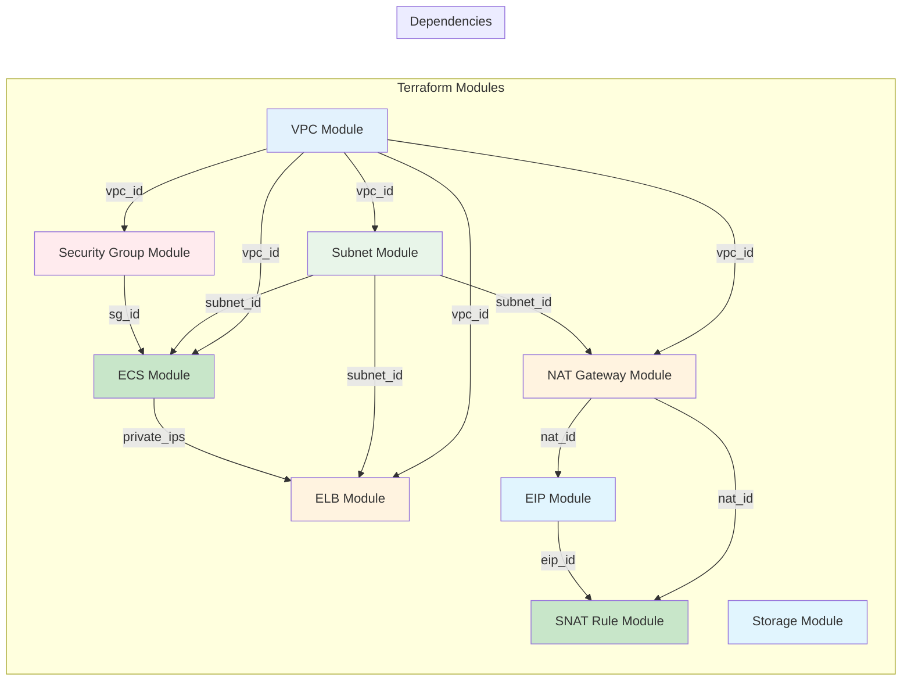
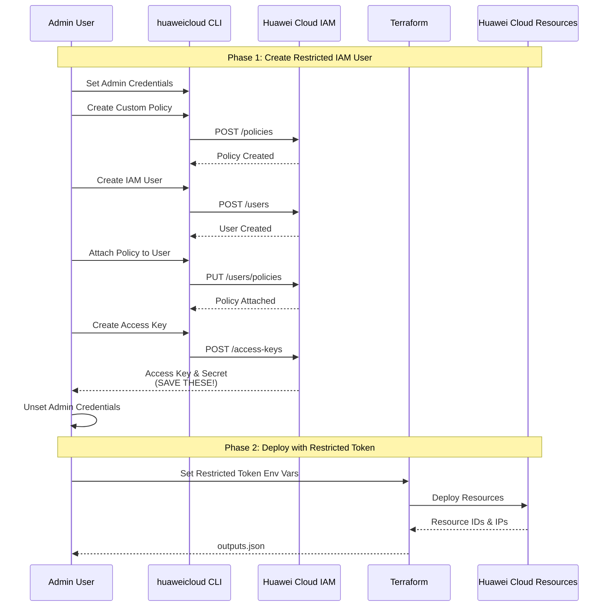
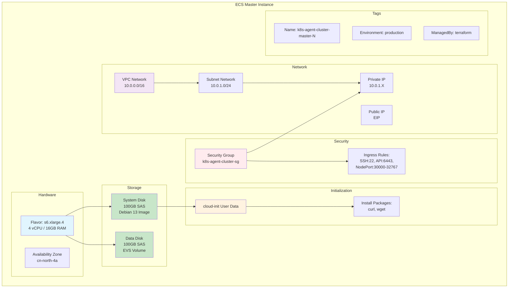
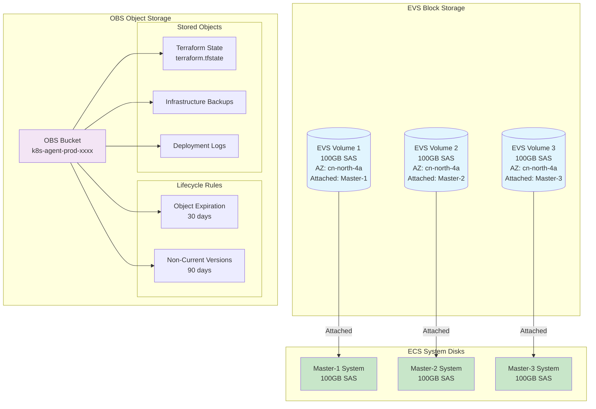
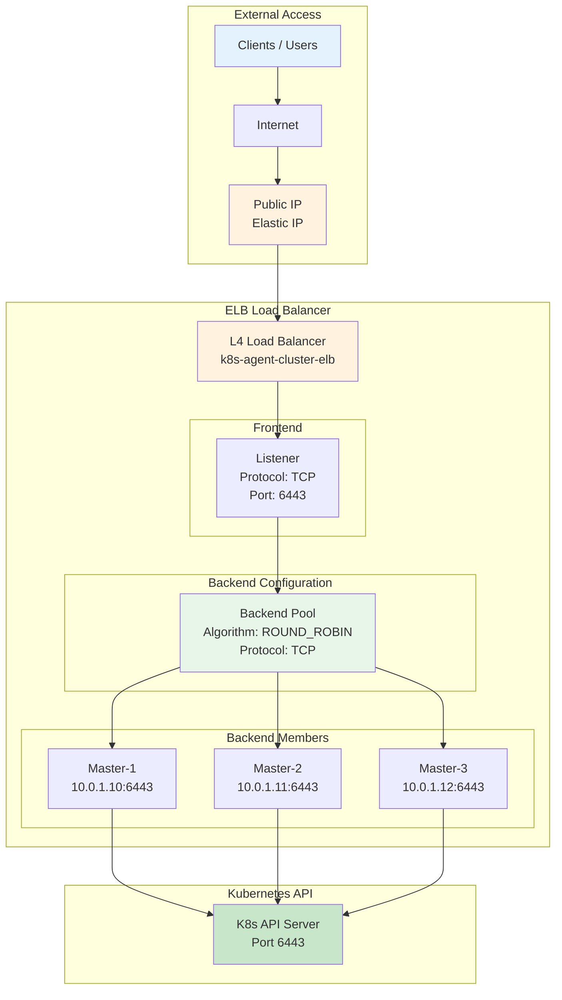
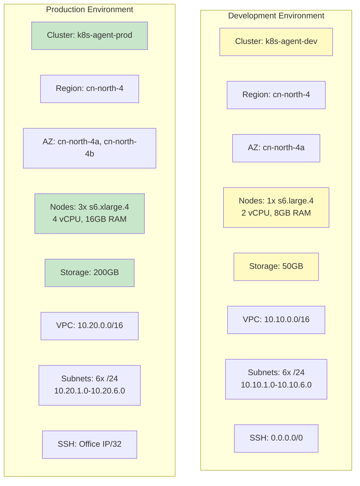

# Cloud Infrastructure Architecture

## Overview

This document provides a visual overview of the Huawei Cloud infrastructure that will be provisioned in Phase 1 of the k8s-agent project.

---

## Complete Infrastructure View

```mermaid
graph TB
    subgraph "Local Machine - Terraform Control"
        Admin[Admin Credentials<br/>AK/SK]
        CLI[huaweicloud CLI]

        subgraph "Step 1: IAM Security Setup"
            CreatePolicy[Create Custom Policy<br/>k8s-agent-infra-policy]
            CreateUser[Create IAM User<br/>k8s-agent-terraform]
            AttachPolicy[Attach Policy to User]
            CreateAK[Create Access Key<br/>Save Credentials!]
            UnsetAdmin[Unset Admin Credentials]
        end

        subgraph "Step 2: Terraform Deploy"
            TFVars[terraform.tfvars<br/>Environment Config]
            TFInit[terraform init]
            TFPlan[terraform plan]
            TFApply[terraform apply]
        end
    end

    subgraph "Huawei Cloud - cn-north-4"
        subgraph "Network Layer"
            VPC[VPC<br/>Name: k8s-agent-cluster-vpc<br/>CIDR: 10.20.0.0/16]

            subgraph "Subnets"
                SubnetDMZ[DMZ Subnet<br/>10.20.1.0/24<br/>Public-facing + NAT]
                SubnetApps[Apps Subnet<br/>10.20.2.0/24<br/>Applications + NAT]
                SubnetDevOps[DevOps Subnet<br/>10.20.3.0/24<br/>CI/CD + Public IPs]
                SubnetDB[Database Subnet<br/>10.20.4.0/24<br/>Databases & Caches]
                SubnetAudit[Audit Subnet<br/>10.20.5.0/24<br/>Audit Resources]
                SubnetDev[Dev Subnet<br/>10.20.6.0/24<br/>Dev/Test + Public IPs]
            end

            subgraph "NAT Gateways"
                NATDMZ[NAT Gateway DMZ<br/>20Mbps EIP]
                NATApps[NAT Gateway Apps<br/>200Mbps EIP]
            end

            subgraph "Security Group Rules"
                SG[Security Groups<br/>k8s-agent-cluster-sg]
                SG_SSH[SSH:22<br/>From: Configurable CIDR]
                SG_API[K8s API:6443<br/>From: VPC CIDR]
                SG_NodePort[NodePort:30000-32767<br/>From: 0.0.0.0/0]
                SG_Linkerd[Linkerd:4143<br/>From: VPC CIDR]
                SG_DevOps[DevOps Services<br/>MongoDB, Kafka, GitLab]
            end
        end

        subgraph "Compute Layer - ECS Instances by Subnet"
            subgraph "DMZ Subnet (3x Kong API Gateway)"
                DMZ1[Kong Gateway-1<br/>s6.large.4<br/>2 vCPU, 8GB RAM]
                DMZ2[Kong Gateway-2<br/>s6.large.4<br/>2 vCPU, 8GB RAM]
                DMZ3[Kong Gateway-3<br/>s6.large.4<br/>2 vCPU, 8GB RAM]
            end

            subgraph "Apps Subnet (1x Application Server)"
                Apps1[Application Server-1<br/>s6.large.4<br/>2 vCPU, 8GB RAM<br/>100GB System Disk]
            end

            subgraph "DevOps Subnet (4x: 3 K8s + 1 CI/CD)"
                K8sM1[K8s Master-1<br/>s6.xlarge.4<br/>4 vCPU, 16GB RAM]
                K8sM2[K8s Master-2<br/>s6.xlarge.4<br/>4 vCPU, 16GB RAM]
                K8sM3[K8s Master-3<br/>s6.xlarge.4<br/>4 vCPU, 16GB RAM]
                DevOps1[DevOps Server<br/>s6.large.4<br/>2 vCPU, 8GB RAM<br/>GitLab, Jenkins]
            end

            subgraph "Database Subnet (3x Databases)"
                DB1[Database-1<br/>s6.xlarge.4<br/>4 vCPU, 16GB RAM<br/>PostgreSQL/MySQL]
                DB2[Database-2<br/>s6.xlarge.4<br/>4 vCPU, 16GB RAM<br/>PostgreSQL/MySQL]
                DB3[Database-3<br/>s6.xlarge.4<br/>4 vCPU, 16GB RAM<br/>PostgreSQL/MySQL]
            end

            subgraph "Development Subnet (1x Dev Server)"
                Dev1[Dev Server<br/>s6.large.4<br/>2 vCPU, 8GB RAM<br/>Testing/Development]
            end

            UserData[cloud-init<br/>Install: curl, wget]
        end

        subgraph "Storage Layer"
            EVS1[(EVS Volume<br/>Attached to App-1<br/>100GB SAS)]
            EVS2[(EVS Volume<br/>Attached to K8sM-1<br/>100GB SAS)]
            EVS3[(EVS Volume<br/>Attached to K8sM-2<br/>100GB SAS)]
            EVS4[(EVS Volume<br/>Attached to K8sM-3<br/>100GB SAS)]
            EVS5[(EVS Volume<br/>Attached to DB-1<br/>200GB SAS)]
            EVS6[(EVS Volume<br/>Attached to DB-2<br/>200GB SAS)]
            EVS7[(EVS Volume<br/>Attached to DB-3<br/>200GB SAS)]
            EVS8[(EVS Volume<br/>Attached to DevOps-1<br/>100GB SAS)]
            EVS9[(EVS Volume<br/>Attached to Dev-1<br/>100GB SAS)]

            OBS[(OBS Bucket<br/>k8s-agent-prod-xxxx<br/>Lifecycle: 30d expiration)]
        end

        subgraph "Load Balancers (2x)"
            ELB_Kong[Kong API Gateway LB<br/>k8s-agent-kong-elb<br/>Port: 8000,8443]
            EIP_Kong[Public IP / EIP<br/>100Mbps]

            ELB_K8s[K8s API LB<br/>k8s-agent-k8s-elb<br/>Port: 6443]
            EIP_K8s[Public IP / EIP<br/>100Mbps]

            Pool_Kong[Kong Backend Pool<br/>Round Robin]
            Pool_K8s[K8s Backend Pool<br/>Round Robin]
        end
    end

    subgraph "Terraform State Management"
        TFState[(Terraform State<br/>Stored in OBS)]
        TFOutput[terraform output<br/>outputs.json]
    end

    Admin --> CreatePolicy
    CreatePolicy --> CreateUser
    CreateUser --> AttachPolicy
    AttachPolicy --> CreateAK
    CreateAK --> UnsetAdmin

    UnsetAdmin --> TFVars
    TFVars --> TFInit
    TFInit --> TFPlan
    TFPlan --> TFApply

    TFApply --> VPC
    TFApply --> SubnetDMZ
    TFApply --> SubnetApps
    TFApply --> SubnetDevOps
    TFApply --> SubnetDB
    TFApply --> SubnetAudit
    TFApply --> SubnetDev
    TFApply --> SG
    TFApply --> NATDMZ
    TFApply --> NATApps
    TFApply --> DMZ1
    TFApply --> DMZ2
    TFApply --> DMZ3
    TFApply --> Apps1
    TFApply --> K8sM1
    TFApply --> K8sM2
    TFApply --> K8sM3
    TFApply --> DevOps1
    TFApply --> DB1
    TFApply --> DB2
    TFApply --> DB3
    TFApply --> Dev1
    TFApply --> EVS1
    TFApply --> EVS2
    TFApply --> EVS3
    TFApply --> EVS4
    TFApply --> EVS5
    TFApply --> EVS6
    TFApply --> EVS7
    TFApply --> EVS8
    TFApply --> EVS9
    TFApply --> OBS
    TFApply --> ELB_Kong
    TFApply --> ELB_K8s

    VPC --> SubnetDMZ
    VPC --> SubnetApps
    VPC --> SubnetDevOps
    VPC --> SubnetDB
    VPC --> SubnetAudit
    VPC --> SubnetDev

    SubnetDMZ --> NATDMZ
    SubnetApps --> NATApps

    SubnetDMZ --> SG
    SubnetApps --> SG
    SubnetDevOps --> SG
    SubnetDB --> SG
    SubnetAudit --> SG
    SubnetDev --> SG

    SG --> SG_SSH
    SG --> SG_API
    SG --> SG_NodePort
    SG --> SG_Linkerd
    SG --> SG_DevOps

    SG --> DMZ1
    SG --> DMZ2
    SG --> DMZ3
    SG --> Apps1
    SG --> K8sM1
    SG --> K8sM2
    SG --> K8sM3
    SG --> DevOps1
    SG --> DB1
    SG --> DB2
    SG --> DB3
    SG --> Dev1

    DMZ1 --> UserData
    DMZ2 --> UserData
    DMZ3 --> UserData
    Apps1 --> UserData
    Apps1 --> EVS1
    K8sM1 --> UserData
    K8sM1 --> EVS2
    K8sM2 --> UserData
    K8sM2 --> EVS3
    K8sM3 --> UserData
    K8sM3 --> EVS4
    DevOps1 --> UserData
    DevOps1 --> EVS8
    DB1 --> UserData
    DB1 --> EVS5
    DB2 --> UserData
    DB2 --> EVS6
    DB3 --> UserData
    DB3 --> EVS7
    Dev1 --> UserData
    Dev1 --> EVS9

    SubnetDMZ --> ELB_Kong
    SubnetDevOps --> ELB_K8s

    DMZ1 --> Pool_Kong
    DMZ2 --> Pool_Kong
    DMZ3 --> Pool_Kong

    K8sM1 --> Pool_K8s
    K8sM2 --> Pool_K8s
    K8sM3 --> Pool_K8s

    ELB_Kong --> EIP_Kong
    ELB_Kong --> Pool_Kong

    ELB_K8s --> EIP_K8s
    ELB_K8s --> Pool_K8s

    TFApply --> TFState
    TFApply --> TFOutput

    style Admin fill:#ffccbc
    style CreatePolicy fill:#fff9c4
    style VPC fill:#e3f2fd
    style SubnetDMZ fill:#ffebee
    style SubnetApps fill:#c8e6c9
    style SubnetDevOps fill:#fff3e0
    style SubnetDB fill:#e1f5fe
    style SubnetAudit fill:#f3e5f5
    style SubnetDev fill:#fff9c4
    style SG fill:#ffebee
    style NATDMZ fill:#e1f5fe
    style NATApps fill:#c8e6c9
    style DMZ1 fill:#ffebee
    style DMZ2 fill:#ffebee
    style DMZ3 fill:#ffebee
    style Apps1 fill:#c8e6c9
    style K8sM1 fill:#c8e6c9
    style K8sM2 fill:#c8e6c9
    style K8sM3 fill:#c8e6c9
    style DevOps1 fill:#fff3e0
    style DB1 fill:#e1f5fe
    style DB2 fill:#e1f5fe
    style DB3 fill:#e1f5fe
    style Dev1 fill:#fff9c4
    style EVS1 fill:#e1f5fe
    style EVS2 fill:#e1f5fe
    style EVS3 fill:#e1f5fe
    style EVS4 fill:#e1f5fe
    style EVS5 fill:#e1f5fe
    style EVS6 fill:#e1f5fe
    style EVS7 fill:#e1f5fe
    style EVS8 fill:#e1f5fe
    style EVS9 fill:#e1f5fe
    style OBS fill:#f3e5f5
    style ELB_Kong fill:#fff3e0
    style ELB_K8s fill:#fff3e0
    style EIP_Kong fill:#ffccbc
    style EIP_K8s fill:#ffccbc
    style Pool_Kong fill:#e8f5e9
    style Pool_K8s fill:#e8f5e9
```



---

## Module Dependency Graph



---

## Security Flow Diagram



---

## Network Architecture

```mermaid
graph TB
    Internet[Internet]

    %% Public IP Layer
    subgraph "Public IPs (EIP)"
        EIP_Kong[Kong LB EIP<br/>1.2.3.4:100Mbps]
        EIP_K8s[K8s API EIP<br/>1.2.3.5:100Mbps]
        EIP_NAT_DMZ[NAT DMZ EIP<br/>1.2.3.6:20Mbps]
        EIP_NAT_Apps[NAT Apps EIP<br/>1.2.3.7:200Mbps]
        EIP_Dev[Dev EIP<br/>1.2.3.8:100Mbps]
    end

    %% VPC
    subgraph "VPC 10.20.0.0/16"

        %% Load Balancers
        subgraph "Load Balancers"
            LB_Kong[Kong LB<br/>VIP:10.20.1.20<br/>Port:8000,8443]
            LB_K8s[K8s API LB<br/>VIP:10.20.3.20<br/>Port:6443]
        end

        %% NAT Gateways
        subgraph "NAT Gateways"
            NAT_DMZ[NAT DMZ<br/>10.20.1.2:20Mbps]
            NAT_Apps[NAT Apps<br/>10.20.2.2:200Mbps]
        end

        %% Subnets
        subgraph "DMZ Subnet (10.20.1.0/24) - 3x Kong"
            Kong1[Kong-1<br/>10.20.1.10<br/>s6.large.4]
            Kong2[Kong-2<br/>10.20.1.11<br/>s6.large.4]
            Kong3[Kong-3<br/>10.20.1.12<br/>s6.large.4]
        end

        subgraph "Apps Subnet (10.20.2.0/24) - 1x App"
            App1[Application Server<br/>10.20.2.10<br/>s6.large.4]
        end

        subgraph "DevOps Subnet (10.20.3.0/24) - 4x: 3 K8s + 1 CI/CD"
            K8sM1[K8s Master-1<br/>10.20.3.10<br/>s6.xlarge.4]
            K8sM2[K8s Master-2<br/>10.20.3.11<br/>s6.xlarge.4]
            K8sM3[K8s Master-3<br/>10.20.3.12<br/>s6.xlarge.4]
            DevOps[CI/CD & Tools<br/>10.20.3.30<br/>s6.large.4]
        end

        subgraph "DB Subnet (10.20.4.0/24) - 3x DB"
            DB1[Database-1<br/>10.20.4.10]
            DB2[Database-2<br/>10.20.4.11]
            DB3[Database-3<br/>10.20.4.12]
        end

        subgraph "Audit Subnet (10.20.5.0/24)"
            Audit[Audit Resources]
        end

        subgraph "Dev Subnet (10.20.6.0/24) - 1x Dev"
            Dev[Dev Server<br/>10.20.6.10<br/>s6.large.4]
        end
    end

    %% Security Rules Group
    subgraph "Security Rules"
        subgraph "VPC Level"
            VPC_SSH[SSH:22]
            VPC_ICMP[ICMP]
        end

        subgraph "Subnet Level"
            DMZ_HTTP[HTTP:80/443]
            K8s_API[K8s API:6443]
            K8s_NP[NodePort:30000-32767]
        end

        subgraph "Instance Level"
            DevOps_MongoDB[MongoDB:27017]
            DevOps_Kafka[Kafka:9092-9094]
            DB_Port[DB:5432,3306]
        end
    end

    %% Internet Flow
    Internet --> EIP_Kong --> LB_Kong
    Internet --> EIP_K8s --> LB_K8s
    Internet --> EIP_Dev --> Dev

    %% LB Backends
    LB_Kong --> Kong1
    LB_Kong --> Kong2
    LB_Kong --> Kong3
    LB_Kong -.-> App1
    LB_Kong -.-> Dev

    LB_K8s --> K8sM1
    LB_K8s --> K8sM2
    LB_K8s --> K8sM3

    %% East-West Traffic
    Kong1 --> App1
    Kong2 --> App1
    Kong3 --> App1
    App1 --> DB1
    App1 --> DB2
    App1 --> DB3
    K8sM1 --> DB1
    K8sM1 --> DB2
    K8sM1 --> DB3
    K8sM2 --> DB1
    K8sM2 --> DB2
    K8sM2 --> DB3
    K8sM3 --> DB1
    K8sM3 --> DB2
    K8sM3 --> DB3
    DevOps --> K8sM1
    DevOps --> K8sM2
    DevOps --> K8sM3

    %% Outbound to Internet
    Kong1 --> NAT_DMZ --> EIP_NAT_DMZ
    Kong2 --> NAT_DMZ --> EIP_NAT_DMZ
    Kong3 --> NAT_DMZ --> EIP_NAT_DMZ
    App1 --> NAT_Apps --> EIP_NAT_Apps

    %% Security Rules Applied
    VPC_SSH --> App1
    VPC_SSH --> Kong1
    VPC_SSH --> Kong2
    VPC_SSH --> Kong3
    VPC_SSH --> K8sM1
    VPC_SSH --> K8sM2
    VPC_SSH --> K8sM3
    VPC_SSH --> DevOps
    VPC_SSH --> DB1
    VPC_SSH --> DB2
    VPC_SSH --> DB3
    VPC_SSH --> Dev

    VPC_ICMP --> App1
    VPC_ICMP --> Kong1
    VPC_ICMP --> Kong2
    VPC_ICMP --> Kong3
    VPC_ICMP --> K8sM1
    VPC_ICMP --> K8sM2
    VPC_ICMP --> K8sM3
    VPC_ICMP --> DevOps
    VPC_ICMP --> DB1
    VPC_ICMP --> DB2
    VPC_ICMP --> DB3
    VPC_ICMP --> Dev

    DMZ_HTTP --> Kong1
    DMZ_HTTP --> Kong2
    DMZ_HTTP --> Kong3

    K8s_API --> K8sM1
    K8s_API --> K8sM2
    K8s_API --> K8sM3

    K8s_NP --> K8sM1
    K8s_NP --> K8sM2
    K8s_NP --> K8sM3

    DevOps_MongoDB --> DevOps
    DevOps_Kafka --> DevOps

    DB_Port --> DB1
    DB_Port --> DB2
    DB_Port --> DB3

    %% Styles
    style Internet fill:#e3f2fd
    style EIP_Kong fill:#ffccbc
    style EIP_K8s fill:#ffccbc
    style EIP_NAT_DMZ fill:#ffccbc
    style EIP_NAT_Apps fill:#ffccbc
    style EIP_Dev fill:#ffccbc
    style LB_Kong fill:#fff3e0
    style LB_K8s fill:#fff3e0
    style NAT_DMZ fill:#e1f5fe
    style NAT_Apps fill:#e1f5fe
    style Kong1 fill:#ffebee
    style Kong2 fill:#ffebee
    style Kong3 fill:#ffebee
    style App1 fill:#c8e6c9
    style K8sM1 fill:#c8e6c9
    style K8sM2 fill:#c8e6c9
    style K8sM3 fill:#c8e6c9
    style DevOps fill:#fff3e0
    style DB1 fill:#e1f5fe
    style DB2 fill:#e1f5fe
    style DB3 fill:#e1f5fe
    style Dev fill:#fff9c4
    style VPC_SSH fill:#ffebee
    style VPC_ICMP fill:#ffebee
    style DMZ_HTTP fill:#fff9c4
    style K8s_API fill:#fff9c4
    style K8s_NP fill:#fff9c4
    style DevOps_MongoDB fill:#c8e6c9
    style DevOps_Kafka fill:#c8e6c9
    style DB_Port fill:#c8e6c9
```



---

## NAT Gateway and Public IP Architecture

The infrastructure uses a hybrid approach for internet access:

### Subnet Internet Access Strategy

| Subnet | Access Method | Bandwidth | Use Case |
|--------|---------------|-----------|----------|
| **DMZ** | NAT Gateway | 20Mbps | Controlled outbound for public-facing resources |
| **Apps** | NAT Gateway | 200Mbps | High-bandwidth outbound for production workloads |
| **DevOps** | Public IPs | Per-resource | Direct access for GitLab, MongoDB, Kafka |
| **Database** | Private | None | Isolated, no direct internet access |
| **Audit** | Private | None | Isolated, no direct internet access |
| **Development** | Public IPs | Flexible | Flexible access for development/testing |

### NAT Gateway Benefits

- **Static Public IPs**: Easy whitelisting in external services
- **Cost Control**: Pay-by-traffic billing
- **Security**: Private subnets remain isolated
- **Simplified Management**: Single EIP per subnet for all outbound traffic

### Public IP Benefits

- **Direct Access**: DevOps services accessible without DNAT
- **Flexibility**: Custom security rules per service
- **Development**: Easy testing and debugging
- **Security**: Fine-grained security group control

### DevOps Service Access

Common DevOps services exposed with public IPs:

| Service | Port | Protocol | Access Control |
|---------|------|----------|----------------|
| GitLab SSH | 22 | TCP | Key-based authentication |
| GitLab HTTP | 80 | TCP | Open with authentication |
| GitLab HTTPS | 443 | TCP | Open with authentication |
| MongoDB | 27017 | TCP | Restricted to known IPs |
| Kafka | 9092-9094 | TCP | Restricted to known IPs |
| Jenkins | 8080 | TCP | Open with authentication |
| Grafana | 3000 | TCP | Open with authentication |

---

## ECS Instance Detail



---

## Storage Architecture



---

## Load Balancer Configuration



---

## Environment Configuration Comparison



| Parameter | Development | Production |
|-----------|-------------|------------|
| **Cluster Name** | k8s-agent-dev | k8s-agent-prod |
| **Region** | cn-north-4 | cn-north-4 |
| **Availability Zones** | cn-north-4a | cn-north-4a, cn-north-4b |
| **Instance Count** | 1 | 3 |
| **Instance Type** | s6.large.4 (2 vCPU, 8GB) | s6.xlarge.4 (4 vCPU, 16GB) |
| **System Disk** | 100GB SAS | 100GB SAS |
| **Data Disk** | 50GB SAS | 200GB SAS |
| **VPC CIDR** | 10.10.0.0/16 | 10.20.0.0/16 |
| **DMZ Subnet** | 10.10.1.0/24 (public-facing) | 10.20.1.0/24 (public-facing) |
| **Apps Subnet** | 10.10.2.0/24 (applications) | 10.20.2.0/24 (applications) |
| **DevOps Subnet** | 10.10.3.0/24 (CI/CD) | 10.20.3.0/24 (CI/CD) |
| **Database Subnet** | 10.10.4.0/24 (databases) | 10.20.4.0/24 (databases) |
| **Audit Subnet** | 10.10.5.0/24 (audit) | 10.20.5.0/24 (audit) |
| **Dev Subnet** | 10.10.6.0/24 (dev/test) | 10.20.6.0/24 (dev/test) |
| **SSH Access** | 0.0.0.0/0 | Office IP/32 |

---

## Deployment Workflow


---

## Verification Steps

```mermaid
graph TB
    subgraph "Post-Deployment Verification"
        V1[1. Verify ECS Instances]
        V2[2. Verify VPC Configuration]
        V3[3. Verify Storage Provisioning]
        V4[4. Verify Load Balancer]
        V5[5. Test Connectivity]
    end

    subgraph "ECS Checks"
        ECS1A[ssh ubuntu@<public-ip>]
        ECS1B[Check: Instances Running]
        ECS1C[Check: cloud-init Complete]
    end

    subgraph "VPC Checks"
        VPC2A[huaweicloud vpc show <vpc-id>]
        VPC2B[Check: CIDR Correct]
        VPC2C[Check: Subnet Attached]
    end

    subgraph "Storage Checks"
        ST3A[huaweicloud evs volume show <volume-id>]
        ST3B[huaweicloud obs bucket list]
        ST3C[Check: EVS Attached]
        ST3D[Check: OBS Created]
    end

    subgraph "ELB Checks"
        ELB4A[huaweicloud elb show <elb-id>]
        ELB4B[Check: Backend Members]
        ELB4C[Check: Listener Active]
    end

    subgraph "Connectivity Tests"
        CONN5A[ping <master-ip>]
        CONN5B[curl -k https://<elb-address>:6443]
        CONN5C[Check: SSH Access]
        CONN5D[Check: API Reachable]
    end

    V1 --> ECS1A
    V1 --> ECS1B
    V1 --> ECS1C

    V2 --> VPC2A
    V2 --> VPC2B
    V2 --> VPC2C

    V3 --> ST3A
    V3 --> ST3B
    V3 --> ST3C
    V3 --> ST3D

    V4 --> ELB4A
    V4 --> ELB4B
    V4 --> ELB4C

    V5 --> CONN5A
    V5 --> CONN5B
    V5 --> CONN5C
    V5 --> CONN5D

    style V1 fill:#c8e6c9
    style V2 fill:#c8e6c9
    style V3 fill:#c8e6c9
    style V4 fill:#c8e6c9
    style V5 fill:#c8e6c9
```



---

## ECS Instance Allocation by Subnet

### Overview

The infrastructure allocates ECS instances across subnets based on their purpose and availability requirements:

| Subnet | Purpose | Instance Count | Instance Type | Network Access |
|--------|---------|----------------|---------------|----------------|
| **DMZ** | Kong API Gateway | 3 | s6.large.4 | Public IP + NAT Gateway + Dedicated LB |
| **Apps** | Application Server | 1 | s6.large.4 (dev) / s6.xlarge.4 (prod) | NAT Gateway |
| **DevOps** | K8s Masters + CI/CD | 4 | 3x s6.xlarge.4 (K8s) + 1x s6.large.4 (CI/CD) | Public IP (direct) + Dedicated LB for K8s |
| **Database** | Database Clusters | 3 | s6.large.4 (dev) / s6.xlarge.4 (prod) | Private (no internet) |
| **Development** | Dev/Test Server | 1 | s6.large.4 | Public IP (direct) |
| **Audit** | Audit Logging | 0 | - | Reserved for future |

### DMZ Subnet (3x Kong API Gateway + Dedicated LB)

```
Purpose: API Gateway and ingress routing
Instances: 3x s6.large.4 (2 vCPU, 8GB RAM, 100GB SAS)
Network: 10.20.1.0/24
Load Balancer: Kong LB (Port 8000, 8443)
Access: Public IP with security group controls
```

**Why 3 instances?**
- High availability for API gateway
- Dedicated load balancer distributes traffic across all 3
- Can handle failures without service disruption
- Kong provides API management, authentication, and rate limiting

### Apps Subnet (1x Application Server)

```
Purpose: Application workloads
Instances: 1x s6.large.4 (2 vCPU, 8GB RAM, 100GB SAS)
Network: 10.20.2.0/24
Access: NAT Gateway for outbound internet
```

**Why 1 instance?**
- Application server for business workloads
- Can scale horizontally by adding more instances
- NAT Gateway provides secure outbound access
- Isolated from K8s control plane

### DevOps Subnet (4x: 3 K8s Masters + 1 CI/CD Server + K8s LB)

```
Purpose: Kubernetes control plane + CI/CD tools
Instances:
  - 3x K8s Masters: s6.xlarge.4 (4 vCPU, 16GB RAM, 100GB SAS each)
  - 1x CI/CD Server: s6.large.4 (2 vCPU, 8GB RAM, 100GB SAS)
Network: 10.20.3.0/24
Load Balancer: K8s API LB (Port 6443)
Access: Public IP (direct) with security group controls
```

**Why 4 instances?**
- **3 K8s Masters**: High availability control plane (quorum-based etcd)
  - Automatic failover if master fails
  - Distributed API server load
  - etcd clustering for data redundancy
- **1 CI/CD Server**: Consolidates DevOps tools (GitLab, Jenkins)
  - Public IP allows external Git access
  - Security groups restrict access to specific ports

### Database Subnet (3x Database Replicas)

```
Purpose: PostgreSQL/MySQL with replication
Instances: 3x s6.xlarge.4 (4 vCPU, 16GB RAM, 200GB SAS each)
Network: 10.20.4.0/24
Access: Private (no direct internet access)
```

**Why 3 instances?**
- Database replication for high availability
- Automatic failover if primary fails
- Distributed read operations
- Isolated subnet for security (no internet access)

### Development Subnet (1x Dev Server)

```
Purpose: Development and testing
Instances: 1x s6.large.4 (2 vCPU, 8GB RAM, 100GB SAS)
Network: 10.20.6.0/24
Access: Public IP with flexible security
```

**Why 1 instance?**
- Dedicated server for development/testing
- Public IP for easy remote access
- Flexible security rules for experimentation
- Isolated from production resources

### Audit Subnet (0 instances - Reserved)

```
Purpose: Audit logging and monitoring (future)
Instances: 0 (reserved for future)
Network: 10.20.5.0/24
Access: TBD
```

### IP Address Allocation

| Subnet | Gateway | Instance IPs | Load Balancer |
|--------|---------|--------------|---------------|
| DMZ (10.20.1.0/24) | 10.20.1.1 | 10.20.1.10, 10.20.1.11, 10.20.1.12 (Kong) | 10.20.1.20 (Kong LB) |
| Apps (10.20.2.0/24) | 10.20.2.1 | 10.20.2.10 (App Server) | - |
| DevOps (10.20.3.0/24) | 10.20.3.1 | 10.20.3.10-12 (K8s Masters), 10.20.3.30 (CI/CD) | 10.20.3.20 (K8s API LB) |
| Database (10.20.4.0/24) | 10.20.4.1 | 10.20.4.10, 10.20.4.11, 10.20.4.12 (DB) | - |
| Audit (10.20.5.0/24) | 10.20.5.1 | (reserved) | - |
| Development (10.20.6.0/24) | 10.20.6.1 | 10.20.6.10 (Dev Server) | - |

### Load Balancer Configuration

| Load Balancer | Subnet | VIP IP | Public EIP | Backend Port | Backend Instances |
|---------------|--------|--------|-----------|--------------|-------------------|
| **Kong LB** | DMZ (10.20.1.0/24) | 10.20.1.20 | 1.2.3.4 (100Mbps) | 8000, 8443 | Kong Gateway-1,2,3 (10.20.1.10-12) |
| **K8s API LB** | DevOps (10.20.3.0/24) | 10.20.3.20 | 1.2.3.5 (100Mbps) | 6443 | K8s Master-1,2,3 (10.20.3.10-12) |

### NAT Gateway Configuration

| NAT Gateway | Subnet | Internal IP | Public EIP | Bandwidth | Serves Subnets |
|-------------|--------|-------------|-----------|-----------|----------------|
| **NAT DMZ** | DMZ (10.20.1.0/24) | 10.20.1.2 | 1.2.3.6 (20Mbps) | 20Mbps | DMZ (Kong Gateways) |
| **NAT Apps** | Apps (10.20.2.0/24) | 10.20.2.2 | 1.2.3.7 (200Mbps) | 200Mbps | Apps (Application Server) |

### EIP Allocation Summary

| EIP | Type | Resource | Purpose |
|-----|------|----------|---------|
| **1.2.3.4** | LB EIP | Kong LB (10.20.1.20) | API Gateway public access |
| **1.2.3.5** | LB EIP | K8s API LB (10.20.3.20) | Kubernetes API public access |
| **1.2.3.6** | NAT EIP | NAT DMZ (10.20.1.2) | DMZ subnet outbound internet |
| **1.2.3.7** | NAT EIP | NAT Apps (10.20.2.2) | Apps subnet outbound internet |
| **1.2.3.8** | Direct EIP | Dev Server (10.20.6.10) | Dev Server direct public access |

**Access URLs:**
- Kong API Gateway: `http://1.2.3.4:8000` (HTTP), `https://1.2.3.4:8443` (HTTPS)
- Kubernetes API: `https://1.2.3.5:6443`
- Dev Server: `ssh ubuntu@1.2.3.8` (SSH), `http://1.2.3.8:8080` (HTTP, if exposed)

**Traffic Flow Summary:**

| Source | Destination | Path | EIP Used |
|--------|-------------|------|----------|
| Internet | Kong API | Internet → EIP_Kong → Kong LB → Kong Gateways | 1.2.3.4 |
| Internet | K8s API | Internet → EIP_K8s → K8s LB → K8s Masters | 1.2.3.5 |
| Internet | Dev Server | Internet → EIP_Dev ↔ Dev Server (direct) | 1.2.3.8 |
| Kong Gateway | Apps Backend | Kong LB → App1 (internal routing) | - |
| Kong Gateway | Dev Server | Kong LB → Dev1 (optional, for testing) | - |
| Apps Server | Internet | App1 → NAT Apps → EIP_NAT_Apps | 1.2.3.7 |
| Kong Gateways | Internet | Kong1/2/3 → NAT DMZ → EIP_NAT_DMZ | 1.2.3.6 |

---

## Resource Summary

### Development Environment

| Resource Type | Quantity | Specifications |
|---------------|----------|----------------|
| **VPC** | 1 | 10.10.0.0/16 |
| **Subnets** | 6 | DMZ, Apps, DevOps, Database, Audit, Dev (each /24) |
| **NAT Gateways** | 2 | DMZ (10Mbps), Apps (50Mbps) |
| **Security Groups** | 2 | Cluster SG, DevOps SG (MongoDB, Kafka, GitLab) |
| **ECS Instances** | 11 | Total across all subnets (see breakdown) |
| **ELB** | 2 | Kong LB (DMZ), K8s API LB (DevOps) |
| **OBS Bucket** | 1 | Globally unique name |

**ECS Instance Allocation by Subnet:**

| Subnet | Instance Count | Type | Specifications | Purpose |
|--------|----------------|------|----------------|---------|
| **DMZ** | 3 | s6.large.4 | 2 vCPU, 8GB RAM, 100GB SAS each | Kong API Gateway (3x HA) |
| **Apps** | 1 | s6.large.4 | 2 vCPU, 8GB RAM, 50GB SAS | Application Server |
| **DevOps** | 4 | 3x s6.xlarge.4 + 1x s6.large.4 | K8s: 4 vCPU, 16GB RAM; CI/CD: 2 vCPU, 8GB RAM | 3x K8s Masters + 1x CI/CD |
| **Database** | 3 | s6.large.4 | 2 vCPU, 8GB RAM, 100GB SAS each | PostgreSQL/MySQL (3x replication) |
| **Development** | 1 | s6.large.4 | 2 vCPU, 8GB RAM, 50GB SAS | Development/testing server |
| **Audit** | 0 | - | - | (No instances, reserved for future) |

**Subnet Breakdown:**
- DMZ: 10.10.1.0/24 (3x Kong API Gateway + Kong LB + NAT Gateway)
- Apps: 10.10.2.0/24 (Application Server + NAT Gateway)
- DevOps: 10.10.3.0/24 (3x K8s Masters + 1x CI/CD + K8s API LB, public IPs)
- Database: 10.10.4.0/24 (3x database replicas)
- Audit: 10.10.5.0/24 (audit resources - reserved)
- Dev: 10.10.6.0/24 (dev/test server with public IPs, flexible security)

**Total Resources**: 26 vCPU, 104GB RAM, 1.05TB storage

### Production Environment

| Resource Type | Quantity | Specifications |
|---------------|----------|----------------|
| **VPC** | 1 | 10.20.0.0/16 |
| **Subnets** | 6 | DMZ, Apps, DevOps, Database, Audit, Dev (each /24) |
| **NAT Gateways** | 2 | DMZ (20Mbps), Apps (200Mbps) |
| **Security Groups** | 2 | Cluster SG, DevOps SG (MongoDB, Kafka, GitLab) |
| **ECS Instances** | 11 | Total across all subnets (see breakdown) |
| **ELB** | 2 | Kong LB (DMZ), K8s API LB (DevOps) |
| **OBS Bucket** | 1 | Globally unique name |

**ECS Instance Allocation by Subnet:**

| Subnet | Instance Count | Type | Specifications | Purpose |
|--------|----------------|------|----------------|---------|
| **DMZ** | 3 | s6.large.4 | 2 vCPU, 8GB RAM, 100GB SAS each | Kong API Gateway (3x HA) |
| **Apps** | 1 | s6.xlarge.4 | 4 vCPU, 16GB RAM, 100GB SAS | Application Server (production grade) |
| **DevOps** | 4 | 3x s6.xlarge.4 + 1x s6.large.4 | K8s: 4 vCPU, 16GB RAM; CI/CD: 2 vCPU, 8GB RAM | 3x K8s Masters + 1x CI/CD |
| **Database** | 3 | s6.xlarge.4 | 4 vCPU, 16GB RAM, 200GB SAS each | PostgreSQL/MySQL (3x replication) |
| **Development** | 1 | s6.large.4 | 2 vCPU, 8GB RAM, 100GB SAS | Development/testing server |
| **Audit** | 0 | - | - | (No instances, reserved for future) |

**Subnet Breakdown:**
- DMZ: 10.20.1.0/24 (3x Kong API Gateway + Kong LB + NAT Gateway)
- Apps: 10.20.2.0/24 (Application Server + NAT Gateway, high bandwidth)
- DevOps: 10.20.3.0/24 (3x K8s Masters + 1x CI/CD + K8s API LB, public IPs)
- Database: 10.20.4.0/24 (3x database replicas with high storage)
- Audit: 10.20.5.0/24 (audit resources - reserved)
- Dev: 10.20.6.0/24 (dev/test server with public IPs, flexible security)

**Total Resources**: 44 vCPU, 176GB RAM, 1.5TB storage

---

## Related Documentation

- [Cloud Infrastructure Plan](./01-cloud-infrastructure-plan.md) - Detailed implementation guide
- [K8s Platform Plan](./02-k8s-platform-plan.md) - Phase 2: Kubernetes setup
- [Architecture Overview](./00-architecture-overview.md) - Complete system architecture
