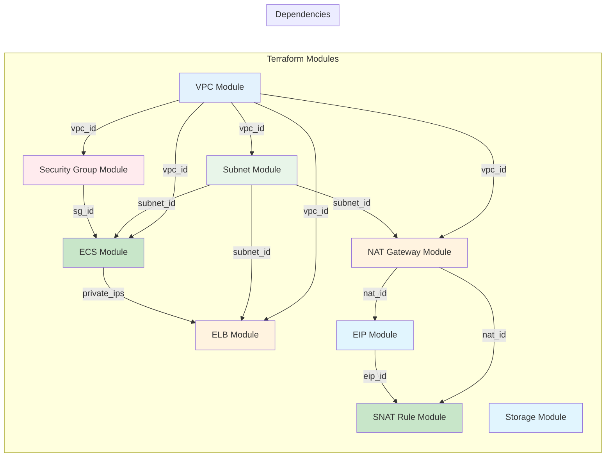
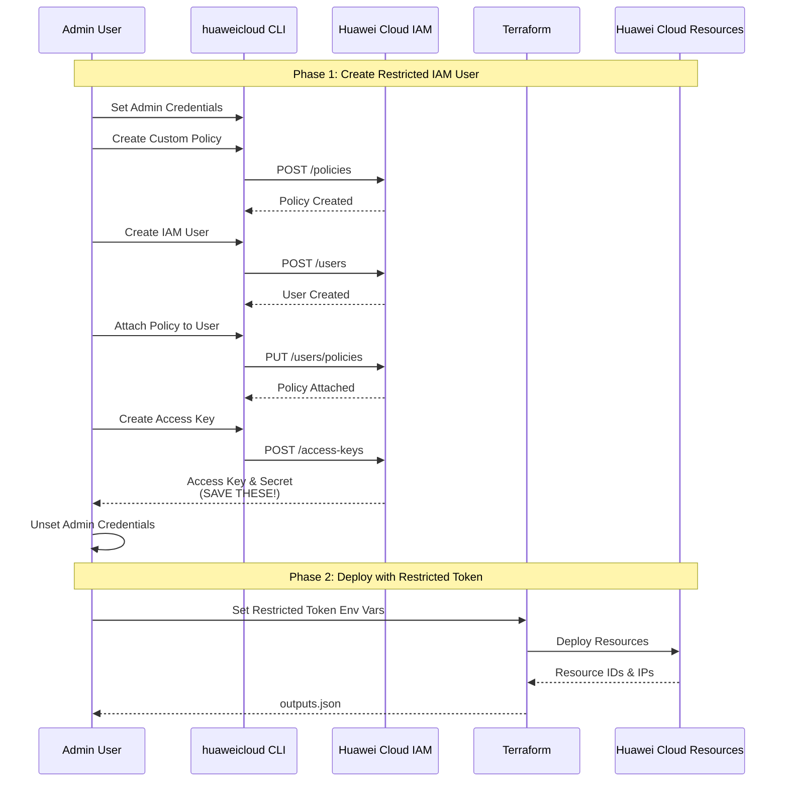
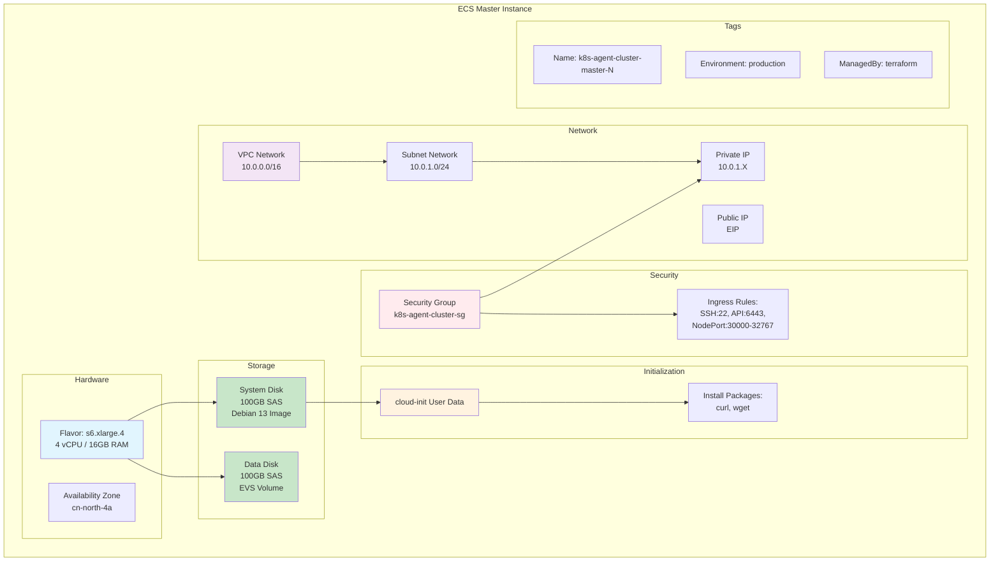
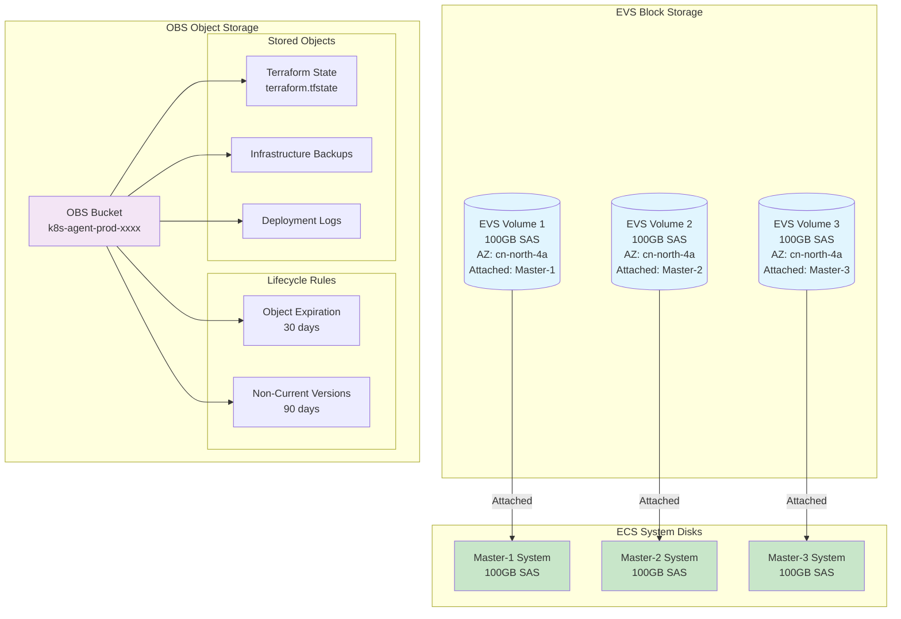
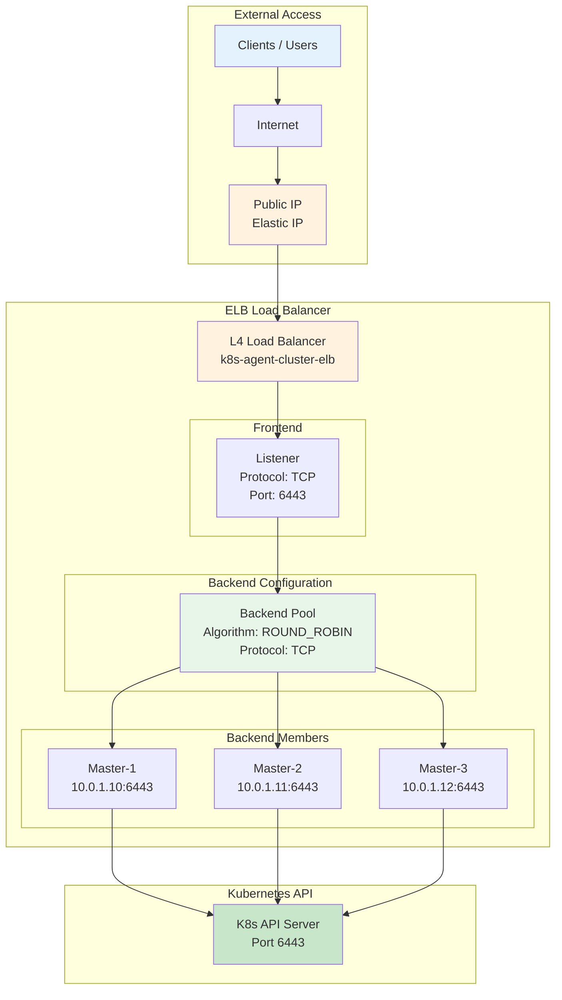
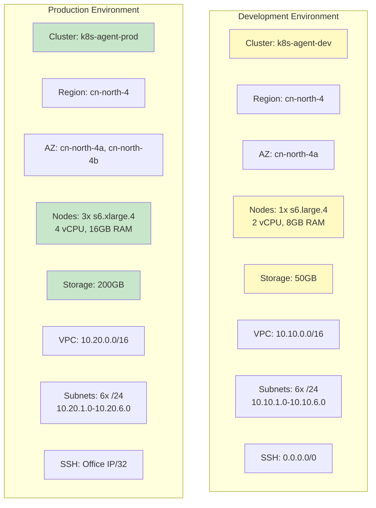
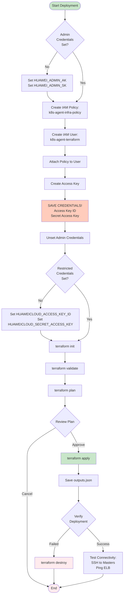

# Cloud Infrastructure Architecture

## Overview

This document provides a visual overview of the Huawei Cloud infrastructure that will be provisioned in Phase 1 of the k8s-agent project.

---

## Complete Infrastructure View

```mermaid
graph TB
    subgraph "Local Machine - Terraform Control"
        Admin[Admin Credentials<br/>AK/SK]
        CLI[huaweicloud CLI]

        subgraph "Step 1: IAM Security Setup"
            CreatePolicy[Create Custom Policy<br/>k8s-agent-infra-policy]
            CreateUser[Create IAM User<br/>k8s-agent-terraform]
            AttachPolicy[Attach Policy to User]
            CreateAK[Create Access Key<br/>Save Credentials!]
            UnsetAdmin[Unset Admin Credentials]
        end

        subgraph "Step 2: Terraform Deploy"
            TFVars[terraform.tfvars<br/>Environment Config]
            TFInit[terraform init]
            TFPlan[terraform plan]
            TFApply[terraform apply]
        end
    end

    subgraph "Huawei Cloud - cn-north-4"
        subgraph "Network Layer"
            VPC[VPC<br/>Name: k8s-agent-cluster-vpc<br/>CIDR: 10.20.0.0/16]

            subgraph "Subnets"
                SubnetDMZ[DMZ Subnet<br/>10.20.1.0/24<br/>Public-facing + NAT]
                SubnetApps[Apps Subnet<br/>10.20.2.0/24<br/>Applications + NAT]
                SubnetDevOps[DevOps Subnet<br/>10.20.3.0/24<br/>CI/CD + Public IPs]
                SubnetDB[Database Subnet<br/>10.20.4.0/24<br/>Databases & Caches]
                SubnetAudit[Audit Subnet<br/>10.20.5.0/24<br/>Audit Resources]
                SubnetDev[Dev Subnet<br/>10.20.6.0/24<br/>Dev/Test + Public IPs]
            end

            subgraph "NAT Gateways"
                NATDMZ[NAT Gateway DMZ<br/>20Mbps EIP]
                NATApps[NAT Gateway Apps<br/>200Mbps EIP]
            end

            subgraph "Security Group Rules"
                SG[Security Groups<br/>k8s-agent-cluster-sg]
                SG_SSH[SSH:22<br/>From: Configurable CIDR]
                SG_API[K8s API:6443<br/>From: VPC CIDR]
                SG_NodePort[NodePort:30000-32767<br/>From: 0.0.0.0/0]
                SG_Linkerd[Linkerd:4143<br/>From: VPC CIDR]
                SG_DevOps[DevOps Services<br/>MongoDB, Kafka, GitLab]
            end
        end

        subgraph "Compute Layer - ECS Instances"
            ECS1[ECS Master-1<br/>s6.xlarge.4<br/>4 vCPU, 16GB RAM<br/>100GB System Disk<br/>100GB Data Disk]
            ECS2[ECS Master-2<br/>s6.xlarge.4<br/>4 vCPU, 16GB RAM<br/>100GB System Disk<br/>100GB Data Disk]
            ECS3[ECS Master-3<br/>s6.xlarge.4<br/>4 vCPU, 16GB RAM<br/>100GB System Disk<br/>100GB Data Disk]

            UserData[cloud-init<br/>Install: curl, wget]
        end

        subgraph "Storage Layer"
            EVS1[(EVS Volume<br/>Attached to Master-1<br/>100GB SAS)]
            EVS2[(EVS Volume<br/>Attached to Master-2<br/>100GB SAS)]
            EVS3[(EVS Volume<br/>Attached to Master-3<br/>100GB SAS)]

            OBS[(OBS Bucket<br/>k8s-agent-prod-xxxx<br/>Lifecycle: 30d expiration)]
        end

        subgraph "Load Balancer"
            ELB[ELB Load Balancer<br/>k8s-agent-cluster-elb<br/>Flavor: L4]
            EIP[Public IP / EIP<br/>100Mbps Bandwidth]
            Listener[Listener<br/>Protocol: TCP<br/>Port: 6443]
            Pool[Backend Pool<br/>Algorithm: Round Robin]
            Members[Backend Members<br/>Master-1: 10.20.2.X<br/>Master-2: 10.20.2.Y<br/>Master-3: 10.20.2.Z]
        end
    end

    subgraph "Terraform State Management"
        TFState[(Terraform State<br/>Stored in OBS)]
        TFOutput[terraform output<br/>outputs.json]
    end

    Admin --> CreatePolicy
    CreatePolicy --> CreateUser
    CreateUser --> AttachPolicy
    AttachPolicy --> CreateAK
    CreateAK --> UnsetAdmin

    UnsetAdmin --> TFVars
    TFVars --> TFInit
    TFInit --> TFPlan
    TFPlan --> TFApply

    TFApply --> VPC
    TFApply --> SubnetDMZ
    TFApply --> SubnetApps
    TFApply --> SubnetDevOps
    TFApply --> SubnetDB
    TFApply --> SubnetAudit
    TFApply --> SubnetDev
    TFApply --> SG
    TFApply --> NATDMZ
    TFApply --> NATApps
    TFApply --> ECS1
    TFApply --> ECS2
    TFApply --> ECS3
    TFApply --> EVS1
    TFApply --> EVS2
    TFApply --> EVS3
    TFApply --> OBS
    TFApply --> ELB

    VPC --> SubnetDMZ
    VPC --> SubnetApps
    VPC --> SubnetDevOps
    VPC --> SubnetDB
    VPC --> SubnetAudit
    VPC --> SubnetDev

    SubnetDMZ --> NATDMZ
    SubnetApps --> NATApps

    SubnetDMZ --> SG
    SubnetApps --> SG
    SubnetDevOps --> SG
    SubnetDB --> SG
    SubnetAudit --> SG
    SubnetDev --> SG

    SG --> SG_SSH
    SG --> SG_API
    SG --> SG_NodePort
    SG --> SG_Linkerd
    SG --> SG_DevOps

    SG --> ECS1
    SG --> ECS2
    SG --> ECS3

    ECS1 --> EVS1
    ECS2 --> EVS2
    ECS3 --> EVS3

    ECS1 --> UserData
    ECS2 --> UserData
    ECS3 --> UserData

    SubnetDMZ --> ELB
    ECS1 --> Members
    ECS2 --> Members
    ECS3 --> Members

    ELB --> EIP
    ELB --> Listener
    Listener --> Pool
    Pool --> Members

    TFApply --> TFState
    TFApply --> TFOutput

    style Admin fill:#ffccbc
    style CreatePolicy fill:#fff9c4
    style VPC fill:#e3f2fd
    style SubnetDMZ fill:#ffebee
    style SubnetApps fill:#c8e6c9
    style SubnetDevOps fill:#fff3e0
    style SubnetDB fill:#e1f5fe
    style SubnetAudit fill:#f3e5f5
    style SubnetDev fill:#fff9c4
    style SG fill:#ffebee
    style NATDMZ fill:#e1f5fe
    style NATApps fill:#c8e6c9
    style ECS1 fill:#c8e6c9
    style ECS2 fill:#c8e6c9
    style ECS3 fill:#c8e6c9
    style EVS1 fill:#e1f5fe
    style EVS2 fill:#e1f5fe
    style EVS3 fill:#e1f5fe
    style OBS fill:#f3e5f5
    style ELB fill:#fff3e0
```

---

## Module Dependency Graph

---

## Security Flow Diagram

---

## Network Architecture

```mermaid
graph TB
    subgraph "Internet"
        Internet2[Internet / Public Network]
        EIP[Public IP / EIP<br/>100Mbps]
    end

    subgraph "VPC: 10.20.0.0/16"
        subgraph "DMZ Subnet: 10.20.1.0/24"
            GatewayDMZ[Gateway<br/>10.20.1.1]
            LB[Load Balancer<br/>10.20.1.20]
            NATDMZ[NAT Gateway<br/>20Mbps EIP]
        end

        subgraph "Apps Subnet: 10.20.2.0/24"
            GatewayApps[Gateway<br/>10.20.2.1]
            NATApps[NAT Gateway<br/>200Mbps EIP]

            subgraph "Security Group: k8s-agent-cluster-sg"
                IngressRules[Ingress Rules]

                subgraph "ECS Instances"
                    M1[Master-1<br/>10.20.2.10]
                    M2[Master-2<br/>10.20.2.11]
                    M3[Master-3<br/>10.20.2.12]
                end
            end
        end

        subgraph "DevOps Subnet: 10.20.3.0/24"
            GatewayDevOps[Gateway<br/>10.20.3.1]
            DevOpsPublic[Public IPs Direct<br/>Security Groups]

            subgraph "DevOps Services"
                GitLab[GitLab<br/>Public IP]
                MongoDB[MongoDB<br/>Public IP]
                Kafka[Kafka<br/>Public IP]
            end
        end

        subgraph "Database Subnet: 10.20.4.0/24"
            GatewayDB[Gateway<br/>10.20.4.1]
            DBResources[Databases & Caches]
        end

        subgraph "Audit Subnet: 10.20.5.0/24"
            GatewayAudit[Gateway<br/>10.20.5.1]
            AuditResources[Audit Log Collectors]
        end

        subgraph "Development Subnet: 10.20.6.0/24"
            GatewayDev[Gateway<br/>10.20.6.1]
            DevPublic[Public IPs Direct<br/>Flexible Security]
            DevResources[Dev/Test Servers]
        end
    end

    subgraph "Security Rules"
        SSH[Port 22<br/>SSH Access]
        API[Port 6443<br/>K8s API]
        NP[Port 30000-32767<br/>NodePort]
        LM[Port 4143<br/>Linkerd Mesh]
        DevOpsSG[DevOps Services<br/>MongoDB:27017<br/>Kafka:9092<br/>GitLab:22,80,443]
    end

    Internet --> EIP
    EIP --> LB

    GatewayApps --> M1
    GatewayApps --> M2
    GatewayApps --> M3

    LB --> M1
    LB --> M2
    LB --> M3

    NATApps --> M1
    NATApps --> M2
    NATApps --> M3

    IngressRules --> SSH
    IngressRules --> API
    IngressRules --> NP
    IngressRules --> LM

    SSH --> M1
    SSH --> M2
    SSH --> M3

    API --> M1
    API --> M2
    API --> M3

    NP --> M1
    NP --> M2
    NP --> M3

    LM --> M1
    LM --> M2
    LM --> M3

    GatewayDevOps --> GitLab
    GatewayDevOps --> MongoDB
    GatewayDevOps --> Kafka
    DevOpsPublic --> DevOpsSG

    GatewayDB --> DBResources
    GatewayAudit --> AuditResources
    GatewayDev --> DevResources
    DevPublic --> DevResources

    style Internet fill:#e3f2fd
    style VPC fill:#f3e5f5
    style LB fill:#fff3e0
    style NATDMZ fill:#e1f5fe
    style NATApps fill:#c8e6c9
    style M1 fill:#c8e6c9
    style M2 fill:#c8e6c9
    style M3 fill:#c8e6c9
    style IngressRules fill:#ffebee
    style GitLab fill:#fff3e0
    style MongoDB fill:#fff3e0
    style Kafka fill:#fff3e0
```

---

## ECS Instance Detail

---

## Storage Architecture

---

## Load Balancer Configuration

---

## Environment Configuration Comparison

| Parameter | Development | Production |
|-----------|-------------|------------|
| **Cluster Name** | k8s-agent-dev | k8s-agent-prod |
| **Region** | cn-north-4 | cn-north-4 |
| **Availability Zones** | cn-north-4a | cn-north-4a, cn-north-4b |
| **Instance Count** | 1 | 3 |
| **Instance Type** | s6.large.4 (2 vCPU, 8GB) | s6.xlarge.4 (4 vCPU, 16GB) |
| **System Disk** | 100GB SAS | 100GB SAS |
| **Data Disk** | 50GB SAS | 200GB SAS |
| **VPC CIDR** | 10.10.0.0/16 | 10.20.0.0/16 |
| **DMZ Subnet** | 10.10.1.0/24 (public-facing) | 10.20.1.0/24 (public-facing) |
| **Apps Subnet** | 10.10.2.0/24 (applications) | 10.20.2.0/24 (applications) |
| **DevOps Subnet** | 10.10.3.0/24 (CI/CD) | 10.20.3.0/24 (CI/CD) |
| **Database Subnet** | 10.10.4.0/24 (databases) | 10.20.4.0/24 (databases) |
| **Audit Subnet** | 10.10.5.0/24 (audit) | 10.20.5.0/24 (audit) |
| **Dev Subnet** | 10.10.6.0/24 (dev/test) | 10.20.6.0/24 (dev/test) |
| **SSH Access** | 0.0.0.0/0 | Office IP/32 |

---

## Deployment Workflow

---

## Verification Steps

```mermaid
graph TB
    subgraph "Post-Deployment Verification"
        V1[1. Verify ECS Instances]
        V2[2. Verify VPC Configuration]
        V3[3. Verify Storage Provisioning]
        V4[4. Verify Load Balancer]
        V5[5. Test Connectivity]
    end

    subgraph "ECS Checks"
        ECS1A[ssh ubuntu@<public-ip>]
        ECS1B[Check: Instances Running]
        ECS1C[Check: cloud-init Complete]
    end

    subgraph "VPC Checks"
        VPC2A[huaweicloud vpc show <vpc-id>]
        VPC2B[Check: CIDR Correct]
        VPC2C[Check: Subnet Attached]
    end

    subgraph "Storage Checks"
        ST3A[huaweicloud evs volume show <volume-id>]
        ST3B[huaweicloud obs bucket list]
        ST3C[Check: EVS Attached]
        ST3D[Check: OBS Created]
    end

    subgraph "ELB Checks"
        ELB4A[huaweicloud elb show <elb-id>]
        ELB4B[Check: Backend Members]
        ELB4C[Check: Listener Active]
    end

    subgraph "Connectivity Tests"
        CONN5A[ping <master-ip>]
        CONN5B[curl -k https://<elb-address>:6443]
        CONN5C[Check: SSH Access]
        CONN5D[Check: API Reachable]
    end

    V1 --> ECS1A
    V1 --> ECS1B
    V1 --> ECS1C

    V2 --> VPC2A
    V2 --> VPC2B
    V2 --> VPC2C

    V3 --> ST3A
    V3 --> ST3B
    V3 --> ST3C
    V3 --> ST3D

    V4 --> ELB4A
    V4 --> ELB4B
    V4 --> ELB4C

    V5 --> CONN5A
    V5 --> CONN5B
    V5 --> CONN5C
    V5 --> CONN5D

    style V1 fill:#c8e6c9
    style V2 fill:#c8e6c9
    style V3 fill:#c8e6c9
    style V4 fill:#c8e6c9
    style V5 fill:#c8e6c9
```

---

## Resource Summary

### Development Environment

| Resource Type | Quantity | Specifications |
|---------------|----------|----------------|
| **VPC** | 1 | 10.10.0.0/16 |
| **Subnets** | 6 | DMZ, Apps, DevOps, Database, Audit, Dev (each /24) |
| **Security Group** | 1 | SSH, K8s API, NodePort |
| **ECS Instances** | 1 | s6.large.4 (2 vCPU, 8GB RAM) |
| **System Disk** | 1 | 100GB SAS per instance |
| **Data Disk** | 1 | 50GB SAS |
| **OBS Bucket** | 1 | Globally unique name |
| **ELB** | 1 | L4 load balancer (in DMZ subnet) |

**Subnet Breakdown:**
- DMZ: 10.10.1.0/24 (public-facing resources)
- Apps: 10.10.2.0/24 (application servers)
- DevOps: 10.10.3.0/24 (CI/CD and config management)
- Database: 10.10.4.0/24 (databases and caches)
- Audit: 10.10.5.0/24 (audit resources)
- Dev: 10.10.6.0/24 (dev/test resources)

**Total Resources**: 2 vCPU, 8GB RAM, 250GB storage

### Production Environment

| Resource Type | Quantity | Specifications |
|---------------|----------|----------------|
| **VPC** | 1 | 10.20.0.0/16 |
| **Subnets** | 6 | DMZ, Apps, DevOps, Database, Audit, Dev (each /24) |
| **Security Group** | 1 | SSH, K8s API, NodePort, Linkerd |
| **ECS Instances** | 3 | s6.xlarge.4 (4 vCPU, 16GB RAM) |
| **System Disk** | 3 | 100GB SAS per instance |
| **Data Disk** | 3 | 200GB SAS |
| **OBS Bucket** | 1 | Globally unique name |
| **ELB** | 1 | L4 load balancer, 2 AZs (in DMZ subnet) |

**Subnet Breakdown:**
- DMZ: 10.20.1.0/24 (public-facing resources - load balancers, web servers)
- Apps: 10.20.2.0/24 (application servers and microservices)
- DevOps: 10.20.3.0/24 (CI/CD servers and configuration management)
- Database: 10.20.4.0/24 (database servers and caches)
- Audit: 10.20.5.0/24 (audit log collectors and processors)
- Dev: 10.20.6.0/24 (development and test servers)

**Total Resources**: 12 vCPU, 48GB RAM, 900GB storage

---

## Related Documentation

- [Cloud Infrastructure Plan](./01-cloud-infrastructure-plan.md) - Detailed implementation guide
- [K8s Platform Plan](./02-k8s-platform-plan.md) - Phase 2: Kubernetes setup
- [Architecture Overview](./00-architecture-overview.md) - Complete system architecture
