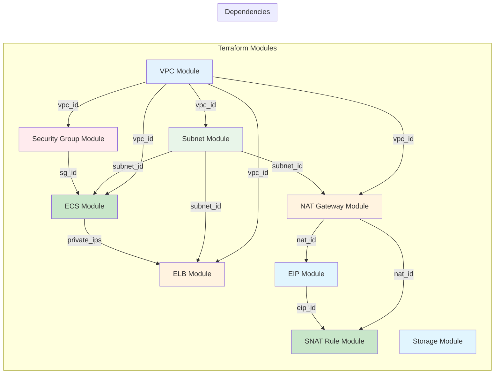
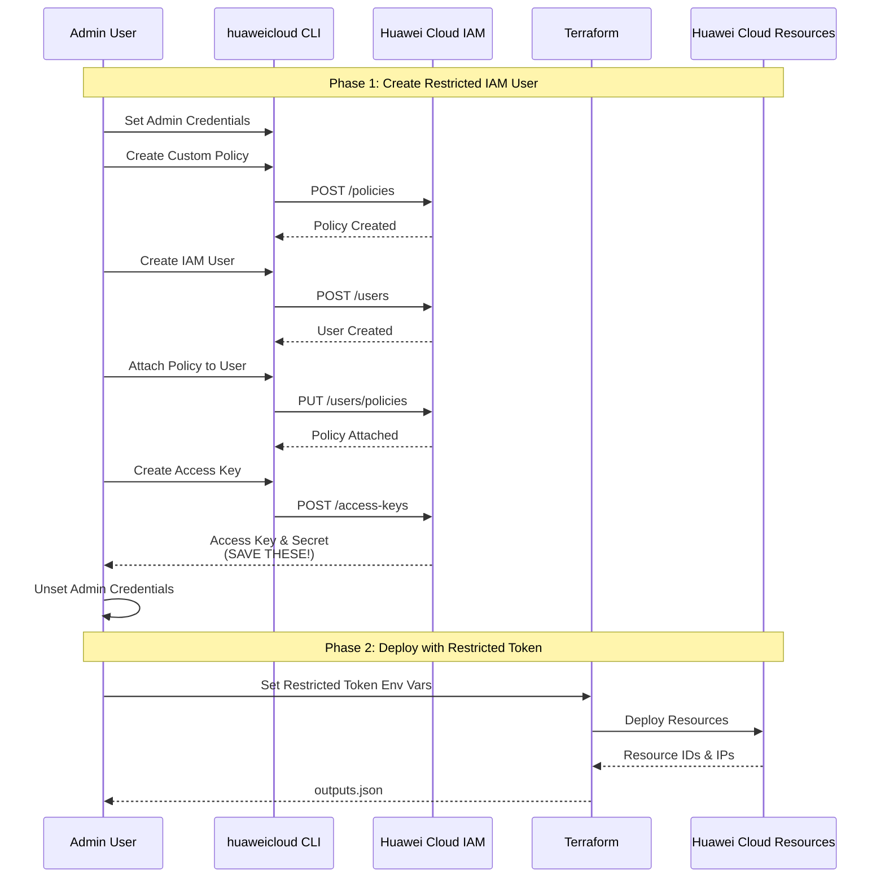
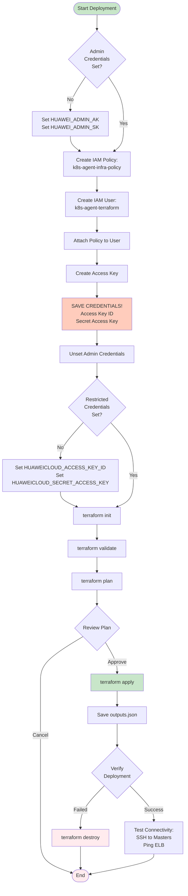

# Cloud Infrastructure Overview

## Overview

This document provides a high-level overview of the Huawei Cloud infrastructure provisioned in Phase 1 of the k8s-agent project, including deployment workflows and verification steps.

---

## Complete Infrastructure View

```mermaid
graph TB
    subgraph "Local Machine - Terraform Control"
        Admin[Admin Credentials<br/>AK/SK]
        CLI[huaweicloud CLI]

        subgraph "Step 1: IAM Security Setup"
            CreatePolicy[Create Custom Policy<br/>k8s-agent-infra-policy]
            CreateUser[Create IAM User<br/>k8s-agent-terraform]
            AttachPolicy[Attach Policy to User]
            CreateAK[Create Access Key<br/>Save Credentials!]
            UnsetAdmin[Unset Admin Credentials]
        end

        subgraph "Step 2: Terraform Deploy"
            TFVars[terraform.tfvars<br/>Environment Config]
            TFInit[terraform init]
            TFPlan[terraform plan]
            TFApply[terraform apply]
        end
    end

    subgraph "Huawei Cloud - cn-north-4"
        subgraph "Network Layer"
            VPC[VPC<br/>Name: k8s-agent-cluster-vpc<br/>CIDR: 10.20.0.0/16]

            subgraph "Subnets"
                SubnetDMZ[DMZ Subnet<br/>10.20.1.0/24<br/>Public-facing + NAT]
                SubnetApps[Apps Subnet<br/>10.20.2.0/24<br/>Applications + NAT]
                SubnetDevOps[DevOps Subnet<br/>10.20.3.0/24<br/>CI/CD + Public IPs]
                SubnetDB[Database Subnet<br/>10.20.4.0/24<br/>Databases & Caches]
                SubnetAudit[Audit Subnet<br/>10.20.5.0/24<br/>Audit Resources]
                SubnetDev[Dev Subnet<br/>10.20.6.0/24<br/>Dev/Test + Public IPs]
            end

            subgraph "NAT Gateways"
                NATDMZ[NAT Gateway DMZ<br/>20Mbps EIP]
                NATApps[NAT Gateway Apps<br/>200Mbps EIP]
            end

            subgraph "Security Group Rules"
                SG[Security Groups<br/>k8s-agent-cluster-sg]
                SG_SSH[SSH:22<br/>From: Configurable CIDR]
                SG_API[K8s API:6443<br/>From: VPC CIDR]
                SG_NodePort[NodePort:30000-32767<br/>From: 0.0.0.0/0]
                SG_Linkerd[Linkerd:4143<br/>From: VPC CIDR]
                SG_DevOps[DevOps Services<br/>MongoDB, Kafka, GitLab]
            end
        end

        subgraph "Compute Layer - ECS Instances by Subnet"
            subgraph "DMZ Subnet (3x Kong API Gateway)"
                DMZ1[Kong Gateway-1<br/>s6.large.4<br/>2 vCPU, 8GB RAM]
                DMZ2[Kong Gateway-2<br/>s6.large.4<br/>2 vCPU, 8GB RAM]
                DMZ3[Kong Gateway-3<br/>s6.large.4<br/>2 vCPU, 8GB RAM]
            end

            subgraph "Apps Subnet (1x Application Server)"
                Apps1[Application Server-1<br/>s6.large.4<br/>2 vCPU, 8GB RAM<br/>100GB System Disk]
            end

            subgraph "DevOps Subnet (4x: 3 K8s + 1 CI/CD)"
                K8sM1[K8s Master-1<br/>s6.xlarge.4<br/>4 vCPU, 16GB RAM]
                K8sM2[K8s Master-2<br/>s6.xlarge.4<br/>4 vCPU, 16GB RAM]
                K8sM3[K8s Master-3<br/>s6.xlarge.4<br/>4 vCPU, 16GB RAM]
                DevOps1[DevOps Server<br/>s6.large.4<br/>2 vCPU, 8GB RAM<br/>GitLab, Jenkins]
            end

            subgraph "Database Subnet (3x Databases)"
                DB1[Database-1<br/>s6.xlarge.4<br/>4 vCPU, 16GB RAM<br/>PostgreSQL/MySQL]
                DB2[Database-2<br/>s6.xlarge.4<br/>4 vCPU, 16GB RAM<br/>PostgreSQL/MySQL]
                DB3[Database-3<br/>s6.xlarge.4<br/>4 vCPU, 16GB RAM<br/>PostgreSQL/MySQL]
            end

            subgraph "Development Subnet (1x Dev Server)"
                Dev1[Dev Server<br/>s6.large.4<br/>2 vCPU, 8GB RAM<br/>Testing/Development]
            end

            UserData[cloud-init<br/>Install: curl, wget]
        end

        subgraph "Storage Layer"
            EVS1[(EVS Volume<br/>Attached to App-1<br/>100GB SAS)]
            EVS2[(EVS Volume<br/>Attached to K8sM-1<br/>100GB SAS)]
            EVS3[(EVS Volume<br/>Attached to K8sM-2<br/>100GB SAS)]
            EVS4[(EVS Volume<br/>Attached to K8sM-3<br/>100GB SAS)]
            EVS5[(EVS Volume<br/>Attached to DB-1<br/>200GB SAS)]
            EVS6[(EVS Volume<br/>Attached to DB-2<br/>200GB SAS)]
            EVS7[(EVS Volume<br/>Attached to DB-3<br/>200GB SAS)]
            EVS8[(EVS Volume<br/>Attached to DevOps-1<br/>100GB SAS)]
            EVS9[(EVS Volume<br/>Attached to Dev-1<br/>100GB SAS)]

            OBS[(OBS Bucket<br/>k8s-agent-prod-xxxx<br/>Lifecycle: 30d expiration)]
        end

        subgraph "Load Balancers (2x)"
            ELB_Kong[Kong API Gateway LB<br/>k8s-agent-kong-elb<br/>Port: 8000,8443]
            EIP_Kong[Public IP / EIP<br/>100Mbps]

            ELB_K8s[K8s API LB<br/>k8s-agent-k8s-elb<br/>Port: 6443]
            EIP_K8s[Public IP / EIP<br/>100Mbps]

            Pool_Kong[Kong Backend Pool<br/>Round Robin]
            Pool_K8s[K8s Backend Pool<br/>Round Robin]
        end
    end

    subgraph "Terraform State Management"
        TFState[(Terraform State<br/>Stored in OBS)]
        TFOutput[terraform output<br/>outputs.json]
    end

    Admin --> CreatePolicy
    CreatePolicy --> CreateUser
    CreateUser --> AttachPolicy
    AttachPolicy --> CreateAK
    CreateAK --> UnsetAdmin

    UnsetAdmin --> TFVars
    TFVars --> TFInit
    TFInit --> TFPlan
    TFPlan --> TFApply

    TFApply --> VPC
    TFApply --> SubnetDMZ
    TFApply --> SubnetApps
    TFApply --> SubnetDevOps
    TFApply --> SubnetDB
    TFApply --> SubnetAudit
    TFApply --> SubnetDev
    TFApply --> SG
    TFApply --> NATDMZ
    TFApply --> NATApps
    TFApply --> DMZ1
    TFApply --> DMZ2
    TFApply --> DMZ3
    TFApply --> Apps1
    TFApply --> K8sM1
    TFApply --> K8sM2
    TFApply --> K8sM3
    TFApply --> DevOps1
    TFApply --> DB1
    TFApply --> DB2
    TFApply --> DB3
    TFApply --> Dev1
    TFApply --> EVS1
    TFApply --> EVS2
    TFApply --> EVS3
    TFApply --> EVS4
    TFApply --> EVS5
    TFApply --> EVS6
    TFApply --> EVS7
    TFApply --> EVS8
    TFApply --> EVS9
    TFApply --> OBS
    TFApply --> ELB_Kong
    TFApply --> ELB_K8s

    VPC --> SubnetDMZ
    VPC --> SubnetApps
    VPC --> SubnetDevOps
    VPC --> SubnetDB
    VPC --> SubnetAudit
    VPC --> SubnetDev

    SubnetDMZ --> NATDMZ
    SubnetApps --> NATApps

    SubnetDMZ --> SG
    SubnetApps --> SG
    SubnetDevOps --> SG
    SubnetDB --> SG
    SubnetAudit --> SG
    SubnetDev --> SG

    SG --> SG_SSH
    SG --> SG_API
    SG --> SG_NodePort
    SG --> SG_Linkerd
    SG --> SG_DevOps

    SG --> DMZ1
    SG --> DMZ2
    SG --> DMZ3
    SG --> Apps1
    SG --> K8sM1
    SG --> K8sM2
    SG --> K8sM3
    SG --> DevOps1
    SG --> DB1
    SG --> DB2
    SG --> DB3
    SG --> Dev1

    DMZ1 --> UserData
    DMZ2 --> UserData
    DMZ3 --> UserData
    Apps1 --> UserData
    Apps1 --> EVS1
    K8sM1 --> UserData
    K8sM1 --> EVS2
    K8sM2 --> UserData
    K8sM2 --> EVS3
    K8sM3 --> UserData
    K8sM3 --> EVS4
    DevOps1 --> UserData
    DevOps1 --> EVS8
    DB1 --> UserData
    DB1 --> EVS5
    DB2 --> UserData
    DB2 --> EVS6
    DB3 --> UserData
    DB3 --> EVS7
    Dev1 --> UserData
    Dev1 --> EVS9

    SubnetDMZ --> ELB_Kong
    SubnetDevOps --> ELB_K8s

    DMZ1 --> Pool_Kong
    DMZ2 --> Pool_Kong
    DMZ3 --> Pool_Kong

    K8sM1 --> Pool_K8s
    K8sM2 --> Pool_K8s
    K8sM3 --> Pool_K8s

    ELB_Kong --> EIP_Kong
    ELB_Kong --> Pool_Kong

    ELB_K8s --> EIP_K8s
    ELB_K8s --> Pool_K8s

    TFApply --> TFState
    TFApply --> TFOutput

    style Admin fill:#ffccbc
    style CreatePolicy fill:#fff9c4
    style VPC fill:#e3f2fd
    style SubnetDMZ fill:#ffebee
    style SubnetApps fill:#c8e6c9
    style SubnetDevOps fill:#fff3e0
    style SubnetDB fill:#e1f5fe
    style SubnetAudit fill:#f3e5f5
    style SubnetDev fill:#fff9c4
    style SG fill:#ffebee
    style NATDMZ fill:#e1f5fe
    style NATApps fill:#c8e6c9
    style DMZ1 fill:#ffebee
    style DMZ2 fill:#ffebee
    style DMZ3 fill:#ffebee
    style Apps1 fill:#c8e6c9
    style K8sM1 fill:#c8e6c9
    style K8sM2 fill:#c8e6c9
    style K8sM3 fill:#c8e6c9
    style DevOps1 fill:#fff3e0
    style DB1 fill:#e1f5fe
    style DB2 fill:#e1f5fe
    style DB3 fill:#e1f5fe
    style Dev1 fill:#fff9c4
    style EVS1 fill:#e1f5fe
    style EVS2 fill:#e1f5fe
    style EVS3 fill:#e1f5fe
    style EVS4 fill:#e1f5fe
    style EVS5 fill:#e1f5fe
    style EVS6 fill:#e1f5fe
    style EVS7 fill:#e1f5fe
    style EVS8 fill:#e1f5fe
    style EVS9 fill:#e1f5fe
    style OBS fill:#f3e5f5
    style ELB_Kong fill:#fff3e0
    style ELB_K8s fill:#fff3e0
    style EIP_Kong fill:#ffccbc
    style EIP_K8s fill:#ffccbc
    style Pool_Kong fill:#e8f5e9
    style Pool_K8s fill:#e8f5e9
```

---

## Module Dependency Graph

---

## Security Flow Diagram

---

## Deployment Workflow

---

## Verification Steps

```mermaid
graph TB
    subgraph "Post-Deployment Verification"
        V1[1. Verify ECS Instances]
        V2[2. Verify VPC Configuration]
        V3[3. Verify Storage Provisioning]
        V4[4. Verify Load Balancer]
        V5[5. Test Connectivity]
    end

    subgraph "ECS Checks"
        ECS1A[ssh ubuntu@<public-ip>]
        ECS1B[Check: Instances Running]
        ECS1C[Check: cloud-init Complete]
    end

    subgraph "VPC Checks"
        VPC2A[huaweicloud vpc show <vpc-id>]
        VPC2B[Check: CIDR Correct]
        VPC2C[Check: Subnet Attached]
    end

    subgraph "Storage Checks"
        ST3A[huaweicloud evs volume show <volume-id>]
        ST3B[huaweicloud obs bucket list]
        ST3C[Check: EVS Attached]
        ST3D[Check: OBS Created]
    end

    subgraph "ELB Checks"
        ELB4A[huaweicloud elb show <elb-id>]
        ELB4B[Check: Backend Members]
        ELB4C[Check: Listener Active]
    end

    subgraph "Connectivity Tests"
        CONN5A[ping <master-ip>]
        CONN5B[curl -k https://<elb-address>:6443]
        CONN5C[Check: SSH Access]
        CONN5D[Check: API Reachable]
    end

    V1 --> ECS1A
    V1 --> ECS1B
    V1 --> ECS1C

    V2 --> VPC2A
    V2 --> VPC2B
    V2 --> VPC2C

    V3 --> ST3A
    V3 --> ST3B
    V3 --> ST3C
    V3 --> ST3D

    V4 --> ELB4A
    V4 --> ELB4B
    V4 --> ELB4C

    V5 --> CONN5A
    V5 --> CONN5B
    V5 --> CONN5C
    V5 --> CONN5D

    style V1 fill:#c8e6c9
    style V2 fill:#c8e6c9
    style V3 fill:#c8e6c9
    style V4 fill:#c8e6c9
    style V5 fill:#c8e6c9
```

---

## Related Documentation

- [Network Architecture Design](./02-network-architecture.md) - Network topology, NAT gateways, and security rules
- [Component Specifications](./03-component-specifications.md) - ECS instances, storage, load balancers, and resource allocation
