# Network Architecture Design

## Overview

This document describes the network architecture for the Huawei Cloud infrastructure, including VPC design, subnet allocation, NAT gateway configuration, and security rules.

---

## Network Architecture Diagram

```mermaid
graph TB
    Internet[Internet]

    %% Public IP Layer
    subgraph "Public IPs (EIP)"
        EIP_Kong[Kong LB EIP<br/>1.2.3.4:100Mbps]
        EIP_K8s[K8s API EIP<br/>1.2.3.5:100Mbps]
        EIP_NAT_DMZ[NAT DMZ EIP<br/>1.2.3.6:20Mbps]
        EIP_NAT_Apps[NAT Apps EIP<br/>1.2.3.7:200Mbps]
        EIP_Dev[Dev EIP<br/>1.2.3.8:100Mbps]
    end

    %% VPC
    subgraph "VPC 10.20.0.0/16"

        %% Load Balancers
        subgraph "Load Balancers"
            LB_Kong[Kong LB<br/>VIP:10.20.1.20<br/>Port:8000,8443]
            LB_K8s[K8s API LB<br/>VIP:10.20.3.20<br/>Port:6443]
        end

        %% NAT Gateways
        subgraph "NAT Gateways"
            NAT_DMZ[NAT DMZ<br/>10.20.1.2:20Mbps]
            NAT_Apps[NAT Apps<br/>10.20.2.2:200Mbps]
        end

        %% Subnets
        subgraph "DMZ Subnet (10.20.1.0/24) - 3x Kong"
            Kong1[Kong-1<br/>10.20.1.10<br/>s6.large.4]
            Kong2[Kong-2<br/>10.20.1.11<br/>s6.large.4]
            Kong3[Kong-3<br/>10.20.1.12<br/>s6.large.4]
        end

        subgraph "Apps Subnet (10.20.2.0/24) - 1x App"
            App1[Application Server<br/>10.20.2.10<br/>s6.large.4]
        end

        subgraph "DevOps Subnet (10.20.3.0/24) - 4x: 3 K8s + 1 CI/CD"
            K8sM1[K8s Master-1<br/>10.20.3.10<br/>s6.xlarge.4]
            K8sM2[K8s Master-2<br/>10.20.3.11<br/>s6.xlarge.4]
            K8sM3[K8s Master-3<br/>10.20.3.12<br/>s6.xlarge.4]
            DevOps[CI/CD & Tools<br/>10.20.3.30<br/>s6.large.4]
        end

        subgraph "DB Subnet (10.20.4.0/24) - 3x DB"
            DB1[Database-1<br/>10.20.4.10]
            DB2[Database-2<br/>10.20.4.11]
            DB3[Database-3<br/>10.20.4.12]
        end

        subgraph "Audit Subnet (10.20.5.0/24)"
            Audit[Audit Resources]
        end

        subgraph "Dev Subnet (10.20.6.0/24) - 1x Dev"
            Dev[Dev Server<br/>10.20.6.10<br/>s6.large.4]
        end
    end

    %% Security Rules Group
    subgraph "Security Rules"
        subgraph "VPC Level"
            VPC_SSH[SSH:22]
            VPC_ICMP[ICMP]
        end

        subgraph "Subnet Level"
            DMZ_HTTP[HTTP:80/443]
            K8s_API[K8s API:6443]
            K8s_NP[NodePort:30000-32767]
        end

        subgraph "Instance Level"
            DevOps_MongoDB[MongoDB:27017]
            DevOps_Kafka[Kafka:9092-9094]
            DB_Port[DB:5432,3306]
        end
    end

    %% Internet Flow
    Internet --> EIP_Kong --> LB_Kong
    Internet --> EIP_K8s --> LB_K8s
    Internet --> EIP_Dev --> Dev

    %% LB Backends
    LB_Kong --> Kong1
    LB_Kong --> Kong2
    LB_Kong --> Kong3
    LB_Kong -.-> App1
    LB_Kong -.-> Dev

    LB_K8s --> K8sM1
    LB_K8s --> K8sM2
    LB_K8s --> K8sM3

    %% East-West Traffic
    Kong1 --> App1
    Kong2 --> App1
    Kong3 --> App1
    App1 --> DB1
    App1 --> DB2
    App1 --> DB3
    K8sM1 --> DB1
    K8sM1 --> DB2
    K8sM1 --> DB3
    K8sM2 --> DB1
    K8sM2 --> DB2
    K8sM2 --> DB3
    K8sM3 --> DB1
    K8sM3 --> DB2
    K8sM3 --> DB3
    DevOps --> K8sM1
    DevOps --> K8sM2
    DevOps --> K8sM3

    %% Outbound to Internet
    Kong1 --> NAT_DMZ --> EIP_NAT_DMZ
    Kong2 --> NAT_DMZ --> EIP_NAT_DMZ
    Kong3 --> NAT_DMZ --> EIP_NAT_DMZ
    App1 --> NAT_Apps --> EIP_NAT_Apps

    %% Security Rules Applied
    VPC_SSH --> App1
    VPC_SSH --> Kong1
    VPC_SSH --> Kong2
    VPC_SSH --> Kong3
    VPC_SSH --> K8sM1
    VPC_SSH --> K8sM2
    VPC_SSH --> K8sM3
    VPC_SSH --> DevOps
    VPC_SSH --> DB1
    VPC_SSH --> DB2
    VPC_SSH --> DB3
    VPC_SSH --> Dev

    VPC_ICMP --> App1
    VPC_ICMP --> Kong1
    VPC_ICMP --> Kong2
    VPC_ICMP --> Kong3
    VPC_ICMP --> K8sM1
    VPC_ICMP --> K8sM2
    VPC_ICMP --> K8sM3
    VPC_ICMP --> DevOps
    VPC_ICMP --> DB1
    VPC_ICMP --> DB2
    VPC_ICMP --> DB3
    VPC_ICMP --> Dev

    DMZ_HTTP --> Kong1
    DMZ_HTTP --> Kong2
    DMZ_HTTP --> Kong3

    K8s_API --> K8sM1
    K8s_API --> K8sM2
    K8s_API --> K8sM3

    K8s_NP --> K8sM1
    K8s_NP --> K8sM2
    K8s_NP --> K8sM3

    DevOps_MongoDB --> DevOps
    DevOps_Kafka --> DevOps

    DB_Port --> DB1
    DB_Port --> DB2
    DB_Port --> DB3

    %% Styles
    style Internet fill:#e3f2fd
    style EIP_Kong fill:#ffccbc
    style EIP_K8s fill:#ffccbc
    style EIP_NAT_DMZ fill:#ffccbc
    style EIP_NAT_Apps fill:#ffccbc
    style EIP_Dev fill:#ffccbc
    style LB_Kong fill:#fff3e0
    style LB_K8s fill:#fff3e0
    style NAT_DMZ fill:#e1f5fe
    style NAT_Apps fill:#e1f5fe
    style Kong1 fill:#ffebee
    style Kong2 fill:#ffebee
    style Kong3 fill:#ffebee
    style App1 fill:#c8e6c9
    style K8sM1 fill:#c8e6c9
    style K8sM2 fill:#c8e6c9
    style K8sM3 fill:#c8e6c9
    style DevOps fill:#fff3e0
    style DB1 fill:#e1f5fe
    style DB2 fill:#e1f5fe
    style DB3 fill:#e1f5fe
    style Dev fill:#fff9c4
    style VPC_SSH fill:#ffebee
    style VPC_ICMP fill:#ffebee
    style DMZ_HTTP fill:#fff9c4
    style K8s_API fill:#fff9c4
    style K8s_NP fill:#fff9c4
    style DevOps_MongoDB fill:#c8e6c9
    style DevOps_Kafka fill:#c8e6c9
    style DB_Port fill:#c8e6c9
```

---

## NAT Gateway and Public IP Architecture

The infrastructure uses a hybrid approach for internet access:

### Subnet Internet Access Strategy

| Subnet | Access Method | Bandwidth | Use Case |
|--------|---------------|-----------|----------|
| **DMZ** | NAT Gateway | 20Mbps | Controlled outbound for public-facing resources |
| **Apps** | NAT Gateway | 200Mbps | High-bandwidth outbound for production workloads |
| **DevOps** | Public IPs | Per-resource | Direct access for GitLab, MongoDB, Kafka |
| **Database** | Private | None | Isolated, no direct internet access |
| **Audit** | Private | None | Isolated, no direct internet access |
| **Development** | Public IPs | Flexible | Flexible access for development/testing |

### NAT Gateway Benefits

- **Static Public IPs**: Easy whitelisting in external services
- **Cost Control**: Pay-by-traffic billing
- **Security**: Private subnets remain isolated
- **Simplified Management**: Single EIP per subnet for all outbound traffic

### Public IP Benefits

- **Direct Access**: DevOps services accessible without DNAT
- **Flexibility**: Custom security rules per service
- **Development**: Easy testing and debugging
- **Security**: Fine-grained security group control

### DevOps Service Access

Common DevOps services exposed with public IPs:

| Service | Port | Protocol | Access Control |
|---------|------|----------|----------------|
| GitLab SSH | 22 | TCP | Key-based authentication |
| GitLab HTTP | 80 | TCP | Open with authentication |
| GitLab HTTPS | 443 | TCP | Open with authentication |
| MongoDB | 27017 | TCP | Restricted to known IPs |
| Kafka | 9092-9094 | TCP | Restricted to known IPs |
| Jenkins | 8080 | TCP | Open with authentication |
| Grafana | 3000 | TCP | Open with authentication |

---

## Subnet Configuration

### VPC Configuration

| Parameter | Value |
|-----------|-------|
| **VPC Name** | k8s-agent-cluster-vpc |
| **VPC CIDR** | 10.20.0.0/16 |
| **Region** | cn-north-4 |
| **Availability Zones** | cn-north-4a |

### Subnet Allocation

| Subnet | CIDR | Gateway | Purpose | Internet Access |
|--------|------|---------|---------|-----------------|
| **DMZ** | 10.20.1.0/24 | 10.20.1.1 | Kong API Gateway | NAT Gateway + Public LB |
| **Apps** | 10.20.2.0/24 | 10.20.2.1 | Application Server | NAT Gateway |
| **DevOps** | 10.20.3.0/24 | 10.20.3.1 | K8s Masters + CI/CD | Direct Public IPs |
| **Database** | 10.20.4.0/24 | 10.20.4.1 | Database Clusters | Private (no internet) |
| **Audit** | 10.20.5.0/24 | 10.20.5.1 | Audit Logging | Private (no internet) |
| **Development** | 10.20.6.0/24 | 10.20.6.1 | Dev/Test Server | Direct Public IP |

---

## Security Group Rules

### Hierarchy

Security rules are applied at three levels:

1. **VPC Level**: Base rules applied to all instances
2. **Subnet Level**: Rules specific to subnet function
3. **Instance Level**: Service-specific rules

### VPC Level Rules

| Rule | Port | Source | Description |
|------|------|--------|-------------|
| SSH | 22 | Configurable CIDR | Administrative access |
| ICMP | - | VPC CIDR | Network connectivity testing |

### Subnet Level Rules

| Subnet | Rule | Port | Source | Description |
|--------|------|------|--------|-------------|
| DMZ | HTTP | 80, 443 | 0.0.0.0/0 | Public web traffic |
| DevOps | K8s API | 6443 | VPC CIDR | Kubernetes API access |
| DevOps | NodePort | 30000-32767 | 0.0.0.0/0 | Kubernetes services |

### Instance Level Rules

| Instance | Service | Port | Source | Description |
|----------|---------|------|--------|-------------|
| DevOps | MongoDB | 27017 | Known IPs | Database access |
| DevOps | Kafka | 9092-9094 | Known IPs | Message broker |
| Database | PostgreSQL | 5432 | VPC CIDR | Database access |
| Database | MySQL | 3306 | VPC CIDR | Database access |

---

## Traffic Flow Summary

| Source | Destination | Path | EIP Used |
|--------|-------------|------|----------|
| Internet | Kong API | Internet → EIP_Kong → Kong LB → Kong Gateways | 1.2.3.4 |
| Internet | K8s API | Internet → EIP_K8s → K8s LB → K8s Masters | 1.2.3.5 |
| Internet | Dev Server | Internet → EIP_Dev ↔ Dev Server (direct) | 1.2.3.8 |
| Kong Gateway | Apps Backend | Kong LB → App1 (internal routing) | - |
| Kong Gateway | Dev Server | Kong LB → Dev1 (optional, for testing) | - |
| Apps Server | Internet | App1 → NAT Apps → EIP_NAT_Apps | 1.2.3.7 |
| Kong Gateways | Internet | Kong1/2/3 → NAT DMZ → EIP_NAT_DMZ | 1.2.3.6 |

---

## EIP Allocation Summary

| EIP | Type | Resource | Purpose |
|-----|------|----------|---------|
| **1.2.3.4** | LB EIP | Kong LB (10.20.1.20) | API Gateway public access |
| **1.2.3.5** | LB EIP | K8s API LB (10.20.3.20) | Kubernetes API public access |
| **1.2.3.6** | NAT EIP | NAT DMZ (10.20.1.2) | DMZ subnet outbound internet |
| **1.2.3.7** | NAT EIP | NAT Apps (10.20.2.2) | Apps subnet outbound internet |
| **1.2.3.8** | Direct EIP | Dev Server (10.20.6.10) | Dev Server direct public access |

### Access URLs

- Kong API Gateway: `http://1.2.3.4:8000` (HTTP), `https://1.2.3.4:8443` (HTTPS)
- Kubernetes API: `https://1.2.3.5:6443`
- Dev Server: `ssh ubuntu@1.2.3.8` (SSH), `http://1.2.3.8:8080` (HTTP, if exposed)

---

## Related Documentation

- [Infrastructure Overview](./01-infrastructure-overview.md) - High-level architecture and deployment
- [Component Specifications](./03-component-specifications.md) - ECS instances, storage, and load balancers
