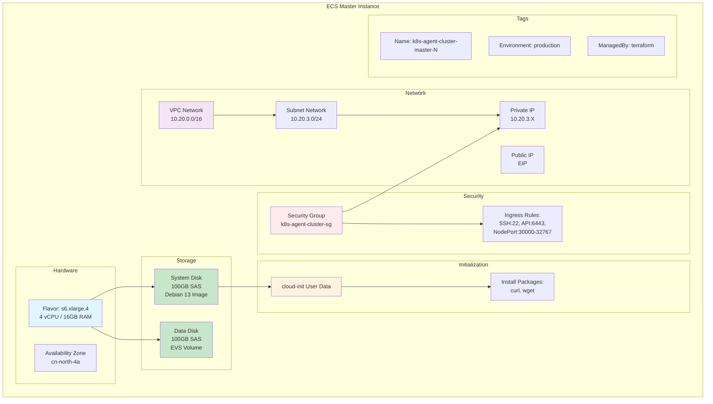
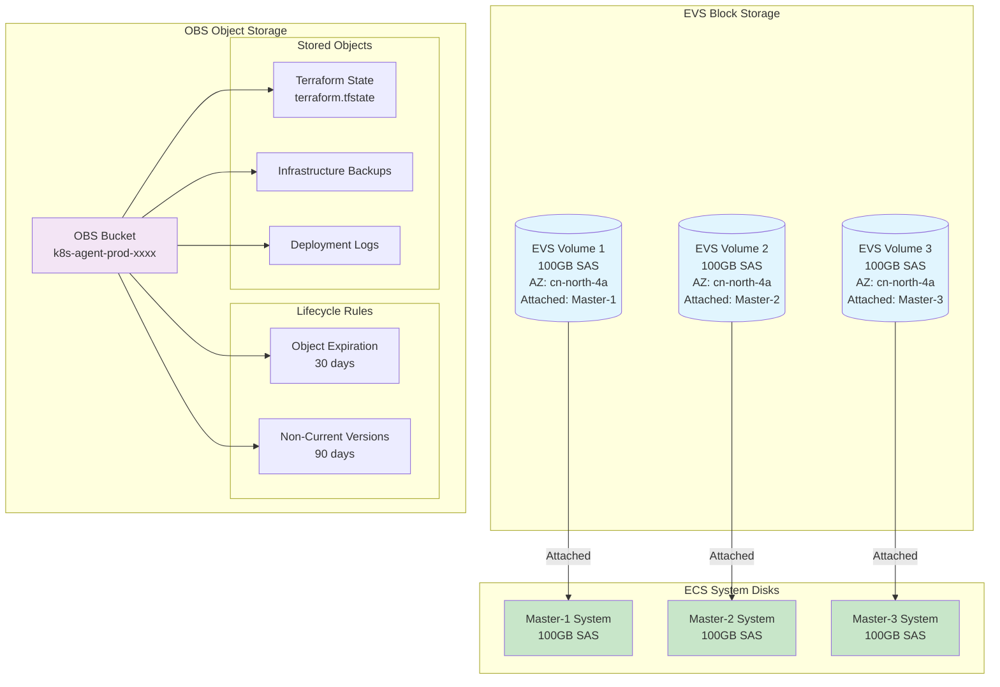
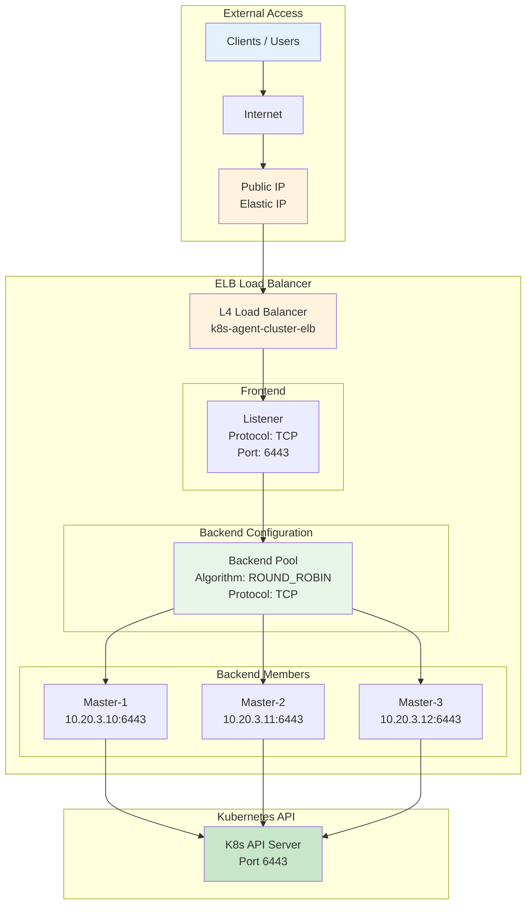
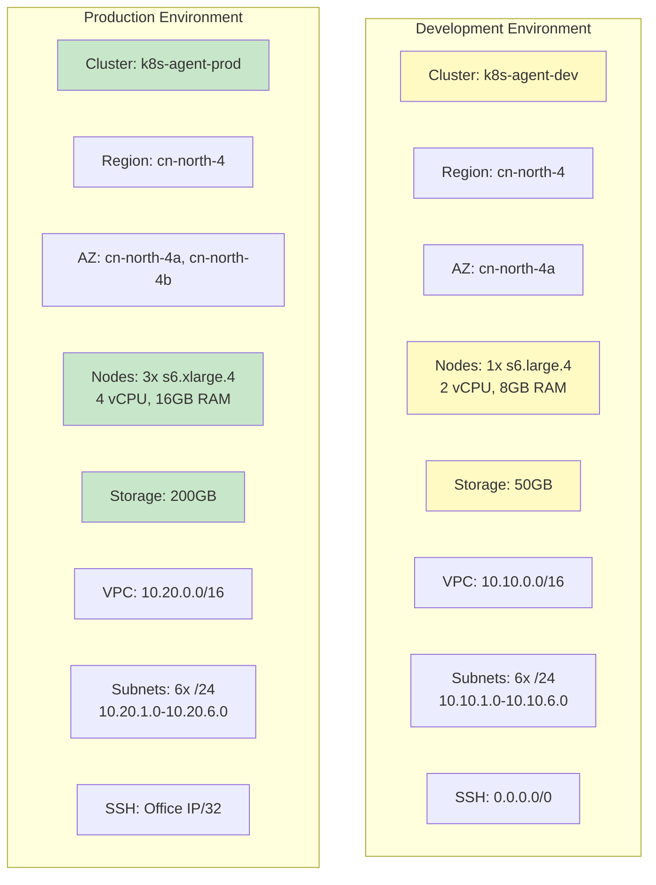

# Component Specifications

## Overview

This document provides detailed specifications for all infrastructure components including ECS instances, storage, load balancers, and resource allocation.

---

## ECS Instance Detail



---

## Storage Architecture



---

## Load Balancer Configuration



---

## ECS Instance Allocation by Subnet

### Overview

The infrastructure allocates ECS instances across subnets based on their purpose and availability requirements:

| Subnet | Purpose | Instance Count | Instance Type | Network Access |
|--------|---------|----------------|---------------|----------------|
| **DMZ** | Kong API Gateway | 3 | s6.large.4 | Public IP + NAT Gateway + Dedicated LB |
| **Apps** | Application Server | 1 | s6.large.4 (dev) / s6.xlarge.4 (prod) | NAT Gateway |
| **DevOps** | K8s Masters + CI/CD | 4 | 3x s6.xlarge.4 (K8s) + 1x s6.large.4 (CI/CD) | Public IP (direct) + Dedicated LB for K8s |
| **Database** | Database Clusters | 3 | s6.large.4 (dev) / s6.xlarge.4 (prod) | Private (no internet) |
| **Development** | Dev/Test Server | 1 | s6.large.4 | Public IP (direct) |
| **Audit** | Audit Logging | 0 | - | Reserved for future |

### DMZ Subnet (3x Kong API Gateway + Dedicated LB)

```
Purpose: API Gateway and ingress routing
Instances: 3x s6.large.4 (2 vCPU, 8GB RAM, 100GB SAS)
Network: 10.20.1.0/24
Load Balancer: Kong LB (Port 8000, 8443)
Access: Public IP with security group controls
```

**Why 3 instances?**
- High availability for API gateway
- Dedicated load balancer distributes traffic across all 3
- Can handle failures without service disruption
- Kong provides API management, authentication, and rate limiting

### Apps Subnet (1x Application Server)

```
Purpose: Application workloads
Instances: 1x s6.large.4 (2 vCPU, 8GB RAM, 100GB SAS)
Network: 10.20.2.0/24
Access: NAT Gateway for outbound internet
```

**Why 1 instance?**
- Application server for business workloads
- Can scale horizontally by adding more instances
- NAT Gateway provides secure outbound access
- Isolated from K8s control plane

### DevOps Subnet (4x: 3 K8s Masters + 1 CI/CD Server + K8s LB)

```
Purpose: Kubernetes control plane + CI/CD tools
Instances:
  - 3x K8s Masters: s6.xlarge.4 (4 vCPU, 16GB RAM, 100GB SAS each)
  - 1x CI/CD Server: s6.large.4 (2 vCPU, 8GB RAM, 100GB SAS)
Network: 10.20.3.0/24
Load Balancer: K8s API LB (Port 6443)
Access: Public IP (direct) with security group controls
```

**Why 4 instances?**
- **3 K8s Masters**: High availability control plane (quorum-based etcd)
  - Automatic failover if master fails
  - Distributed API server load
  - etcd clustering for data redundancy
- **1 CI/CD Server**: Consolidates DevOps tools (GitLab, Jenkins)
  - Public IP allows external Git access
  - Security groups restrict access to specific ports

### Database Subnet (3x Database Replicas)

```
Purpose: PostgreSQL/MySQL with replication
Instances: 3x s6.xlarge.4 (4 vCPU, 16GB RAM, 200GB SAS each)
Network: 10.20.4.0/24
Access: Private (no direct internet access)
```

**Why 3 instances?**
- Database replication for high availability
- Automatic failover if primary fails
- Distributed read operations
- Isolated subnet for security (no internet access)

### Development Subnet (1x Dev Server)

```
Purpose: Development and testing
Instances: 1x s6.large.4 (2 vCPU, 8GB RAM, 100GB SAS)
Network: 10.20.6.0/24
Access: Public IP with flexible security
```

**Why 1 instance?**
- Dedicated server for development/testing
- Public IP for easy remote access
- Flexible security rules for experimentation
- Isolated from production resources

### Audit Subnet (0 instances - Reserved)

```
Purpose: Audit logging and monitoring (future)
Instances: 0 (reserved for future)
Network: 10.20.5.0/24
Access: TBD
```

---

## IP Address Allocation

| Subnet | Gateway | Instance IPs | Load Balancer |
|--------|---------|--------------|---------------|
| DMZ (10.20.1.0/24) | 10.20.1.1 | 10.20.1.10, 10.20.1.11, 10.20.1.12 (Kong) | 10.20.1.20 (Kong LB) |
| Apps (10.20.2.0/24) | 10.20.2.1 | 10.20.2.10 (App Server) | - |
| DevOps (10.20.3.0/24) | 10.20.3.1 | 10.20.3.10-12 (K8s Masters), 10.20.3.30 (CI/CD) | 10.20.3.20 (K8s API LB) |
| Database (10.20.4.0/24) | 10.20.4.1 | 10.20.4.10, 10.20.4.11, 10.20.4.12 (DB) | - |
| Audit (10.20.5.0/24) | 10.20.5.1 | (reserved) | - |
| Development (10.20.6.0/24) | 10.20.6.1 | 10.20.6.10 (Dev Server) | - |

---

## Load Balancer Configuration

| Load Balancer | Subnet | VIP IP | Public EIP | Backend Port | Backend Instances |
|---------------|--------|--------|-----------|--------------|-------------------|
| **Kong LB** | DMZ (10.20.1.0/24) | 10.20.1.20 | 1.2.3.4 (100Mbps) | 8000, 8443 | Kong Gateway-1,2,3 (10.20.1.10-12) |
| **K8s API LB** | DevOps (10.20.3.0/24) | 10.20.3.20 | 1.2.3.5 (100Mbps) | 6443 | K8s Master-1,2,3 (10.20.3.10-12) |

---

## NAT Gateway Configuration

| NAT Gateway | Subnet | Internal IP | Public EIP | Bandwidth | Serves Subnets |
|-------------|--------|-------------|-----------|-----------|----------------|
| **NAT DMZ** | DMZ (10.20.1.0/24) | 10.20.1.2 | 1.2.3.6 (20Mbps) | 20Mbps | DMZ (Kong Gateways) |
| **NAT Apps** | Apps (10.20.2.0/24) | 10.20.2.2 | 1.2.3.7 (200Mbps) | 200Mbps | Apps (Application Server) |

---

## Environment Configuration Comparison



| Parameter | Development | Production |
|-----------|-------------|------------|
| **Cluster Name** | k8s-agent-dev | k8s-agent-prod |
| **Region** | cn-north-4 | cn-north-4 |
| **Availability Zones** | cn-north-4a | cn-north-4a, cn-north-4b |
| **Instance Count** | 1 | 3 |
| **Instance Type** | s6.large.4 (2 vCPU, 8GB) | s6.xlarge.4 (4 vCPU, 16GB) |
| **System Disk** | 100GB SAS | 100GB SAS |
| **Data Disk** | 50GB SAS | 200GB SAS |
| **VPC CIDR** | 10.10.0.0/16 | 10.20.0.0/16 |
| **DMZ Subnet** | 10.10.1.0/24 (public-facing) | 10.20.1.0/24 (public-facing) |
| **Apps Subnet** | 10.10.2.0/24 (applications) | 10.20.2.0/24 (applications) |
| **DevOps Subnet** | 10.10.3.0/24 (CI/CD) | 10.20.3.0/24 (CI/CD) |
| **Database Subnet** | 10.10.4.0/24 (databases) | 10.20.4.0/24 (databases) |
| **Audit Subnet** | 10.10.5.0/24 (audit) | 10.20.5.0/24 (audit) |
| **Dev Subnet** | 10.10.6.0/24 (dev/test) | 10.20.6.0/24 (dev/test) |
| **SSH Access** | 0.0.0.0/0 | Office IP/32 |

---

## Resource Summary

### Development Environment

| Resource Type | Quantity | Specifications |
|---------------|----------|----------------|
| **VPC** | 1 | 10.10.0.0/16 |
| **Subnets** | 6 | DMZ, Apps, DevOps, Database, Audit, Dev (each /24) |
| **NAT Gateways** | 2 | DMZ (300Mbps), Apps (300Mbps) |
| **Security Groups** | 2 | Cluster SG, DevOps SG (MongoDB, Kafka, GitLab) |
| **ECS Instances** | 11 | Total across all subnets (see breakdown) |
| **ELB** | 2 | Kong LB (DMZ), K8s API LB (DevOps) |
| **OBS Bucket** | 1 | Globally unique name |

**ECS Instance Allocation by Subnet:**

| Subnet | Instance Count | Type | Specifications | Purpose |
|--------|----------------|------|----------------|---------|
| **DMZ** | 3 | s6.large.4 | 2 vCPU, 8GB RAM, 100GB SAS each | Kong API Gateway (3x HA) |
| **Apps** | 2 | s6.large.4 | 2 vCPU, 8GB RAM, 50GB SAS | Application Server |
| **DevOps** | 4 | 3x s6.xlarge.4 + 1x s6.large.4 | K8s: 4 vCPU, 16GB RAM; CI/CD: 2 vCPU, 8GB RAM | 3x K8s Masters + 1x CI/CD |
| **Database** | 3 | s6.large.4 | 2 vCPU, 8GB RAM, 100GB SAS each | PostgreSQL/MySQL (3x replication) |
| **Development** | 2 | s6.large.4 | 2 vCPU, 8GB RAM, 50GB SAS | Development/testing server |
| **Audit** | 0 | - | - | (No instances, reserved for future) |

**Total Resources**: 26 vCPU, 104GB RAM, 1.05TB storage

### Production Environment

| Resource Type | Quantity | Specifications |
|---------------|----------|----------------|
| **VPC** | 1 | 10.20.0.0/16 |
| **Subnets** | 6 | DMZ, Apps, DevOps, Database, Audit, Dev (each /24) |
| **NAT Gateways** | 2 | DMZ (20Mbps), Apps (200Mbps) |
| **Security Groups** | 2 | Cluster SG, DevOps SG (MongoDB, Kafka, GitLab) |
| **ECS Instances** | 11 | Total across all subnets (see breakdown) |
| **ELB** | 2 | Kong LB (DMZ), K8s API LB (DevOps) |
| **OBS Bucket** | 1 | Globally unique name |

**ECS Instance Allocation by Subnet:**

| Subnet | Instance Count | Type | Specifications | Purpose |
|--------|----------------|------|----------------|---------|
| **DMZ** | 3 | s6.large.4 | 2 vCPU, 8GB RAM, 100GB SAS each | Kong API Gateway (3x HA) |
| **Apps** | 1 | s6.xlarge.4 | 4 vCPU, 16GB RAM, 100GB SAS | Application Server (production grade) |
| **DevOps** | 4 | 3x s6.xlarge.4 + 1x s6.large.4 | K8s: 4 vCPU, 16GB RAM; CI/CD: 2 vCPU, 8GB RAM | 3x K8s Masters + 1x CI/CD |
| **Database** | 3 | s6.xlarge.4 | 4 vCPU, 16GB RAM, 200GB SAS each | PostgreSQL/MySQL (3x replication) |
| **Development** | 1 | s6.large.4 | 2 vCPU, 8GB RAM, 100GB SAS | Development/testing server |
| **Audit** | 0 | - | - | (No instances, reserved for future) |

**Total Resources**: 44 vCPU, 176GB RAM, 1.5TB storage

---

## Related Documentation

- [Infrastructure Overview](./01-infrastructure-overview.md) - High-level architecture and deployment
- [Network Architecture Design](./02-network-architecture.md) - Network topology, NAT gateways, and security rules
