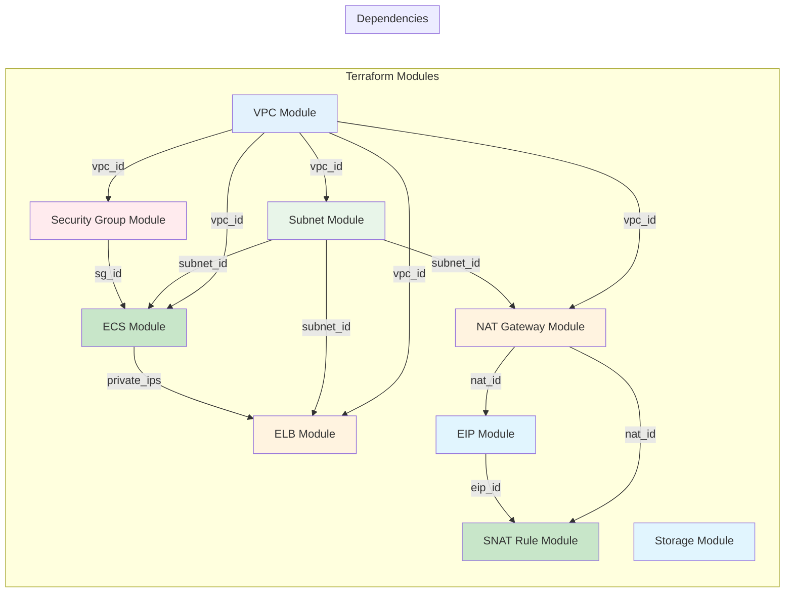
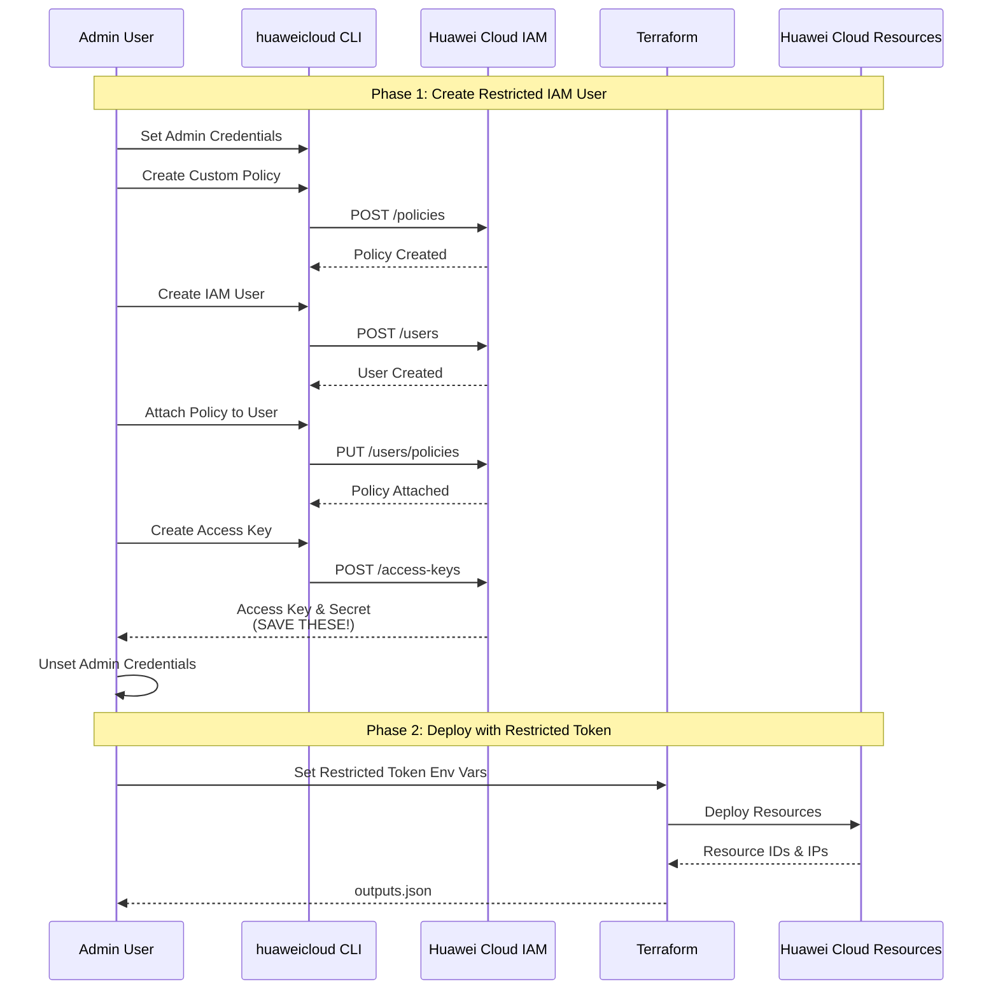
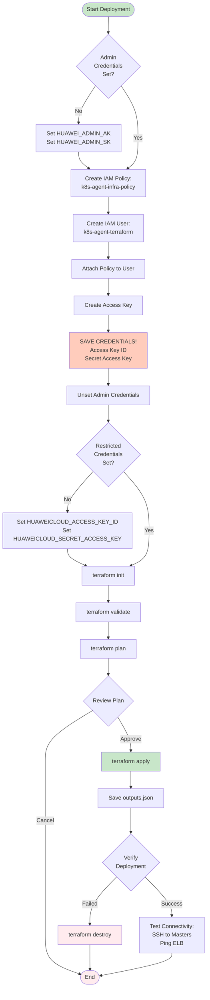

# Cloud Infrastructure Overview

## Overview

This document provides a high-level overview of the Huawei Cloud infrastructure provisioned in Phase 1 of the k8s-agent project, including deployment workflows and verification steps.

---

## Complete Infrastructure View

```mermaid
graph TB
    subgraph "Local Machine - Terraform Control"
        Admin[Admin Credentials (AK/SK)]
        CLI[huaweicloud CLI]

        subgraph "Step 1: IAM Security Setup"
            CreatePolicy[Create Custom Policy (k8s-agent-infra-policy)]
            CreateUser[Create IAM User (k8s-agent-terraform)]
            AttachPolicy[Attach Policy to User]
            CreateAK[Create Access Key (Save Credentials!)]
            UnsetAdmin[Unset Admin Credentials]
        end

        subgraph "Step 2: Terraform Deploy"
            TFVars[terraform.tfvars (Environment Config)]
            TFInit[terraform init]
            TFPlan[terraform plan]
            TFApply[terraform apply]
        end
    end

    subgraph "Huawei Cloud - ap-southeast-3"
        subgraph "Network Layer"
            VPC[VPC - Name: k8s-agent-cluster-vpc (CIDR: 10.x.0.0/16)]

            subgraph "Subnets"
                SubnetDMZ[DMZ Subnet 10.x.0.0/22 - Public-facing]
                SubnetExternal[External-Access Subnet 10.x.4.0/24 - Partner + DB Proxies]
                SubnetInternal[Internal-Shared Subnet 10.x.8.0/22 - Shared resources + NAT]
                SubnetDevOps[DevOps-Only Subnet 10.x.12.0/22 - CI/CD + NAT]
                SubnetDev[Development-Only Subnet 10.x.16.0/22 - Dev/Test + NAT]
                SubnetBusiness[Business-Only Subnet 10.x.20.0/22 - Business apps + NAT]
                SubnetDB[Database-Private Subnet 10.x.24.0/22 - Limited egress]
                SubnetSecurity[Security-Private Subnet 10.x.28.0/24 - Limited egress]
            end

            subgraph "NAT Gateway"
                NATGateway[Single NAT Gateway - Internal-Shared Subnet - 200Mbps EIP]
            end

            subgraph "Security Group Rules"
                SG[Security Groups - k8s-agent-cluster-sg]
                SG_SSH[SSH:22 - From: Configurable CIDR]
                SG_API[K8s API:6443 - From: VPC CIDR]
                SG_NodePort[NodePort:30000-32767 - From: 0.0.0.0/0]
                SG_Linkerd[Linkerd:4143 - From: VPC CIDR]
                SG_DevOps[DevOps Services (MongoDB, Kafka, GitLab)]
            end
        end

        subgraph "Compute Layer - ECS Instances by Subnet"
            subgraph "DMZ Subnet (Public-facing resources)"
                DMZ1[Kong Gateway-1 - s6.large.4 (2 vCPU, 8GB RAM)]
                DMZ2[Kong Gateway-2 - s6.large.4 (2 vCPU, 8GB RAM)]
                DMZ3[Kong Gateway-3 - s6.large.4 (2 vCPU, 8GB RAM)]
            end

            subgraph "External-Access Subnet (Partner + DB Proxies)"
                Partner1[Partner Service-1 - s6.large.4 (2 vCPU, 8GB RAM)]
                KafkaProxy[Kafka Proxy - s6.large.4 (2 vCPU, 8GB RAM)]
                MongoProxy[MongoDB Proxy - s6.large.4 (2 vCPU, 8GB RAM)]
                PGProxy[PostgreSQL Proxy - s6.large.4 (2 vCPU, 8GB RAM)]
                ESProxy[Elasticsearch Proxy - s6.large.4 (2 vCPU, 8GB RAM)]
            end

            subgraph "Internal-Shared Subnet (Shared resources)"
                K8sM1[K8s Master-1 - s6.xlarge.4 (4 vCPU, 16GB RAM)]
                K8sM2[K8s Master-2 - s6.xlarge.4 (4 vCPU, 16GB RAM)]
                K8sM3[K8s Master-3 - s6.xlarge.4 (4 vCPU, 16GB RAM)]
                Loki[Loki Logging - s6.large.4 (2 vCPU, 8GB RAM)]
                Prometheus[Prometheus Monitoring - s6.large.4 (2 vCPU, 8GB RAM)]
                GitLab[GitLab - s6.large.4 (2 vCPU, 8GB RAM)]
            end

            subgraph "DevOps-Only Subnet (DevOps resources)"
                CI[CI/CD Servers - s6.large.4 (2 vCPU, 8GB RAM)]
                Build[Build Agents - s6.large.4 (2 vCPU, 8GB RAM)]
            end

            subgraph "Development-Only Subnet (Development resources)"
                Test[Test Environments - s6.large.4 (2 vCPU, 8GB RAM)]
                DevServers[Dev Servers - s6.large.4 (2 vCPU, 8GB RAM)]
            end

            subgraph "Business-Only Subnet (Business resources)"
                ERP[ERP Systems - s6.large.4 (2 vCPU, 8GB RAM)]
                BusinessApps[Business Applications - s6.large.4 (2 vCPU, 8GB RAM)]
            end

            subgraph "Database-Private Subnet (Database resources)"
                SelfHostedPG[Self-Hosted PostgreSQL - s6.xlarge.4 (4 vCPU, 16GB RAM)]
                CloudPG[Cloud PostgreSQL/RDS - s6.xlarge.4 (4 vCPU, 16GB RAM)]
                Cache[Caches - s6.large.4 (2 vCPU, 8GB RAM)]
            end

            subgraph "Security-Private Subnet (Security resources)"
                Vault[Vault - s6.large.4 (2 vCPU, 8GB RAM)]
                IDS[Intrusion Detection - s6.large.4 (2 vCPU, 8GB RAM)]
            end

            UserData[cloud-init - Install: curl, wget]
        end

        subgraph "Storage Layer"
            EVS1[(EVS Volume - Attached to App-1 (100GB SAS))]
            EVS2[(EVS Volume - Attached to K8sM-1 (100GB SAS))]
            EVS3[(EVS Volume - Attached to K8sM-2 (100GB SAS))]
            EVS4[(EVS Volume - Attached to K8sM-3 (100GB SAS))]
            EVS5[(EVS Volume - Attached to DB-1 (200GB SAS))]
            EVS6[(EVS Volume - Attached to DB-2 (200GB SAS))]
            EVS7[(EVS Volume - Attached to DB-3 (200GB SAS))]
            EVS8[(EVS Volume - Attached to DevOps-1 (100GB SAS))]
            EVS9[(EVS Volume - Attached to Dev-1 (100GB SAS))]

            OBS[(OBS Bucket - k8s-agent-prod-xxxx (Lifecycle: 30d expiration))]
        end

        subgraph "Load Balancers"
            ELB_Kong[Kong API Gateway LB - DMZ - Port: 8000,8443]
            EIP_Kong[Public IP / EIP (100Mbps)]

            ELB_Proxy[DB Proxy LBs - External-Access - Ports: 9092,27017,5432,9200]
            EIP_Proxy[Public IP / EIP (100Mbps)]

            ELB_K8s[K8s API LB - Internal-Shared - Port: 6443]
            EIP_K8s[Public IP / EIP (100Mbps)]

            Pool_Kong[Kong Backend Pool (Round Robin)]
            Pool_Proxy[Proxy Backend Pool (Round Robin)]
            Pool_K8s[K8s Backend Pool (Round Robin)]
        end
    end

    subgraph "Terraform State Management"
        TFState[(Terraform State - Stored in OBS)]
        TFOutput[terraform output (outputs.json)]
    end

    Admin --> CLI
    CLI --> CreatePolicy
    CreatePolicy --> CreateUser
    CreateUser --> AttachPolicy
    AttachPolicy --> CreateAK
    CreateAK --> UnsetAdmin
    UnsetAdmin --> TFVars
    TFVars --> TFInit
    TFInit --> TFPlan
    TFPlan --> TFApply
    TFApply --> VPC
    VPC --> NATGateway
    NATGateway --> DMZ1
    NATGateway --> DMZ2
    NATGateway --> DMZ3
    NATGateway --> KafkaProxy
    NATGateway --> MongoProxy
    NATGateway --> PGProxy
    NATGateway --> ESProxy
    NATGateway --> Partner1
    NATGateway --> K8sM1
    NATGateway --> K8sM2
    NATGateway --> K8sM3
    NATGateway --> Loki
    NATGateway --> Prometheus
    NATGateway --> GitLab
    NATGateway --> CI
    NATGateway --> Build
    NATGateway --> Test
    NATGateway --> DevServers
    NATGateway --> ERP
    NATGateway --> BusinessApps
    NATGateway --> SelfHostedPG
    NATGateway --> CloudPG
    NATGateway --> Cache
    NATGateway --> Vault
    NATGateway --> IDS

    DMZ1 --> EVS1
    K8sM1 --> EVS2
    K8sM2 --> EVS3
    K8sM3 --> EVS4
    SelfHostedPG --> EVS5
    CloudPG --> EVS6
    Cache --> EVS7
    CI --> EVS8
    Test --> EVS9

    EVS1 --> OBS
    ELB_Kong --> EIP_Kong
    ELB_Proxy --> EIP_Proxy
    ELB_K8s --> EIP_K8s
    ELB_Kong --> Pool_Kong
    ELB_Proxy --> Pool_Proxy
    ELB_K8s --> Pool_K8s

    Pool_Kong --> DMZ1
    Pool_Kong --> DMZ2
    Pool_Kong --> DMZ3

    Pool_Proxy --> KafkaProxy
    Pool_Proxy --> MongoProxy
    Pool_Proxy --> PGProxy
    Pool_Proxy --> ESProxy

    Pool_K8s --> K8sM1
    Pool_K8s --> K8sM2
    Pool_K8s --> K8sM3

    TFState --> TFOutput

    style Admin fill:#ffccbc
    style CreatePolicy fill:#fff9c4
    style VPC fill:#e3f2fd
    style SubnetDMZ fill:#ffebee
    style SubnetApps fill:#c8e6c9
    style SubnetDevOps fill:#fff3e0
    style SubnetDB fill:#e1f5fe
    style SubnetAudit fill:#f3e5f5
    style SubnetDev fill:#fff9c4
    style SG fill:#ffebee
    style NATDMZ fill:#e1f5fe
    style NATApps fill:#c8e6c9
    style DMZ1 fill:#ffebee
    style DMZ2 fill:#ffebee
    style DMZ3 fill:#ffebee
    style Apps1 fill:#c8e6c9
    style K8sM1 fill:#c8e6c9
    style K8sM2 fill:#c8e6c9
    style K8sM3 fill:#c8e6c9
    style DevOps1 fill:#fff3e0
    style DB1 fill:#e1f5fe
    style DB2 fill:#e1f5fe
    style DB3 fill:#e1f5fe
    style Dev1 fill:#fff9c4
    style EVS1 fill:#e1f5fe
    style EVS2 fill:#e1f5fe
    style EVS3 fill:#e1f5fe
    style EVS4 fill:#e1f5fe
    style EVS5 fill:#e1f5fe
    style EVS6 fill:#e1f5fe
    style EVS7 fill:#e1f5fe
    style EVS8 fill:#e1f5fe
    style EVS9 fill:#e1f5fe
    style OBS fill:#f3e5f5
    style ELB_Kong fill:#fff3e0
    style ELB_Proxy fill:#fff3e0
    style ELB_K8s fill:#fff3e0
    style EIP_Kong fill:#ffccbc
    style EIP_Proxy fill:#ffccbc
    style EIP_K8s fill:#ffccbc
    style Pool_Kong fill:#e8f5e9
    style Pool_Proxy fill:#e8f5e9
    style Pool_K8s fill:#e8f5e9
```

---

## Module Dependency Graph



---

## Security Flow Diagram



---

## Deployment Workflow



---

## Verification Steps

```mermaid
graph TB
    subgraph "Post-Deployment Verification"
        V1[1. Verify ECS Instances]
        V2[2. Verify VPC Configuration]
        V3[3. Verify Storage Provisioning]
        V4[4. Verify Load Balancer]
        V5[5. Test Connectivity]
    end

    subgraph "ECS Checks"
        ECS1A[ssh ubuntu@<public-ip>]
        ECS1B[Check: Instances Running]
        ECS1C[Check: cloud-init Complete]
    end

    subgraph "VPC Checks"
        VPC2A[huaweicloud vpc show <vpc-id>]
        VPC2B[Check: CIDR Correct]
        VPC2C[Check: Subnet Attached]
    end

    subgraph "Storage Checks"
        ST3A[huaweicloud evs volume show <volume-id>]
        ST3B[huaweicloud obs bucket list]
        ST3C[Check: EVS Attached]
        ST3D[Check: OBS Created]
    end

    subgraph "ELB Checks"
        ELB4A[huaweicloud elb show <elb-id>]
        ELB4B[Check: Backend Members]
        ELB4C[Check: Listener Active]
    end

    subgraph "Connectivity Tests"
        CONN5A[ping <master-ip>]
        CONN5B[curl -k https://<elb-address>:6443]
        CONN5C[Check: SSH Access]
        CONN5D[Check: API Reachable]
    end

    V1 --> ECS1A
    V1 --> ECS1B
    V1 --> ECS1C

    V2 --> VPC2A
    V2 --> VPC2B
    V2 --> VPC2C

    V3 --> ST3A
    V3 --> ST3B
    V3 --> ST3C
    V3 --> ST3D

    V4 --> ELB4A
    V4 --> ELB4B
    V4 --> ELB4C

    V5 --> CONN5A
    V5 --> CONN5B
    V5 --> CONN5C
    V5 --> CONN5D

    style V1 fill:#c8e6c9
    style V2 fill:#c8e6c9
    style V3 fill:#c8e6c9
    style V4 fill:#c8e6c9
    style V5 fill:#c8e6c9
```



---

## Related Documentation

- [Network Architecture Design](./02-network-architecture.md) - Network topology, NAT gateways, and security rules
- [Component Specifications](./03-component-specifications.md) - ECS instances, storage, load balancers, and resource allocation
