# Network Architecture Design

## Overview

This document describes the network architecture for the Huawei Cloud infrastructure, including VPC design, subnet allocation, NAT gateway configuration, and security rules.

---

## Network Architecture Diagram

```mermaid
graph TD
    internet[Internet]

    subgraph vpc[VPC ap-southeast-3]
        pgw[Public Network Gateway]

        %% Public Route Table (used by DMZ and External-Access subnets)
        subgraph public-rt[Public Route Table]
            subgraph dmz-subnet[DMZ Subnet 10.x.0.0/22]
                web[Web Servers]
                public-lb[Public Load Balancer EIP]
            end

            subgraph external-subnet[External-Access Subnet 10.x.4.0/24]
                partner[Partner-Facing Services]
                kafka-proxy[Kafka Proxy]
                mongo-proxy[MongoDB Proxy]
                pg-proxy[PostgreSQL Proxy]
                es-proxy[Elasticsearch Proxy]
            end
        end

        %% Private-Egress Route Table (all subnets requiring NAT egress)
        subgraph private-egress-rt[Private-Egress Route Table]
            subgraph internal-shared-subnet[Internal-Shared Subnet 10.x.8.0/22]
                internal-lb[Internal Load Balancer]
                loki[Loki Logging]
                prometheus[Prometheus Monitoring]
                gitlab[GitLab]
                nat[NAT Gateway EIP]
            end

            subgraph devops-subnet[DevOps-Only Subnet 10.x.12.0/22]
                ci[CI/CD Servers]
                build[Build Agents]
            end

            subgraph dev-subnet[Development-Only Subnet 10.x.16.0/22]
                test[Test Environments]
                devservers[Dev Servers]
            end

            subgraph business-subnet[Business-Only Subnet 10.x.20.0/22]
                erp[ERP Systems]
                business-apps[Business Applications]
            end

            subgraph database-subnet[Database-Private Subnet 10.x.24.0/22]
                self-hosted-pg[Self-Hosted PostgreSQL]
                cloud-pg[Cloud PostgreSQL/RDS]
                cache[Caches]
            end

            subgraph security-subnet[Security-Private Subnet 10.x.28.0/24]
                vault[Vault]
                ids[Intrusion Detection]
            end
        end
    end

    %% Internet ingress to public-facing subnets
    internet --> pgw
    pgw --> dmz-subnet
    pgw --> external-subnet

    %% All private subnets egress via single NAT Gateway
    internal-shared-subnet -.->|SNAT| nat
    devops-subnet -.->|SNAT| nat
    dev-subnet -.->|SNAT| nat
    business-subnet -.->|SNAT| nat
    database-subnet -.->|limited egress| nat
    security-subnet -.->|limited egress| nat
    nat --> internet

    %% Load Balancer traffic flows
    public-lb --> web
    public-lb --> kafka-proxy
    public-lb --> mongo-proxy
    public-lb --> pg-proxy
    public-lb --> es-proxy

    internal-lb --> loki
    internal-lb --> prometheus
    internal-lb --> gitlab

    %% Style definitions
    class vpc vpc-style
    class public-rt,private-egress-rt route-table-style
    class dmz-subnet,external-subnet public-subnet-style
    class internal-shared-subnet internal-shared-style
    class devops-subnet,dev-subnet,business-subnet team-subnet-style
    class database-subnet,security-subnet private-subnet-style
    class public-lb,internal-lb load-balancer-style
    class web,kafka-proxy,mongo-proxy,pg-proxy,es-proxy,partner,loki,prometheus,gitlab,ci,build,test,devservers,erp,business-apps,self-hosted-pg,cloud-pg,cache,vault,ids resource-style
    class pgw,nat gateway-style

    classDef vpc-style fill:#f0f8ff,stroke:#1e90ff,stroke-width:2px
    classDef route-table-style fill:#fff5ee,stroke:#ff8c00,stroke-width:1px
    classDef public-subnet-style fill:#ffcccc,stroke:#ff0000
    classDef internal-shared-style fill:#ccffcc,stroke:#00ff00
    classDef team-subnet-style fill:#ffffcc,stroke:#ffcc00
    classDef private-subnet-style fill:#ccccff,stroke:#0000ff
    classDef resource-style fill:#e8f4f8,stroke:#3498db
    classDef load-balancer-style fill:#a8d8ea,stroke:#0094c6,stroke-width:2px
    classDef gateway-style fill:#ffffff,stroke:#333333,stroke-width:2px,stroke-dasharray:5,5
```

---

## NAT Gateway and Public IP Architecture

The infrastructure uses a hybrid approach for internet access:

### Subnet Internet Access Strategy

| Subnet | Access Method | Bandwidth | Use Case |
|--------|---------------|-----------|----------|
| **DMZ** | Public Network Gateway | - | Public-facing resources with direct internet access |
| **External-Access** | Public Network Gateway | - | Resources accessible from external partners or vendors, DB proxies |
| **Internal-Shared** | NAT Gateway (Medium) | 200Mbps | Shared resources requiring outbound internet access |
| **DevOps-Only** | NAT Gateway (Medium) | 200Mbps | DevOps resources requiring outbound internet access |
| **Development-Only** | NAT Gateway (Medium) | 200Mbps | Development resources requiring outbound internet access |
| **Business-Only** | NAT Gateway (Medium) | 200Mbps | Business/Operations resources requiring outbound internet access |
| **Database-Private** | NAT Gateway (Limited) | 200Mbps | Limited egress for package updates, NTP only |
| **Security-Private** | NAT Gateway (Limited) | 200Mbps | Limited egress for package updates, NTP only |

### NAT Gateway Configuration

**Single NAT Gateway** in Internal-Shared subnet serves all private subnets via SNAT rules.

### NAT Gateway Benefits

- **Static Public IPs**: Easy whitelisting in external services
- **Cost Control**: Single NAT gateway reduces costs, pay-by-traffic billing
- **Security**: Private subnets remain isolated, limited egress for sensitive subnets
- **Simplified Management**: Single EIP per NAT gateway for all associated subnets
- **SNAT Rules**: Different SNAT rules for different subnet groups enable traffic tracking

### Public IP Benefits

- **Direct Access**: Public-facing services accessible without DNAT
- **Flexibility**: Custom security rules per service
- **Development**: Easy testing and debugging
- **Security**: Fine-grained security group control

---

## Subnet Configuration

### VPC Configuration

| Parameter | Value |
|-----------|-------|
| **VPC Name** | k8s-agent-cluster-vpc |
| **VPC CIDR** | 10.x.0.0/16 |
| **Region** | ap-southeast-3 |
| **Availability Zones** | ap-southeast-3a, ap-southeast-3b |

### Subnet Allocation

| Subnet | CIDR | Gateway | Purpose | Internet Access |
|--------|------|---------|---------|-----------------|
| **DMZ** | 10.x.0.0/22 | 10.x.0.1 | Public-facing resources accessible from internet | Public Network Gateway + Public LB |
| **External-Access** | 10.x.4.0/24 | 10.x.4.1 | Resources accessible from external partners, DB proxies | Public Network Gateway |
| **Internal-Shared** | 10.x.8.0/22 | 10.x.8.1 | Resources shared across all internal teams | NAT Gateway |
| **DevOps-Only** | 10.x.12.0/22 | 10.x.12.1 | DevOps team exclusive resources | NAT Gateway |
| **Development-Only** | 10.x.16.0/22 | 10.x.16.1 | Development team exclusive resources | NAT Gateway |
| **Business-Only** | 10.x.20.0/22 | 10.x.20.1 | Business/Operations team exclusive resources | NAT Gateway |
| **Database-Private** | 10.x.24.0/22 | 10.x.24.1 | Database resources with restricted access | NAT Gateway (limited egress) |
| **Security-Private** | 10.x.28.0/24 | 10.x.28.1 | Security-critical resources with minimal access | NAT Gateway (limited egress) |

---

## Security Group Rules

### Workload-Based Security Groups

Security groups are organized by workload type rather than hierarchy:

| Security Group | Purpose | Example Inbound Rules |
|----------------|---------|----------------------|
| **sg-web-servers** | Public-facing web servers | 80, 443 from 0.0.0.0/0 |
| **sg-api-gateway** | Kong/API services | 8000, 8443 from 0.0.0.0/0 |
| **sg-db-proxies** | Database proxy services | 9092, 27017, 5432, 9200 from whitelisted IPs |
| **sg-databases** | Database instances | 5432, 6379 from app security groups |
| **sg-monitoring** | Loki, Prometheus | 3100, 9090 from VPC CIDR |
| **sg-devops** | CI/CD, Build agents | 22 from bastion, 8080 internal |
| **sg-security** | Vault, IDS | 8200 from restricted CIDR |

### Base Rules (All Security Groups)

| Rule | Port | Source | Description |
|------|------|--------|-------------|
| SSH | 22 | Configurable CIDR (e.g., office IP range) | Administrative access |
| ICMP | All | VPC CIDR (10.x.0.0/16) | Network connectivity testing |

### Limited Egress Rules (Database-Private, Security-Private)

For sensitive subnets, outbound security group rules restrict egress:

| Destination | Port | Purpose |
|-------------|------|---------|
| Package repositories (apt.example.com, pypi.org) | 80, 443 | System updates |
| NTP servers (time.huaweicloud.com) | 123 | Time synchronization |
| Cloud API endpoints (*.myhuaweicloud.com) | 443 | Cloud service access |
| **All other 0.0.0.0/0** | **Deny** | No unrestricted egress |

---

## Traffic Flow Summary

| Source | Destination | Path | EIP Used |
|--------|-------------|------|----------|
| Internet | Public Services | Internet → Public Network Gateway → DMZ Subnet → Public Load Balancers → Services | EIP (per LB) |
| Internet | Partner Services | Internet → Public Network Gateway → External-Access Subnet → Partner Services | EIP (per service) |
| Internal Services | Internet | Internal Resources → NAT Gateway → EIP | NAT Gateway EIP |
| DMZ Services | Internal Services | DMZ → Internal-Shared Subnet → Internal Services | - |
| Team Resources | Shared Resources | Team Subnets → Internal-Shared Subnet → Shared Resources | - |
| All Resources | Database | Any Subnet → Database-Private Subnet → Databases | - |

---

## Load Balancer Configuration

### Public Load Balancers (DMZ Subnet)

| Load Balancer | Type | VIP | EIP | Ports | Backend |
|---------------|------|-----|-----|-------|---------|
| Kong API Gateway | TCP | - | - | 8000, 8443 | Kong instances |

### External Load Balancers (External-Access Subnet)

| Load Balancer | Type | VIP | EIP | Ports | Backend |
|---------------|------|-----|-----|-------|---------|
| Kafka Proxy | TCP | - | - | 9092 | Kafka cluster |
| MongoDB Proxy | TCP | - | - | 27017 | MongoDB cluster |
| PostgreSQL Proxy | TCP | - | - | 5432 | PostgreSQL cluster |
| Elasticsearch Proxy | TCP | - | - | 9200 | Elasticsearch cluster |

### Internal Load Balancers (Internal-Shared Subnet)

| Load Balancer | Type | VIP | EIP | Ports | Backend |
|---------------|------|-----|-----|-------|---------|
| K8s API | TCP | - | - | 6443 | Kubernetes masters |
| Internal Services | HTTP/HTTPS | - | - | 80, 443 | Internal applications |

---

## Route Table Configuration

### Route Table Grouping

| Route Table | Subnet Associations | Default Route | Purpose |
|-------------|---------------------|---------------|---------|
| **Public** | DMZ, External-Access | Public Network Gateway | Internet-facing subnets |
| **Private-Egress** | Internal-Shared, DevOps-Only, Development-Only, Business-Only, Database-Private, Security-Private | NAT Gateway | All private subnets with NAT egress |

### SNAT Rules Configuration

| SNAT Rule | Source CIDR | EIP | Purpose |
|-----------|-------------|-----|---------|
| Internal-Shared | 10.x.8.0/22 | EIP-NAT | Shared services egress |
| Team Subnets | 10.x.12.0/22, 10.x.16.0/22, 10.x.20.0/22 | EIP-NAT | Team resources egress |
| Private Limited | 10.x.24.0/22, 10.x.28.0/24 | EIP-NAT | Package updates, NTP only |

**Note:** Database-Private and Security-Private subnets use the same NAT gateway and SNAT rules, but security group outbound rules restrict traffic to specific destinations only.

---

## Related Documentation

- [Infrastructure Overview](./01-infrastructure-overview.md) - High-level architecture and deployment
- [Component Specifications](./03-component-specifications.md) - ECS instances, storage, and load balancers
