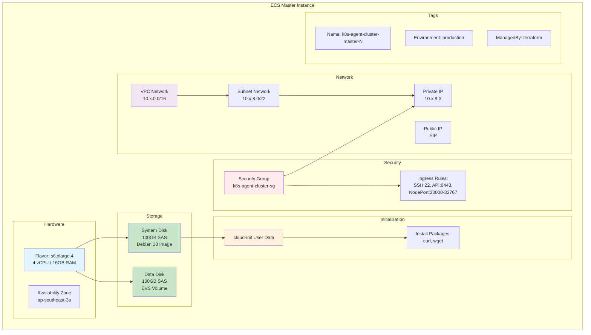
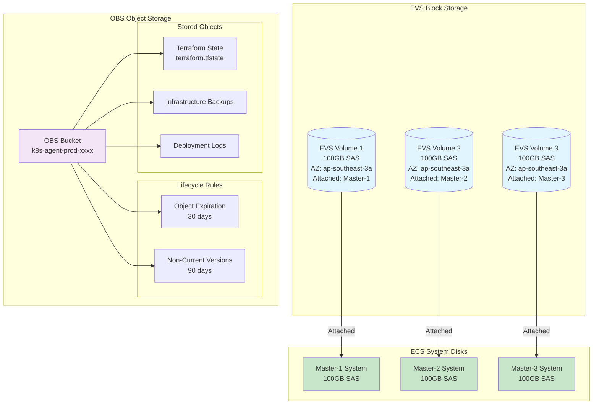
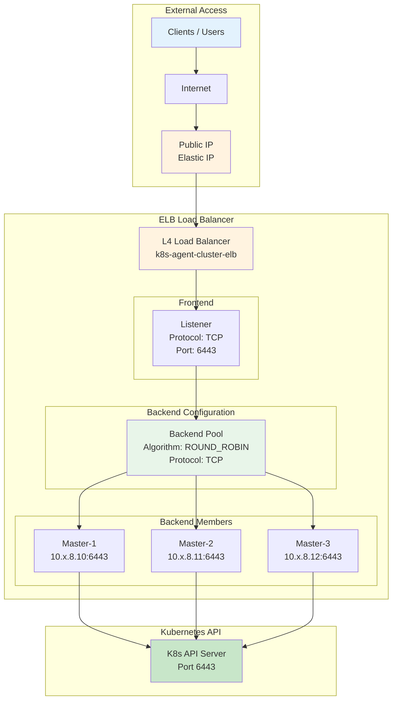
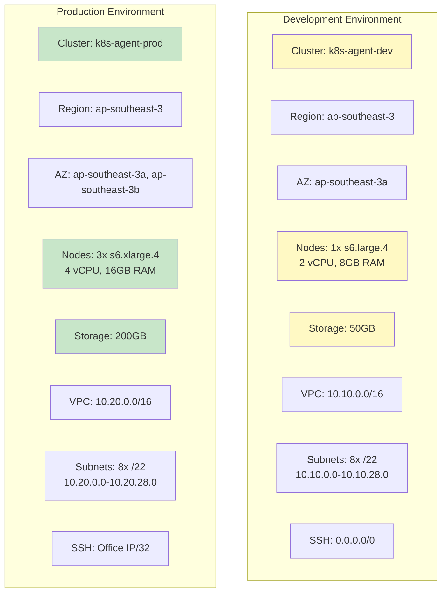

# Component Specifications

## Overview

This document provides detailed specifications for all infrastructure components including ECS instances, storage, load balancers, and resource allocation.

---

## ECS Instance Detail



---

## Storage Architecture



---

## Load Balancer Configuration



---

## ECS Instance Allocation by Subnet

### Overview

The infrastructure allocates ECS instances across subnets based on their purpose and availability requirements:

| Subnet | Purpose | Instance Count | Instance Type | Network Access |
|--------|---------|----------------|---------------|----------------|
| **DMZ** | Kong API Gateway | 3 | 3x s6.large.4 (Kong) | Public IP + Dedicated LB |
| **External-Access** | Partner-facing services + DB Proxies | 5 | 1x s6.large.4 (Partner) + 4x s6.large.4 (Proxies) | Public IP |
| **Internal-Shared** | K8s Masters + Shared services | 6 | 3x s6.xlarge.4 (K8s) + 3x s6.large.4 (Loki, Prometheus, GitLab) | NAT Gateway + Dedicated LB for K8s |
| **DevOps-Only** | CI/CD + Build agents | 2 | 1x s6.large.4 (CI/CD) + 1x s6.large.4 (Build) | NAT Gateway |
| **Development-Only** | Dev/Test servers | 2 | 1x s6.large.4 (Test) + 1x s6.large.4 (Dev) | NAT Gateway |
| **Business-Only** | Business applications | 2 | 1x s6.large.4 (ERP) + 1x s6.large.4 (Business Apps) | NAT Gateway |
| **Database-Private** | Database clusters | 3 | 3x s6.xlarge.4 (PostgreSQL/RDS + Caches) | NAT Gateway (limited egress) |
| **Security-Private** | Security resources | 2 | 1x s6.large.4 (Vault) + 1x s6.large.4 (IDS) | NAT Gateway (limited egress) |

### DMZ Subnet (3x Kong + Dedicated LB)

```
Purpose: API Gateway and ingress routing
Instances: 3x s6.large.4 (2 vCPU, 8GB RAM, 100GB SAS) for Kong
Network: 10.x.0.0/22
Load Balancer: Kong LB (Port 8000, 8443)
Access: Public IP with security group controls
```

**Why 3 instances?**
- High availability for API gateway (3 Kong instances)
- Load balancer distributes traffic across all instances
- Can handle failures without service disruption
- Kong provides API management, authentication, and rate limiting

### External-Access Subnet (5x: 1 Partner + 4 Proxies)

```
Purpose: Partner-facing services and database proxies
Instances: 1x s6.large.4 (2 vCPU, 8GB RAM, 100GB SAS) for partner services
           4x s6.large.4 (2 vCPU, 8GB RAM, 100GB SAS) for proxies (Kafka, MongoDB, PostgreSQL, Elasticsearch)
Network: 10.x.4.0/24
Load Balancer: Proxy LBs (Ports 9092, 27017, 5432, 9200)
Access: Public IP with security group controls (whitelisted IPs)
```

**Why 5 instances?**
- Dedicated server for partner-facing services
- Database proxies for external access to internal services (Kafka, MongoDB, PostgreSQL, Elasticsearch)
- Isolated subnet for security and compliance with IP whitelisting
- Public IP for direct partner and proxy access
- Can scale horizontally by adding more instances

### Internal-Shared Subnet (6x: 3 K8s Masters + 3 Shared Services + K8s LB)

```
Purpose: Kubernetes control plane + shared services
Instances:
  - 3x K8s Masters: s6.xlarge.4 (4 vCPU, 16GB RAM, 100GB SAS each)
  - 1x Loki Logging: s6.large.4 (2 vCPU, 8GB RAM, 100GB SAS)
  - 1x Prometheus Monitoring: s6.large.4 (2 vCPU, 8GB RAM, 100GB SAS)
  - 1x GitLab: s6.large.4 (2 vCPU, 8GB RAM, 100GB SAS)
Network: 10.x.8.0/22
Load Balancer: K8s API LB (Port 6443), Internal Services LB (Ports 80, 443)
Access: NAT Gateway for outbound internet
```

**Why 6 instances?**
- **3 K8s Masters**: High availability control plane (quorum-based etcd)
  - Automatic failover if master fails
  - Distributed API server load
  - etcd clustering for data redundancy
- **3 Shared Services**: Loki (logging), Prometheus (monitoring), GitLab (version control)
  - Shared across all internal teams
  - Internal load balancer provides access to all teams
  - NAT Gateway provides secure outbound access

### DevOps-Only Subnet (2x: CI/CD + Build Agents)

```
Purpose: DevOps team exclusive resources
Instances:
  - 1x CI/CD Server: s6.large.4 (2 vCPU, 8GB RAM, 100GB SAS)
  - 1x Build Agents: s6.large.4 (2 vCPU, 8GB RAM, 100GB SAS)
Network: 10.x.12.0/22
Access: NAT Gateway for outbound internet
```

**Why 2 instances?**
- Dedicated CI/CD server for DevOps processes
- Build agents for continuous integration
- Isolated subnet for DevOps team resources
- Security groups restrict access to DevOps team only

### Development-Only Subnet (2x: Test + Dev Servers)

```
Purpose: Development team exclusive resources
Instances:
  - 1x Test Environments: s6.large.4 (2 vCPU, 8GB RAM, 100GB SAS)
  - 1x Dev Servers: s6.large.4 (2 vCPU, 8GB RAM, 100GB SAS)
Network: 10.x.16.0/22
Access: NAT Gateway for outbound internet
```

**Why 2 instances?**
- Dedicated test environments for development
- Dev servers for coding and debugging
- Isolated subnet for development team resources
- Security groups restrict access to Development team only

### Business-Only Subnet (2x: ERP + Business Apps)

```
Purpose: Business/Operations team exclusive resources
Instances:
  - 1x ERP Systems: s6.large.4 (2 vCPU, 8GB RAM, 100GB SAS)
  - 1x Business Applications: s6.large.4 (2 vCPU, 8GB RAM, 100GB SAS)
Network: 10.x.20.0/22
Access: NAT Gateway for outbound internet
```

**Why 2 instances?**
- Dedicated ERP system for business operations
- Business applications for daily operations
- Isolated subnet for Business team resources
- Security groups restrict access to Business team only

### Database-Private Subnet (3x: Databases + Caches)

```
Purpose: Database resources with restricted access
Instances:
  - 1x Self-Hosted PostgreSQL: s6.xlarge.4 (4 vCPU, 16GB RAM, 200GB SAS)
  - 1x Cloud PostgreSQL/RDS: s6.xlarge.4 (4 vCPU, 16GB RAM, 200GB SAS)
  - 1x Caches: s6.large.4 (2 vCPU, 8GB RAM, 100GB SAS)
Network: 10.x.24.0/22
Access: NAT Gateway (limited egress - package updates, NTP only)
```

**Why 3 instances?**
- Database replication for high availability
- Cloud PostgreSQL/RDS for managed database service
- Caches for performance optimization
- Limited egress via NAT for essential updates only
- Security group outbound rules restrict to specific destinations

### Security-Private Subnet (2x: Vault + IDS)

```
Purpose: Security-critical resources with minimal access
Instances:
  - 1x Vault: s6.large.4 (2 vCPU, 8GB RAM, 100GB SAS)
  - 1x Intrusion Detection: s6.large.4 (2 vCPU, 8GB RAM, 100GB SAS)
Network: 10.x.28.0/24
Access: NAT Gateway (limited egress - package updates, NTP only)
```

**Why 2 instances?**
- Vault for secret management
- Intrusion Detection System (IDS) for security monitoring
- Limited egress via NAT for essential updates only
- Security group outbound rules restrict to specific destinations
- Security groups restrict inbound access to security team only

---

## IP Address Allocation

IP addresses are dynamically assigned by the cloud service and managed by Kubernetes internal DNS for service discovery. Predefined IP ranges are not specified.

---

## Load Balancer Configuration

| Load Balancer | Subnet | VIP IP | Public EIP | Backend Port | Backend Instances |
|---------------|--------|--------|-----------|--------------|-------------------|
| **Kong LB** | DMZ (10.x.0.0/22) | - | - | 8000, 8443 | Kong Gateway-1,2,3 |
| **Kafka Proxy LB** | External-Access (10.x.4.0/24) | - | - | 9092 | Kafka Proxy |
| **MongoDB Proxy LB** | External-Access (10.x.4.0/24) | - | - | 27017 | MongoDB Proxy |
| **PostgreSQL Proxy LB** | External-Access (10.x.4.0/24) | - | - | 5432 | PostgreSQL Proxy |
| **Elasticsearch Proxy LB** | External-Access (10.x.4.0/24) | - | - | 9200 | Elasticsearch Proxy |
| **K8s API LB** | Internal-Shared (10.x.8.0/22) | - | - | 6443 | K8s Master-1,2,3 |
| **Internal Services LB** | Internal-Shared (10.x.8.0/22) | - | - | 80, 443 | Internal applications |

---

## NAT Gateway Configuration

| NAT Gateway | Subnet | Internal IP | Public EIP | Bandwidth | Serves Subnets |
|-------------|--------|-------------|-----------|-----------|----------------|
| **k8s-agent-nat-gateway** | Internal-Shared (10.x.8.0/22) | - | - | 200Mbps | Internal-Shared, DevOps-Only, Development-Only, Business-Only, Database-Private, Security-Private |

### SNAT Rules

| SNAT Rule | Source CIDR | EIP | Purpose |
|-----------|-------------|-----|---------|
| Internal-Shared | 10.x.8.0/22 | EIP-NAT | Shared services egress |
| Team Subnets | 10.x.12.0/22, 10.x.16.0/22, 10.x.20.0/22 | EIP-NAT | Team resources egress |
| Private Limited | 10.x.24.0/22, 10.x.28.0/24 | EIP-NAT | Package updates, NTP only |

**Note:** Database-Private and Security-Private subnets have limited egress - security group outbound rules restrict to specific destinations (package repos, NTP, cloud APIs).

---

## Environment Configuration Comparison



| Parameter | Development | Production |
|-----------|-------------|------------|
| **Cluster Name** | k8s-agent-dev | k8s-agent-prod |
| **Region** | ap-southeast-3 | ap-southeast-3 |
| **Availability Zones** | ap-southeast-3a | ap-southeast-3a, ap-southeast-3b |
| **Instance Count** | 1 | 3 |
| **Instance Type** | s6.large.4 (2 vCPU, 8GB) | s6.xlarge.4 (4 vCPU, 16GB) |
| **System Disk** | 100GB SAS | 100GB SAS |
| **Data Disk** | 50GB SAS | 200GB SAS |
| **VPC CIDR** | 10.10.0.0/16 | 10.20.0.0/16 |
| **DMZ Subnet** | 10.10.0.0/22 (public-facing) | 10.20.0.0/22 (public-facing) |
| **External-Access Subnet** | 10.10.4.0/24 (partner + proxies) | 10.20.4.0/24 (partner + proxies) |
| **Internal-Shared Subnet** | 10.10.8.0/22 (shared) | 10.20.8.0/22 (shared) |
| **DevOps-Only Subnet** | 10.10.12.0/22 (DevOps) | 10.20.12.0/22 (DevOps) |
| **Development-Only Subnet** | 10.10.16.0/22 (dev/test) | 10.20.16.0/22 (dev/test) |
| **Business-Only Subnet** | 10.10.20.0/22 (business) | 10.20.20.0/22 (business) |
| **Database-Private Subnet** | 10.10.24.0/22 (databases) | 10.20.24.0/22 (databases) |
| **Security-Private Subnet** | 10.10.28.0/24 (security) | 10.20.28.0/24 (security) |
| **SSH Access** | 0.0.0.0/0 | Office IP/32 |

---

## Resource Summary

### Development Environment

| Resource Type | Quantity | Specifications |
|---------------|----------|----------------|
| **VPC** | 1 | 10.10.0.0/16 |
| **Subnets** | 8 | DMZ (/22), External-Access (/24), Internal-Shared (/22), DevOps-Only (/22), Development-Only (/22), Business-Only (/22), Database-Private (/22), Security-Private (/24) |
| **NAT Gateways** | 1 | Single NAT in Internal-Shared, Medium instance type, 200Mbps |
| **Security Groups** | Multiple | Workload-based security groups (sg-web-servers, sg-api-gateway, sg-databases, etc.) |
| **ECS Instances** | 25 | Total across all subnets (see breakdown) |
| **ELB** | 7 | Kong LB (DMZ), Kafka/MongoDB/PostgreSQL/Elasticsearch Proxy LBs (External-Access), K8s API LB, Internal Services LB |
| **OBS Bucket** | 1 | Globally unique name |

**ECS Instance Allocation by Subnet:**

| Subnet | Instance Count | Type | Specifications | Purpose |
|--------|----------------|------|----------------|---------|
| **DMZ** | 3 | 3x s6.large.4 | 2 vCPU, 8GB RAM, 100GB SAS each | Kong API Gateway (3x HA) |
| **External-Access** | 5 | 5x s6.large.4 | 2 vCPU, 8GB RAM, 100GB SAS each | Partner-facing services + DB Proxies (4x) |
| **Internal-Shared** | 6 | 3x s6.xlarge.4 + 3x s6.large.4 | K8s: 4 vCPU, 16GB RAM; Others: 2 vCPU, 8GB RAM | 3x K8s Masters + Loki + Prometheus + GitLab |
| **DevOps-Only** | 2 | 2x s6.large.4 | 2 vCPU, 8GB RAM, 100GB SAS each | CI/CD + Build Agents |
| **Development-Only** | 2 | 2x s6.large.4 | 2 vCPU, 8GB RAM, 100GB SAS each | Test Environments + Dev Servers |
| **Business-Only** | 2 | 2x s6.large.4 | 2 vCPU, 8GB RAM, 100GB SAS each | ERP Systems + Business Applications |
| **Database-Private** | 3 | 3x s6.xlarge.4 | 4 vCPU, 16GB RAM, 200GB SAS each | Self-Hosted PostgreSQL + Cloud PostgreSQL/RDS + Caches |
| **Security-Private** | 2 | 2x s6.large.4 | 2 vCPU, 8GB RAM, 100GB SAS each | Vault + Intrusion Detection |

**Total Resources**: 68 vCPU, 272GB RAM, 2.5TB storage

### Production Environment

| Resource Type | Quantity | Specifications |
|---------------|----------|----------------|
| **VPC** | 1 | 10.20.0.0/16 |
| **Subnets** | 8 | DMZ (/22), External-Access (/24), Internal-Shared (/22), DevOps-Only (/22), Development-Only (/22), Business-Only (/22), Database-Private (/22), Security-Private (/24) |
| **NAT Gateways** | 1 | Single NAT in Internal-Shared, Medium instance type, 200Mbps |
| **Security Groups** | Multiple | Workload-based security groups (sg-web-servers, sg-api-gateway, sg-databases, etc.) |
| **ECS Instances** | 25 | Total across all subnets (see breakdown) |
| **ELB** | 7 | Kong LB (DMZ), Kafka/MongoDB/PostgreSQL/Elasticsearch Proxy LBs (External-Access), K8s API LB, Internal Services LB |
| **OBS Bucket** | 1 | Globally unique name |

**ECS Instance Allocation by Subnet:**

| Subnet | Instance Count | Type | Specifications | Purpose |
|--------|----------------|------|----------------|---------|
| **DMZ** | 3 | 3x s6.large.4 | 2 vCPU, 8GB RAM, 100GB SAS each | Kong API Gateway (3x HA) |
| **External-Access** | 5 | 5x s6.large.4 | 2 vCPU, 8GB RAM, 100GB SAS each | Partner-facing services + DB Proxies (4x) |
| **Internal-Shared** | 6 | 3x s6.xlarge.4 + 3x s6.large.4 | K8s: 4 vCPU, 16GB RAM; Others: 2 vCPU, 8GB RAM | 3x K8s Masters + Loki + Prometheus + GitLab |
| **DevOps-Only** | 2 | 2x s6.large.4 | 2 vCPU, 8GB RAM, 100GB SAS each | CI/CD + Build Agents |
| **Development-Only** | 2 | 2x s6.large.4 | 2 vCPU, 8GB RAM, 100GB SAS each | Test Environments + Dev Servers |
| **Business-Only** | 2 | 2x s6.large.4 | 2 vCPU, 8GB RAM, 100GB SAS each | ERP Systems + Business Applications |
| **Database-Private** | 3 | 3x s6.xlarge.4 | 4 vCPU, 16GB RAM, 200GB SAS each | Self-Hosted PostgreSQL + Cloud PostgreSQL/RDS + Caches |
| **Security-Private** | 2 | 2x s6.large.4 | 2 vCPU, 8GB RAM, 100GB SAS each | Vault + Intrusion Detection |

**Total Resources**: 68 vCPU, 272GB RAM, 2.5TB storage

---

## Related Documentation

- [Infrastructure Overview](./01-infrastructure-overview.md) - High-level architecture and deployment
- [Network Architecture Design](./02-network-architecture.md) - Network topology, NAT gateways, and security rules
