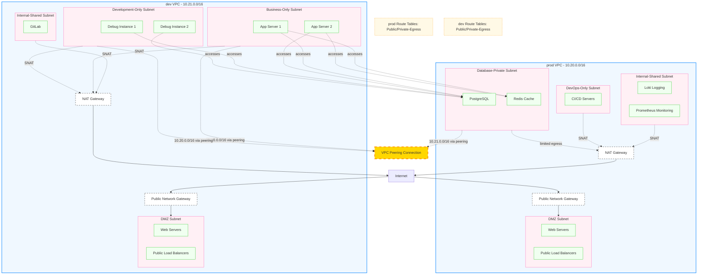

## Network Architecture Guidelines

- region should use `ap-southeast-3`
- vpc rules:
  - production vpc: `10.20.0.0/16`
  - development vpc: `10.21.0.0/16`
  - for additional environments, use non-overlapping CIDRs: `10.22.0.0/16`, `10.23.0.0/16`, etc.
- nat gateway rules:
  - use single NAT gateway (medium instance) in Internal-Shared subnet
  - configure multiple SNAT rules for different subnet groups
  - EIP per NAT gateway for outbound internet
- subnet rules:
  - /22 for high-density subnets: DMZ, Internal-Shared, DevOps, Development, Business, Database-Private
  - /24 for low-density subnets: External-Access, Security-Private
- security group rules:
  - use workload-based security groups (sg-web-servers, sg-api-gateway, sg-databases, etc.)
  - each ecs has its own security group
  - each subnet has its own security group
  - each vpc has its own security group
- eip rules:
  - NAT gateway uses EIP for outbound internet
  - Private subnets egress via NAT Gateway with SNAT rules
  - public network gateway should use eip
- lb rules:
  - each public lb should use eip
  - public lb should be in dmz subnet(api gateway,tcp proxy for internal kafka,mongodb,pg,es etc.)
  - internal lb should be in internal-shared subnet(k8s master api)

### NAT Gateway

- Single NAT Gateway in Internal-Shared subnet
- SNAT rules for different subnet groups:
  - Internal-Shared: 10.x.8.0/22
  - Team Subnets: 10.x.12.0/22, 10.x.16.0/22, 10.x.20.0/22
  - Private Limited: 10.x.24.0/22, 10.x.28.0/24 (package updates, NTP only)

### LB

- Public Load Balancer: in DMZ subnet
- external Load Balancer: in External-Access subnet
- Internal Load Balancer: in Internal-Shared subnet

### Route Table Grouping (Simplified)

- Simplified route table grouping (3 route tables):
  - **Public Route Table**: for internet-facing subnets (DMZ, External-Access)
  - **Private-Egress Route Table**: for all subnets requiring NAT egress (Internal-Shared, DevOps-Only, Development-Only, Business-Only, Database-Private, Security-Private)
  - Note: Private-Isolated route table removed - Database-Private and Security-Private now have limited egress via NAT with security group restrictions

### Subnet (Categorized by User Access Patterns)

- the subnet should split into multi categories based on user access patterns:
  - DMZ subnet: for public-facing resources accessible from internet (web servers, load balancers, etc.)
  - external-access subnet: for resources accessible from external partners or vendors
  - internal-shared subnet: for resources shared across all internal teams (logging servers, monitoring servers, configuration management, etc.)
  - devops-only subnet: for DevOps team exclusive resources (CI/CD servers, build agents, etc.)
  - development-only subnet: for Development team exclusive resources (dev servers, test environments, etc.)
  - business-only subnet: for Business/Operations team exclusive resources (ERP systems, business applications, etc.)
  - database-private subnet: for database resources with restricted access (self-hosted PostgreSQL, cloud-based PostgreSQL/RDS, caches, etc.)
  - security-private subnet: for security-critical resources with minimal access (vault, intrusion detection systems, etc.)

- resources in shared subnets should expose services via internal load balancers with appropriate ACL restrictions
- exclusive subnets should have strict security group rules limiting access to their respective teams

## Diagram (Single VPC - Development Environment)

> **Development VPC:** `10.21.0.0/16` | Production uses separate VPC: `10.20.0.0/16`

```mermaid
graph TD
    internet[Internet]

    subgraph vpc[VPC ap-southeast-3 - Development 10.21.0.0/16]
        pgw[Public Network Gateway]

        %% Public Route Table (used by DMZ and External-Access subnets)
        subgraph public-rt[Public Route Table]
            subgraph dmz-subnet[DMZ Subnet 10.21.0.0/22]
                web[Web Servers]
                public-lb[Public Load Balancer EIP]
            end

            subgraph external-subnet[External-Access Subnet 10.21.4.0/24]
                partner[Partner-Facing Services]
                kafka-proxy[Kafka Proxy]
                mongo-proxy[MongoDB Proxy]
                pg-proxy[PostgreSQL Proxy]
                es-proxy[Elasticsearch Proxy]
            end
        end

        %% Private-Egress Route Table (all subnets requiring NAT egress)
        subgraph private-egress-rt[Private-Egress Route Table]
            subgraph internal-shared-subnet[Internal-Shared Subnet 10.21.8.0/22]
                internal-lb[Internal Load Balancer]
                loki[Loki Logging]
                prometheus[Prometheus Monitoring]
                gitlab[GitLab]
                nat[NAT Gateway EIP]
            end

            subgraph devops-subnet[DevOps-Only Subnet 10.21.12.0/22]
                ci[CI/CD Servers]
                build[Build Agents]
            end

            subgraph dev-subnet[Development-Only Subnet 10.21.16.0/22]
                test[Test Environments]
                devservers[Dev Servers]
            end

            subgraph business-subnet[Business-Only Subnet 10.21.20.0/22]
                erp[ERP Systems]
                business-apps[Business Applications]
            end

            subgraph database-subnet[Database-Private Subnet 10.21.24.0/22]
                self-hosted-pg[Self-Hosted PostgreSQL]
                cloud-pg[Cloud PostgreSQL/RDS]
                cache[Caches]
            end

            subgraph security-subnet[Security-Private Subnet 10.21.28.0/24]
                vault[Vault]
                ids[Intrusion Detection]
            end
        end
    end

    %% Internet ingress to public-facing subnets
    internet --> pgw
    pgw --> dmz-subnet
    pgw --> external-subnet

    %% All private subnets egress via single NAT Gateway
    internal-shared-subnet -.->|SNAT| nat
    devops-subnet -.->|SNAT| nat
    dev-subnet -.->|SNAT| nat
    business-subnet -.->|SNAT| nat
    database-subnet -.->|limited egress| nat
    security-subnet -.->|limited egress| nat
    nat --> internet

    %% Load Balancer traffic flows
    public-lb --> web
    public-lb --> kafka-proxy
    public-lb --> mongo-proxy
    public-lb --> pg-proxy
    public-lb --> es-proxy

    internal-lb --> loki
    internal-lb --> prometheus
    internal-lb --> gitlab

    %% Style definitions
    class vpc vpc-style
    class public-rt,private-egress-rt route-table-style
    class dmz-subnet,external-subnet public-subnet-style
    class internal-shared-subnet internal-shared-style
    class devops-subnet,dev-subnet,business-subnet team-subnet-style
    class database-subnet,security-subnet private-subnet-style
    class public-lb,internal-lb load-balancer-style
    class web,kafka-proxy,mongo-proxy,pg-proxy,es-proxy,partner,loki,prometheus,gitlab,ci,build,test,devservers,erp,business-apps,self-hosted-pg,cloud-pg,cache,vault,ids resource-style
    class pgw,nat gateway-style

    classDef vpc-style fill:#f0f8ff,stroke:#1e90ff,stroke-width:2px
    classDef route-table-style fill:#fff5ee,stroke:#ff8c00,stroke-width:1px
    classDef public-subnet-style fill:#ffcccc,stroke:#ff0000
    classDef internal-shared-style fill:#ccffcc,stroke:#00ff00
    classDef team-subnet-style fill:#ffffcc,stroke:#ffcc00
    classDef private-subnet-style fill:#ccccff,stroke:#0000ff
    classDef resource-style fill:#e8f4f8,stroke:#3498db
    classDef load-balancer-style fill:#a8d8ea,stroke:#0094c6,stroke-width:2px
    classDef gateway-style fill:#ffffff,stroke:#333333,stroke-width:2px,stroke-dasharray:5,5
```



## Subnet Specifications

**Environment:** Development | **VPC CIDR:** `10.21.0.0/16` | **Region:** `ap-southeast-3`

> **Note:** This VPC is for development environment. Production will use a separate VPC (`10.20.0.0/16`).

### Public-Facing Subnets

| Category | CIDR | AZ | Route Table | Default Route | Inbound Sources | Example Workloads |
|----------|------|----|-------------|---------------|-----------------|-------------------|
| DMZ | 10.21.0.0/22 | 3a, 3b | Public | PGW | Internet (0.0.0.0/0) | Public LBs, API Gateway, Web Servers |
| External-Access | 10.21.4.0/24 | 3a | Public | PGW | Partner VPNs, Whitelisted IPs | Partner-facing services, DB Proxies (Kafka/Mongo/PG/ES) |

### Internal Shared Subnets

| Category | CIDR | AZ | Route Table | Default Route | Inbound Sources | Example Workloads |
|----------|------|----|-------------|---------------|-----------------|-------------------|
| Internal-Shared | 10.21.8.0/22 | 3a, 3b | Internal-Shared | NAT1 | All internal subnets via SG | Internal LBs, Loki, Prometheus, GitLab |

### Team-Exclusive Subnets

| Category | CIDR | AZ | Route Table | Default Route | Inbound Sources | Example Workloads |
|----------|------|----|-------------|---------------|-----------------|-------------------|
| DevOps-Only | 10.21.12.0/22 | 3a | Team | NAT2 | DevOps team SGs | CI/CD servers, Build agents |
| Development-Only | 10.21.16.0/22 | 3a | Team | NAT2 | Dev team SGs | Debug instances, Test pods, Developer workstations |
| Business-Only | 10.21.20.0/22 | 3a, 3b | Team | NAT2 | Business team SGs, Internal LB | Application servers, ERP systems, Business apps |

### Private Restricted Subnets

| Category | CIDR | AZ | Route Table | Default Route | Inbound Sources | Example Workloads |
|----------|------|----|-------------|---------------|-----------------|-------------------|
| Database-Private | 10.21.24.0/22 | 3a, 3b | Private-Egress | NAT (limited) | App subnets via SG, Peered VPCs | PostgreSQL (self-hosted/RDS), Redis |
| Security-Private | 10.21.28.0/24 | 3a | Private-Egress | NAT (limited) | Security team SGs only | Vault, Intrusion Detection, HSM |

**Limited Egress** for Database-Private and Security-Private:
- Allowed: Package repositories (apt, pypi), NTP servers, Cloud API endpoints
- Security group outbound rules restrict to specific destinations only

### Route Table Summary

| Route Table | Associated Subnets | Default Route (0.0.0.0/0) |
|-------------|-------------------|---------------------------|
| Public | DMZ, External-Access | Public Network Gateway |
| Private-Egress | Internal-Shared, DevOps-Only, Development-Only, Business-Only, Database-Private, Security-Private | NAT Gateway (in Internal-Shared subnet) |

### SNAT Rules Configuration

| SNAT Rule | Source CIDR | EIP | Purpose |
|-----------|-------------|-----|---------|
| Internal-Shared | 10.x.8.0/22 | EIP-NAT | Shared services egress |
| Team Subnets | 10.x.12.0/22, 10.x.16.0/22, 10.x.20.0/22 | EIP-NAT | Team resources egress |
| Private Limited | 10.x.24.0/22, 10.x.28.0/24 | EIP-NAT | Package updates, NTP only |

## Golden Flows

### Flow 1: Internet to Application (Public Ingress)

```
Internet
    ↓ (HTTPS :443)
Public Network Gateway
    ↓ (DMZ subnet - 10.21.0.0/22)
Public Load Balancer (EIP)
    ↓ (HTTP :8080, target: app servers)
App Servers (Business-Only - 10.21.20.0/22)
    ↓ (PostgreSQL :5432)
PostgreSQL (Database-Private - 10.21.24.0/22)
```

**Key points:**
- Public LB SG allows: 0.0.0.0/0:443
- App SG allows: Public LB SG:8080
- DB SG allows: App SG:5432
- No NAT involved (ingress traffic path)

### Flow 2: Private Egress (Package Updates)

```
App Server (Business-Only - 10.21.20.0/22)
    ↓ (default route 0.0.0.0/0)
NAT Gateway (Internal-Shared - 10.21.8.0/22)
    ↓ (via EIP, SNAT rule for 10.21.20.0/22)
Internet
    ↓ (repository.example.com)
Package Repository (apt/yum/pip)
```

**Key points:**
- App server has no public IP
- Uses single NAT Gateway for outbound internet access
- SNAT rule maps source CIDR to NAT EIP
- Return traffic follows reverse path via NAT

### Flow 3: Cross-VPC Access (Dev to Prod Peering)

```
Debug Instance (dev VPC - 10.21.0.0/16)
    ↓ (route: 10.20.0.0/16 via peering)
VPC Peering Connection
    ↓ (prod Database-Private subnet)
PostgreSQL (prod VPC - 10.20.0.0/16)
```

**Configuration requirements:**
- dev team route table: `10.20.0.0/16 → peering`
- prod private route table: `10.21.0.0/16 → peering`
- prod DB SG: allow `10.21.0.0/16:5432`
- dev App SG: allow outbound to `10.20.0.0/16:5432`

## Multi-VPC Peering for Cross-Environment Access

For scenarios with multiple VPCs (prod for production, dev for development) where resources in dev need to access services in prod, use VPC Peering:

### Configuration Steps

1. **Create VPC Peering Connection**
   - In Huawei Cloud VPC console, create a peering connection between prod and dev VPCs
   - Ensure VPC CIDR blocks don't overlap (prod: `10.20.0.0/16`, dev: `10.21.0.0/16`)
   - Both VPCs must be in the same region

2. **Update Route Tables**
   - **prod-private-route**: Add route to `10.21.0.0/16` via VPC Peering
   - **dev-team-route**: Add route to `10.20.0.0/16` via VPC Peering

3. **Security Group Rules**
   - **prod-db security group**: Allow inbound traffic from `10.21.0.0/16` on PostgreSQL (5432) and Redis (6379) ports
   - **dev-app security group**: Allow outbound traffic to `10.20.0.0/16` on required ports

### Multi-VPC Peering Diagram (prod ↔ dev)


