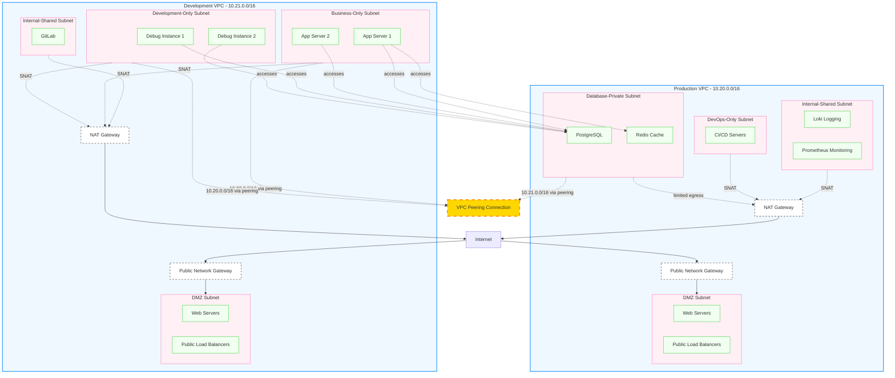

# Network Architecture

## Overview

This document provides the visual architecture diagrams for the k8s-agent network infrastructure on Huawei Cloud (ap-southeast-3).

---

## Single VPC Architecture

```mermaid
graph TD
    internet[Internet]

    subgraph vpc["VPC - 10.x.0.0/16 (ap-southeast-3)"]
        pgw[Public Network Gateway]

        %% Public Route Table (DMZ and External-Access subnets)
        subgraph public-rt["Public Route Table"]
            subgraph dmz-subnet["DMZ Subnet - 10.x.0.0/22"]
                web[Web Servers]
                public-lb[Public Load Balancers EIP]
            end

            subgraph external-subnet["External-Access Subnet - 10.x.4.0/24"]
                partner[Partner-Facing Services]
                kafka-proxy[Kafka Proxy]
                mongo-proxy[MongoDB Proxy]
                pg-proxy[PostgreSQL Proxy]
                es-proxy[Elasticsearch Proxy]
            end
        end

        %% Private-Egress Route Table (all subnets with NAT egress)
        subgraph private-egress-rt["Private-Egress Route Table"]
            subgraph internal-shared-subnet["Internal-Shared Subnet - 10.x.8.0/22"]
                internal-lb[Internal Load Balancer]
                loki[Loki Logging]
                prometheus[Prometheus Monitoring]
                gitlab[GitLab]
                nat[NAT Gateway EIP]
            end

            subgraph devops-subnet["DevOps-Only Subnet - 10.x.12.0/22"]
                ci[CI/CD Servers]
                build[Build Agents]
            end

            subgraph dev-subnet["Development-Only Subnet - 10.x.16.0/22"]
                test[Test Environments]
                devservers[Dev Servers]
            end

            subgraph business-subnet["Business-Only Subnet - 10.x.20.0/22"]
                erp[ERP Systems]
                business-apps[Business Applications]
            end

            subgraph database-subnet["Database-Private Subnet - 10.x.24.0/22"]
                self-hosted-pg[Self-Hosted PostgreSQL]
                cloud-pg[Cloud PostgreSQL/RDS]
                cache[Caches Redis]
            end

            subgraph security-subnet["Security-Private Subnet - 10.x.28.0/24"]
                vault[Vault]
                ids[Intrusion Detection]
            end
        end
    end

    %% Internet ingress to public-facing subnets
    internet --> pgw
    pgw --> dmz-subnet
    pgw --> external-subnet

    %% All private subnets egress via NAT Gateway
    internal-shared-subnet -.->|SNAT| nat
    devops-subnet -.->|SNAT| nat
    dev-subnet -.->|SNAT| nat
    business-subnet -.->|SNAT| nat
    database-subnet -.->|limited egress| nat
    security-subnet -.->|limited egress| nat
    nat --> internet

    %% Load Balancer traffic flows
    public-lb --> web
    public-lb --> kafka-proxy
    public-lb --> mongo-proxy
    public-lb --> pg-proxy
    public-lb --> es-proxy

    internal-lb --> loki
    internal-lb --> prometheus
    internal-lb --> gitlab

    %% Style definitions
    classDef vpc-style fill:#f0f8ff,stroke:#1e90ff,stroke-width:2px
    classDef rt-style fill:#fff5ee,stroke:#ff8c00,stroke-width:1px
    classDef public-style fill:#ffcccc,stroke:#cc0000,stroke-width:2px
    classDef internal-shared-style fill:#ccffcc,stroke:#00aa00,stroke-width:2px
    classDef team-style fill:#ffffcc,stroke:#ccaa00,stroke-width:2px
    classDef private-style fill:#ccccff,stroke:#0000cc,stroke-width:2px
    classDef resource-style fill:#e8f4f8,stroke:#3498db,stroke-width:1px
    classDef lb-style fill:#a8d8ea,stroke:#0094c6,stroke-width:2px
    classDef gateway-style fill:#ffffff,stroke:#333333,stroke-width:2px,stroke-dasharray:5,5

    class vpc vpc-style
    class public-rt,private-egress-rt rt-style
    class dmz-subnet,external-subnet public-style
    class internal-shared-subnet internal-shared-style
    class devops-subnet,dev-subnet,business-subnet team-style
    class database-subnet,security-subnet private-style
    class web,kafka-proxy,mongo-proxy,pg-proxy,es-proxy,partner,loki,prometheus,gitlab,ci,build,test,devservers,erp,business-apps,self-hosted-pg,cloud-pg,cache,vault,ids resource-style
    class public-lb,internal-lb lb-style
    class pgw,nat gateway-style
```

---

## Multi-VPC Peering Architecture

---

## Quick Reference

| Environment | VPC CIDR | Region |
|-------------|----------|--------|
| Production | 10.20.0.0/16 | ap-southeast-3 |
| Development | 10.21.0.0/16 | ap-southeast-3 |

---

## Related Documentation

- [Specifications](./network-specifications.md) - Detailed subnet, route table, and load balancer specifications
- [Guidelines](./network-guidelines.md) - Design rules, principles, and best practices
- [Flows](./network-flows.md) - Traffic flow examples and golden flows
- [User Rules](../user.md) - High-level network rules and guidelines
