# K8s-Agent Architecture Overview

## Table of Contents
1. [High-Level Architecture](#high-level-architecture)
2. [Cloud Infrastructure Layer](#cloud-infrastructure-layer)
3. [Kubernetes Platform Layer](#kubernetes-platform-layer)
4. [Security & Governance Layer](#security--governance-layer)
5. [Observability Layer](#observability-layer)
6. [Application Platform Layer](#application-platform-layer)
7. [Developer Experience Layer](#developer-experience-layer)
8. [Service Infrastructure Layer](#service-infrastructure-layer)
9. [Data & Middleware Layer](#data--middleware-layer)
10. [Data Flows](#data-flows)

---

## High-Level Architecture

```mermaid
graph TB
    subgraph "Users & Access"
        Dev[Developers]
        Ops[Platform Engineers]
        SRE[SRE Teams]
        Admin[Admins]
    end

    subgraph "Developer Experience Layer"
        Backstage[Backstage<br/>Developer Portal]
        Homer[Homer<br/>Service Dashboard]
        Coder[Coder<br/>Cloud IDE]
        N8N[n8n<br/>Workflow Automation]
    end

    subgraph "Application Platform Layer"
        Kusion[Kusion<br/>App Configuration]
        Apollo[Apollo<br/>Config Center]
        ArgoCD[ArgoCD<br/>GitOps]
        Flagger[Flagger<br/>Progressive Delivery]
    end

    subgraph "Service Mesh & Gateway"
        Kong[Kong<br/>API Gateway]
        Linkerd[Linkerd<br/>Service Mesh]
    end

    subgraph "Kubernetes Cluster (k3s)"
        subgraph "Control Plane"
            API[K8s API Server]
            ETCD[(etcd)]
            Scheduler[Scheduler]
            Controller[Controller Manager]
        end

        subgraph "Workloads"
            Apps[Application Pods]
            Operators[Operators]
            Jobs[Jobs/CronJobs]
        end
    end

    subgraph "Security & Governance"
        Vault[Vault<br/>Secrets Manager]
        ESO[External Secrets<br/>Operator]
        Kyverno[Kyverno<br/>Policy Engine]
        Trivy[Trivy<br/>Security Scanner]
        IAM[IAM<br/>Keycloak/Authentik]
        Jumpserver[Jumpserver<br/>Bastion Host]
    end

    subgraph "Observability Stack"
        Prometheus[Prometheus<br/>Metrics]
        Grafana[Grafana<br/>Dashboards]
        Loki[Loki<br/>Logs]
        Tempo[Tempo<br/>Traces]
        OpenCost[OpenCost<br/>Cost Allocation]
        Signoz[Signoz<br/>APM]
        Posthog[Posthog<br/>Analytics]
        Sentry[Sentry<br/>Error Tracking]
    end

    subgraph "Service Infrastructure"
        LiteLLM[LiteLLM<br/>LLM Gateway]
        KMCP[KMCP<br/>MCP Lifecycle]
        KAgent[KAgent<br/>AI Agents]
        Athens[Athens<br/>Go Proxy]
        PyPI[PyPI Server<br/>Python Proxy]
        Verdaccio[Verdaccio<br/>NPM Proxy]
    end

    subgraph "Data & Middleware"
        Kafka[Kafka<br/>Event Streaming]
        Redis[Redis<br/>Cache/Queue]
        Postgres[(PostgreSQL<br/>Primary DB)]
        MongoDB[(MongoDB<br/>Document DB)]
        Elastic[(Elasticsearch<br/>Search/Logs)]
        Superset[Superset<br/>Data Viz]
        Bytebase[Bytebase<br/>DB DevSecOps]
    end

    subgraph "External Resources (Crossplane)"
        HuaweiC[Huawei Cloud<br/>ECS/VPC/EVS]
        AWS[AWS Resources]
        Azure[Azure Resources]
        GCP[GCP Resources]
    end

    Dev --> Backstage
    Dev --> Coder
    Dev --> Homer

    Ops --> Backstage
    Ops --> N8N
    Ops --> Grafana

    SRE --> Grafana
    SRE --> Sentry
    SRE --> Signoz

    Admin --> Backstage
    Admin --> Jumpserver

    Backstage --> ArgoCD
    Coder --> ArgoCD
    N8N --> ArgoCD

    ArgoCD --> API
    Kusion --> ArgoCD
    Apollo --> Apps

    Kong --> Linkerd
    Linkerd --> Apps

    API --> Vault
    API --> Kyverno
    Vault --> ESO

    Apps --> Prometheus
    Apps --> Loki
    Apps --> Tempo

    Prometheus --> Grafana
    Loki --> Grafana
    Tempo --> Grafana
    Prometheus --> OpenCost
    Prometheus --> Signoz

    Apps --> Sentry
    Apps --> Posthog

    Apps --> Kafka
    Apps --> Redis
    Apps --> Postgres
    Apps --> MongoDB
    Apps --> Elastic

    Operators --> HuaweiC
    Operators --> AWS
    Operators --> Azure
    Operators --> GCP

    Operators --> Kafka
    Operators --> Redis
    Operators --> Postgres
    Operators --> MongoDB
    Operators --> Elastic

    Backstage --> LiteLLM
    Backstage --> KAgent
    Apps --> LiteLLM

    Apps --> Athens
    Apps --> PyPI
    Apps --> Verdaccio

    Superset --> Postgres
    Superset --> MongoDB
    Superset --> Elastic

    Bytebase --> Postgres
    Bytebase --> MongoDB

    IAM --> Backstage
    IAM --> Vault
    IAM --> Jumpserver

    style Backstage fill:#e1f5fe
    style ArgoCD fill:#fff3e0
    style Vault fill:#f3e5f5
    style Kong fill:#e8f5e9
    style Prometheus fill:#fff8e1
    style Linkerd fill:#fce4ec
```

---

## Cloud Infrastructure Layer

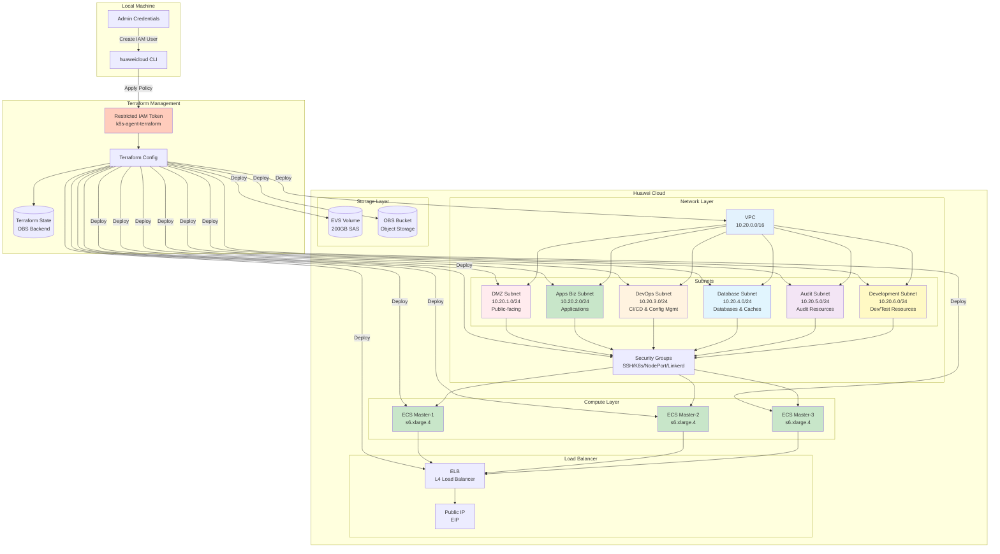

### Infrastructure Components

| Component | Purpose | Configuration |
|-----------|---------|---------------|
| **VPC** | Virtual Private Cloud isolation | CIDR: 10.20.0.0/16 |
| **DMZ Subnet** | Public-facing resources | CIDR: 10.20.1.0/24, Gateway: 10.20.1.1 |
| **Apps Biz Subnet** | Application servers & microservices | CIDR: 10.20.2.0/24, Gateway: 10.20.2.1 |
| **DevOps Subnet** | CI/CD & configuration management | CIDR: 10.20.3.0/24, Gateway: 10.20.3.1 |
| **Database Subnet** | Databases & caches | CIDR: 10.20.4.0/24, Gateway: 10.20.4.1 |
| **Audit Subnet** | Audit log collectors & processors | CIDR: 10.20.5.0/24, Gateway: 10.20.5.1 |
| **Development Subnet** | Dev/test servers | CIDR: 10.20.6.0/24, Gateway: 10.20.6.1 |
| **Security Groups** | Network traffic control | SSH:22, K8s:6443, NodePort:30000-32767 |
| **ECS Instances** | K8s cluster nodes | 3x s6.xlarge.4 (4 vCPU, 16GB RAM) |
| **EVS Volume** | Block storage | 200GB SAS disk per node |
| **OBS Bucket** | Object storage | Terraform state, backups |
| **ELB** | Load balancing | K8s API server HA |

---

## Kubernetes Platform Layer

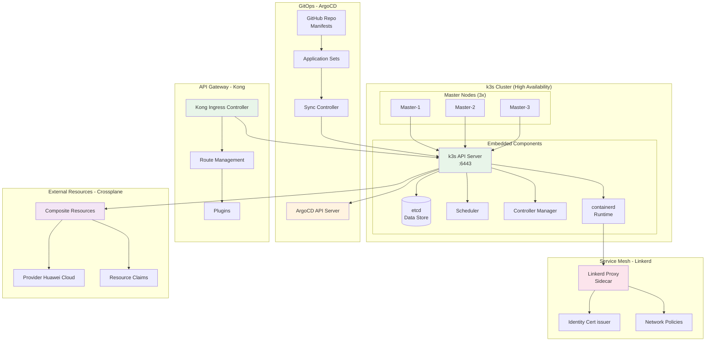

### Kubernetes Components

| Component | Purpose | Version |
|-----------|---------|---------|
| **k3s** | Lightweight Kubernetes distribution | v1.32+ |
| **ArgoCD** | GitOps continuous delivery | v2.12+ |
| **Linkerd** | Service mesh for microservices | v2.6+ |
| **Kong** | Ingress & API gateway | v3.6+ |
| **Crossplane** | Multi-cloud resource management | v1.18+ |

---

## Security & Governance Layer

```mermaid
graph TB
    subgraph "Secrets Management"
        Vault[Vault<br/>Self-Hosted]
        VaultUI[Vault UI]
        VaultStorage[(Vault Storage<br/>EVS Backend)]

        subgraph "Secret Sources"
            ExtVault[External Vault]
            AWS[AWS Secrets Manager]
            Azure[Azure Key Vault]
            GCP[GCP Secret Manager]
            ApolloConfig[Apollo Config]
            KusionConfig[Kusion Config]
            Helmfile[Helmfile Values]
        end

        ESO[External Secrets Operator]
    end

    subgraph "Policy Enforcement"
        KyvernoCluster[Cluster Policies]
        KyvernoNamespace[Namespace Policies]
        KyvernoValidate[Validation Rules]
        KyvernoMutate[Mutation Rules]
    end

    subgraph "Security Scanning"
        Harbor[Harbor Registry]
        TrivyScanner[Trivy Scanner]
        ImageScan[Image Vulnerability Scan]
        KubeScan[Kube-Bench<br/>CIS Benchmark]
    end

    subgraph "Identity & Access"
        IAMProvider[IAM Provider<br/>Keycloak/Authentik/Zitadel]
        IAMUsers[User Directory]
        IAMGroups[Group Management]
        IAMRoles[Role-Based Access]
        SSO[Single Sign-On]
        MFA[Multi-Factor Auth]
    end

    subgraph "Infrastructure Access"
        Jumpserver[Jumpserver<br/>Bastion Host]
        AuditLog[Audit Logging]
        SessionRec[Session Recording]
    end

    subgraph "Backup & Restore"
        Velero[Velero<br/>Backup Operator]
        ScheduleBackup[Scheduled Backups]
        OnDemand[On-Demand Backup]
        Restore[Restore Workflow]
    end

    Vault --> VaultUI
    Vault --> VaultStorage

    ExtVault --> ESO
    AWS --> ESO
    Azure --> ESO
    GCP --> ESO
    ApolloConfig --> ESO
    KusionConfig --> ESO
    Helmfile --> ESO

    ESO --> K8sSecrets[(K8s Secrets)]

    Vault --> ESO

    KyvernoCluster --> KyvernoValidate
    KyvernoCluster --> KyvernoMutate
    KyvernoNamespace --> KyvernoValidate

    Harbor --> TrivyScanner
    TrivyScanner --> ImageScan
    K8sNode --> KubeScan

    IAMProvider --> IAMUsers
    IAMProvider --> IAMGroups
    IAMProvider --> IAMRoles
    IAMProvider --> SSO
    IAMProvider --> MFA

    IAMProvider --> Vault
    IAMProvider --> Jumpserver

    Jumpserver --> AuditLog
    Jumpserver --> SessionRec

    Velero --> ScheduleBackup
    Velero --> OnDemand
    ScheduleBackup --> Restore
    OnDemand --> Restore

    style Vault fill:#f3e5f5
    style ESO fill:#e8eaf6
    style KyvernoCluster fill:#e8f5e9
    style TrivyScanner fill:#fff9c4
    style IAMProvider fill:#e3f2fd
    style Jumpserver fill:#ffebee
```

### Security Components

| Component | Purpose | Features |
|-----------|---------|----------|
| **Vault** | Secrets management | Encryption, dynamic secrets, lease management |
| **ESO** | Multi-source secret sync | 8+ secret providers, automatic rotation |
| **Kyverno** | Policy enforcement | Validation, mutation, generation policies |
| **Trivy** | Security scanning | CVE detection, misconfiguration detection |
| **IAM** | Identity provider | SSO, MFA, RBAC, user federation |
| **Jumpserver** | Secure access | Bastion host, audit logging, session recording |
| **Velero** | Backup/restore | Cluster & PV backup, disaster recovery |

---

## Observability Layer

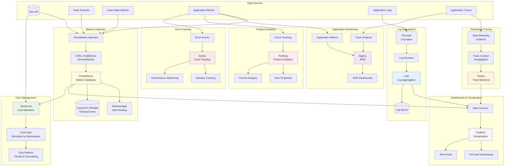

### Observability Components

| Component | Purpose | Retention |
|-----------|---------|-----------|
| **Prometheus** | Metrics collection | 15d local, long-term in Thanos |
| **Grafana** | Visualization | 50+ pre-built dashboards |
| **Loki** | Log aggregation | 30d with automated cleanup |
| **Tempo** | Distributed tracing | 15d traces |
| **OpenCost** | Cost allocation | Real-time + historical |
| **Signoz** | APM | Application performance |
| **Posthog** | Product analytics | User behavior tracking |
| **Sentry** | Error tracking | Real-time error alerts |

---

## Application Platform Layer

```mermaid
graph TB
    subgraph "Developer Tools"
        Backstage[Backstage<br/>Developer Portal]
        BackstageCatalog[Service Catalog]
        BackstageTech[Tech Docs]
        BackstageTemplate[Software Templates]
        BackstagePlugin[Plugins]

        Homer[Homer<br/>Service Dashboard]
        HomerLink[Quick Links]
        HomerStatus[Service Status]

        Coder[Coder<br/>Cloud IDE]
        CoderWorkspace[Workspaces]
        CoderDevEnv[Dev Environments]

        N8N[n8n<br/>Workflow Automation]
        N8NFlow[Workflow Flows]
        N8NTrigger[Triggers]
        N8NAction[Actions]

        Prefect[Prefect<br/>Workflow Orchestration]
        PrefectFlow[Data Flows]
        PrefectSchedule[Schedules]

        Dagster[Dagster<br/>Data Orchestration]
        DagsterAsset[Data Assets]
        DagsterJob[Data Jobs]
    end

    subgraph "Configuration Management"
        Kusion[Kusion<br/>App Configuration]
        KusionStack[Stack Definitions]
        KusionEnv[Environment Config]

        Apollo[Apollo<br/>Config Center]
        ApolloNamespace[Namespaces]
        ApolloCluster[Cluster Config]
        ApolloRelease[Release Management]

        Helmfile[Helmfile<br/>Helm Orchestration]
        HelmfileEnv[Environments]
        HelmfileRelease[Release Definitions]
    end

    subgraph "GitOps & Delivery"
        ArgoCD[ArgoCD]
        ArgoAppSet[Application Sets]
        ArgoSync[Sync Waves]
        ArgoRollout[Rollouts]

        Flagger[Flagger<br/>Progressive Delivery]
        FlaggerCanary[Canary Releases]
        FlaggerAB[A/B Testing]
        FlaggerBlueGreen[Blue-Green Deployments]
    end

    subgraph "CI/CD Integration"
        GitLab[GitLab<br/>Git Hosting]
        GitLabCI[CI/CD Pipelines]
        GitLabReg[Container Registry]

        GitHub[GitHub<br/>Optional Git Host]
        GHA[GitHub Actions]
    end

    Backstage --> BackstageCatalog
    Backstage --> BackstageTech
    Backstage --> BackstageTemplate
    Backstage --> BackstagePlugin

    Homer --> HomerLink
    Homer --> HomerStatus

    Coder --> CoderWorkspace
    Coder --> CoderDevEnv

    N8N --> N8NFlow
    N8N --> N8NTrigger
    N8N --> N8NAction

    Prefect --> PrefectFlow
    Prefect --> PrefectSchedule

    Dagster --> DagsterAsset
    Dagster --> DagsterJob

    Kusion --> KusionStack
    Kusion --> KusionEnv

    Apollo --> ApolloNamespace
    Apollo --> ApolloCluster
    Apollo --> ApolloRelease

    Helmfile --> HelmfileEnv
    Helmfile --> HelmfileRelease

    ArgoCD --> ArgoAppSet
    ArgoCD --> ArgoSync
    ArgoCD --> ArgoRollout

    Flagger --> ArgoRollout
    Flagger --> FlaggerCanary
    Flagger --> FlaggerAB
    Flagger --> FlaggerBlueGreen

    GitLab --> GitLabCI
    GitLab --> GitLabReg

    GitHub --> GHA

    GitLabCI --> ArgoCD
    GHA --> ArgoCD

    Kusion --> ArgoCD
    Helmfile --> ArgoCD
    BackstageTemplate --> GitLab

    style Backstage fill:#e1f5fe
    style Homer fill:#e8f5e9
    style Coder fill:#f3e5f5
    style N8N fill:#fff3e0
    style ArgoCD fill:#e8f5e9
    style Flagger fill:#fce4ec
```

### Application Platform Components

| Component | Purpose | Use Case |
|-----------|---------|----------|
| **Backstage** | Developer portal | Service catalog, docs, templates |
| **Homer** | Service dashboard | Quick access to internal services |
| **Coder** | Cloud IDE | Remote development environments |
| **n8n** | Workflow automation | No-code workflow automation |
| **Prefect** | Workflow orchestration | Data pipeline orchestration |
| **Dagster** | Data orchestration | Data asset management |
| **Kusion** | App configuration | Environment-agnostic config |
| **Apollo** | Config center | Dynamic configuration |
| **ArgoCD** | GitOps | Continuous delivery |
| **Flagger** | Progressive delivery | Canary, A/B, blue-green |

---

## Service Infrastructure Layer

```mermaid
graph TB
    subgraph "AI/LLM Infrastructure"
        LiteLLM[LiteLLM<br/>LLM Gateway]
        LiteLLMProvider[Multi-Provider Support]
        LiteLLMCache[Response Cache]
        LiteLLMMetrics[Usage Metrics]

        KMCP[KMCP<br/>MCP Lifecycle Manager]
        KMCPDeploy[MCP Deployment]
        KMCPScale[MCP Scaling]
        KMCPMonitor[MCP Monitoring]

        KAgent[KAgent<br/>AI Agents for K8s]
        KAgentOps[Operational Tasks]
        KAgentChat[Chat Interface]
        KAgentAuto[Automation]

        MCPForge[MCP Context Forge<br/>Custom MCP Builder]
        MCPCompose[Compose from Multiple]
        MCPDeploy[Deploy Custom MCPs]
    end

    subgraph "Package Management"
        Athens[Athens<br/>Go Module Proxy]
        AthensCache[Module Cache]
        AthensAuth[Authentication]

        PyPI[PyPI Server<br/>Python Package Index]
        PyPIUpload[Package Upload]
        PyPIProxy[PyPI Proxy]

        Verdaccio[Verdaccio<br/>NPM Registry]
        VerdaccioScope[Scoped Packages]
        VerdaccioProxy[NPM Proxy]
    end

    subgraph "Workflow & Automation"
        N8N[n8n<br/>Workflow Automation]
        Prefect[Prefect<br/>Data Workflow]
        Langfuse[Langfuse<br/>LLM Observability]
    end

    subgraph "Integrations"
        App[Applications]
        DevTools[Developer Tools]
        Monitoring[Monitoring Stack]
    end

    App --> LiteLLM
    LiteLLM --> LiteLLMProvider
    LiteLLM --> LiteLLMCache
    LiteLLM --> LiteLLMMetrics

    DevTools --> KMCP
    KMCP --> KMCPDeploy
    KMCP --> KMCPScale
    KMCP --> KMCPMonitor

    App --> KAgent
    KAgent --> KAgentOps
    KAgent --> KAgentChat
    KAgent --> KAgentAuto

    DevTools --> MCPForge
    MCPForge --> MCPCompose
    MCPForge --> MCPDeploy

    App --> Athens
    Athens --> AthensCache
    Athens --> AthensAuth

    App --> PyPI
    PyPI --> PyPIUpload
    PyPI --> PyPIProxy

    App --> Verdaccio
    Verdaccio --> VerdaccioScope
    Verdaccio --> VerdaccioProxy

    App --> N8N
    App --> Prefect
    App --> Langfuse

    style LiteLLM fill:#e1f5fe
    style KMCP fill:#f3e5f5
    style KAgent fill:#fff3e0
    style Athens fill:#e8f5e9
    style PyPI fill:#e8f5e9
    style Verdaccio fill:#e8f5e9
```

### Service Infrastructure Components

| Component | Purpose | Features |
|-----------|---------|----------|
| **LiteLLM** | LLM gateway | Multi-provider, caching, metrics |
| **KMCP** | MCP lifecycle | Deploy, scale, monitor MCPs |
| **KAgent** | AI K8s operations | Chat-driven operations |
| **MCP Context Forge** | Custom MCP builder | Compose from multiple sources |
| **Athens** | Go module proxy | Module caching, authentication |
| **PyPI Server** | Python registry | Private packages, PyPI proxy |
| **Verdaccio** | NPM registry | Scoped packages, NPM proxy |
| **Langfuse** | LLM observability | LLM tracing, evaluation |

---

## Data & Middleware Layer

```mermaid
graph TB
    subgraph "Event Streaming"
        Kafka[Kafka Cluster<br/>Strimzi Operator]
        KafkaTopic[Topics]
        KafkaProducer[Producers]
        KafkaConsumer[Consumers]
        KafkaUI[Kafka UI<br/>Management]
    end

    subgraph "Caching & Queue"
        Redis[Redis Cluster<br/>Redis Operator]
        RedisMaster[Master Nodes]
        RedisReplica[Replica Nodes]
        RedisInsight[RedisInsight<br/>Management UI]
    end

    subgraph "Relational Database"
        Postgres[(PostgreSQL<br/>Postgres Operator)]
        PostgresPrimary[Primary Instance]
        PostgresStandby[Standby Instances]
        PostgresBackup[Automated Backups]
        PgAdmin[pgAdmin<br/>Management UI]
    end

    subgraph "Document Database"
        MongoDB[(MongoDB<br/>MongoDB Operator)]
        MongoShard[Sharded Cluster]
        MongoReplica[Replica Set]
        MongoCompass[Compass Web<br/>Management UI]
    end

    subgraph "Search & Analytics"
        Elastic[(Elasticsearch<br/>ECK Operator)]
        ElasticData[Data Nodes]
        ElasticIngest[Ingest Nodes]
        ElasticMaster[Master Nodes]
        Kibana[Kibana<br/>Visualization]
    end

    subgraph "Data Visualization"
        Superset[Apache Superset<br/>Data Visualization]
        SupersetChart[Charts & Dashboards]
        SupersetSQL[SQL Lab]
        SupersetCache[Caching Layer]
    end

    subgraph "Database DevSecOps"
        Bytebase[Bytebase<br/>Database DevSecOps]
        BytebaseSchema[Schema Migration]
        BytebaseReview[SQL Review]
        BytebaseBackup[Backup Manager]
        BytebaseAudit[Audit Logging]
    end

    subgraph "Applications"
        App1[Application 1]
        App2[Application 2]
        App3[Application 3]
        Analytics[Analytics Jobs]
    end

    App1 --> KafkaProducer
    App2 --> KafkaConsumer
    Kafka --> KafkaTopic
    KafkaTopic --> KafkaProducer
    KafkaTopic --> KafkaConsumer
    Kafka --> KafkaUI

    App1 --> RedisMaster
    App2 --> RedisReplica
    Redis --> RedisMaster
    Redis --> RedisReplica
    Redis --> RedisInsight

    App1 --> PostgresPrimary
    Postgres --> PostgresPrimary
    Postgres --> PostgresStandby
    Postgres --> PostgresBackup
    Postgres --> PgAdmin

    App2 --> MongoShard
    MongoDB --> MongoShard
    MongoDB --> MongoReplica
    MongoDB --> MongoCompass

    App3 --> ElasticData
    Analytics --> ElasticIngest
    Elastic --> ElasticData
    Elastic --> ElasticIngest
    Elastic --> ElasticMaster
    Elastic --> Kibana

    Postgres --> Superset
    MongoDB --> Superset
    Elastic --> Superset
    Superset --> SupersetChart
    Superset --> SupersetSQL
    Superset --> SupersetCache

    Postgres --> Bytebase
    MongoDB --> Bytebase
    Postgres --> BytebaseSchema
    MongoDB --> BytebaseSchema
    Bytebase --> BytebaseReview
    Bytebase --> BytebaseBackup
    Bytebase --> BytebaseAudit

    style Kafka fill:#e8f5e9
    style Redis fill:#fce4ec
    style Postgres fill:#e1f5fe
    style MongoDB fill:#fff3e0
    style Elastic fill:#f3e5f5
    style Superset fill:#e8eaf6
    style Bytebase fill:#ffebee
```

### Data & Middleware Components

| Component | Purpose | Operator |
|-----------|---------|----------|
| **Kafka** | Event streaming | Strimzi Operator |
| **Redis** | Cache, queue, session store | Redis Operator |
| **PostgreSQL** | Primary relational database | Postgres Operator |
| **MongoDB** | Document database | MongoDB Kubernetes Operator |
| **Elasticsearch** | Search, analytics, logs | ECK Operator |
| **Superset** | Data visualization | Native Helm Charts |
| **Bytebase** | Database DevSecOps | Native Helm Charts |

---

## Developer Experience Layer

```mermaid
graph TB
    subgraph "Developer Portal - Backstage"
        Catalog[Service Catalog<br/>Software Catalog]
        Docs[Tech Docs<br/>Documentation]
        Templates[Software Templates<br/>Scaffolding]
        Plugins[Plugins<br/>Extensions]
        Search[Search<br/>Discovery]

        Scaffolder[Scaffolder<br/>Template Engine]
        Lighthouse[Lighthouse<br/>Tech Insights]
        Permissions[Permissions<br/>RBAC]
    end

    subgraph "Service Dashboard - Homer"
        HomerDashboard[Dashboard<br/>Service Links]
        HomerGroups[Service Groups]
        HomerTheme[Custom Themes]
        HomerAPI[API Status]
    end

    subgraph "Cloud IDE - Coder"
        CoderWorkspace[Workspaces<br/>Dev Environments]
        CoderTemplate[Templates<br/>Workspace Configs]
        CoderProvider[Providers<br/>K8s/Docker]
        CoderAgent[Agent<br/>Workspace Agent]
    end

    subgraph "Workflow Automation - n8n"
        N8NEditor[Workflow Editor<br/>Visual Builder]
        N8NNode[Node Library<br/>Integrations]
        N8NWebhook[Webhooks<br/>Triggers]
        N8NSchedule[Scheduled<br/>Workflows]
        N8NExec[Execution<br/>History]
    end

    subgraph "Workflow Orchestration - Prefect"
        PrefectFlow[Flows<br/>Workflows]
        PrefectTask[Tasks<br/>Units of Work]
        PrefectDeploy[Deployments<br/>Flow Management]
        PrefectSchedule[Schedules<br/>Cron/Interval]
        PrefectUI[Dashboard<br/>Monitoring]
    end

    subgraph "Data Orchestration - Dagster"
        DagsterAsset[Assets<br/>Data Units]
        DagsterOp[Operations<br/>Transformations]
        DagsterJob[Jobs<br/>Execution Plans]
        DagsterSchedule[Schedules<br/>Automation]
        DagsterLaunch[Launchpad<br/>UI]
    end

    subgraph "LLM Observability - Langfuse"
        LangfuseTrace[Traces<br/>LLM Calls]
        LangfuseEval[Evaluation<br/>Quality Metrics]
        LangfusePrompt[Prompt<br/>Management]
        LangfuseDashboard[Analytics<br/>Dashboard]
    end

    subgraph "Developer Tools"
        Git[Git/GitLab/GitHub]
        CLI[CLI Tools]
        IDE[Local IDE]
        Browser[Browser Access]
    end

    Developer[Developer] --> Git
    Developer --> CLI
    Developer --> IDE
    Developer --> Browser

    Browser --> Catalog
    Browser --> Docs
    Browser --> Templates
    Browser --> Search
    Browser --> HomerDashboard
    Browser --> CoderWorkspace
    Browser --> N8NEditor
    Browser --> PrefectUI
    Browser --> DagsterLaunch
    Browser --> LangfuseDashboard

    IDE --> CoderWorkspace
    IDE --> CoderAgent

    CLI --> CoderTemplate
    CLI --> CoderProvider

    Catalog --> Scaffolder
    Catalog --> Lighthouse
    Catalog --> Permissions

    Templates --> Scaffolder

    HomerDashboard --> HomerGroups
    HomerDashboard --> HomerTheme
    HomerDashboard --> HomerAPI

    CoderWorkspace --> CoderAgent
    CoderWorkspace --> CoderTemplate

    N8NEditor --> N8NNode
    N8NEditor --> N8NWebhook
    N8NEditor --> N8NSchedule
    N8NEditor --> N8NExec

    PrefectFlow --> PrefectTask
    PrefectFlow --> PrefectDeploy
    PrefectFlow --> PrefectSchedule

    DagsterAsset --> DagsterOp
    DagsterAsset --> DagsterJob
    DagsterAsset --> DagsterSchedule

    LangfuseTrace --> LangfuseEval
    LangfuseTrace --> LangfusePrompt

    style Catalog fill:#e1f5fe
    style HomerDashboard fill:#e8f5e9
    style CoderWorkspace fill:#f3e5f5
    style N8NEditor fill:#fff3e0
    style PrefectFlow fill:#e8f5e9
    style DagsterAsset fill:#e8eaf6
    style LangfuseTrace fill:#fce4ec
```

### Developer Experience Components

| Component | Purpose | Key Features |
|-----------|---------|--------------|
| **Backstage** | Developer portal | Service catalog, tech docs, templates |
| **Homer** | Service dashboard | Quick links, service status |
| **Coder** | Cloud IDE | Remote development, workspace templates |
| **n8n** | Workflow automation | Visual workflow builder, 400+ integrations |
| **Prefect** | Workflow orchestration | Data flow orchestration, scheduling |
| **Dagster** | Data orchestration | Data asset management, software-defined assets |
| **Langfuse** | LLM observability | LLM tracing, prompt management |

---

## Data Flows

### Deployment Flow

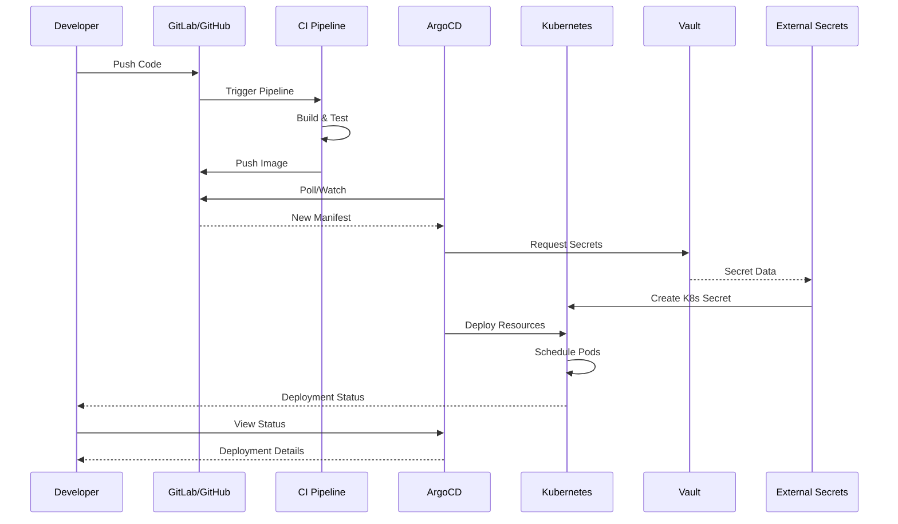

### Secret Synchronization Flow

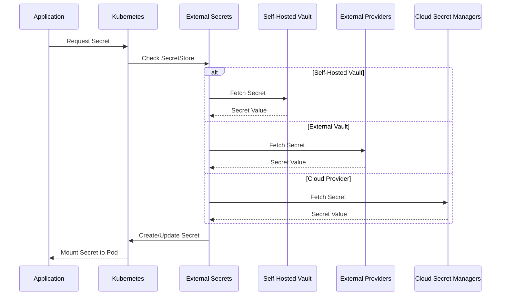

### Observability Data Flow

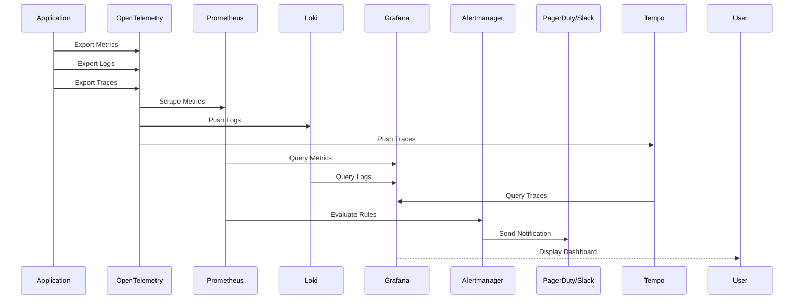

### Progressive Delivery Flow

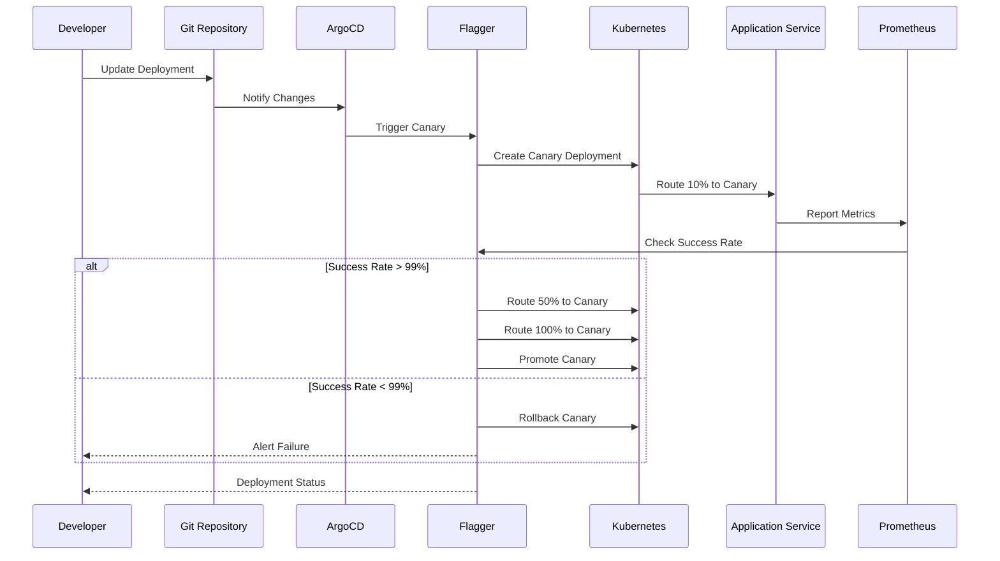

---

## Resource Summary

### Infrastructure Resources

| Layer | Components | Estimated Resources |
|-------|-----------|-------------------|
| **Cloud Infrastructure** | VPC, Subnet, 3x ECS, ELB, EVS, OBS | 12 vCPU, 48GB RAM, 600GB storage |
| **Kubernetes Platform** | k3s, ArgoCD, Kong, Linkerd, Crossplane | 4 vCPU, 8GB RAM |
| **Security** | Vault, ESO, Kyverno, Trivy, IAM, Jumpserver, Velero | 6 vCPU, 12GB RAM, 100GB storage |
| **Observability** | Prometheus, Grafana, Loki, Tempo, OpenCost, Signoz, Posthog, Sentry | 8 vCPU, 16GB RAM, 500GB storage |
| **Developer Tools** | Backstage, Homer, Coder, n8n, Prefect, Dagster, Langfuse | 8 vCPU, 16GB RAM |
| **Service Infrastructure** | LiteLLM, KMCP, KAgent, MCP Forge, Athens, PyPI, Verdaccio | 4 vCPU, 8GB RAM, 200GB storage |
| **Data & Middleware** | Kafka, Redis, Postgres, MongoDB, Elasticsearch, Superset, Bytebase | 12 vCPU, 32GB RAM, 2TB storage |

### Total Estimated Resources

| Resource | Quantity |
|----------|----------|
| **vCPU** | 54+ |
| **RAM** | 140+ GB |
| **Storage** | 3.4+ TB |
| **Services** | 70+ |
| **Namespaces** | 15+ |

---

## Network Ports Reference

| Service | Port | Protocol | Purpose |
|---------|------|----------|---------|
| SSH | 22 | TCP | Server access |
| Kubernetes API | 6443 | TCP | Cluster API |
| Kong Admin | 8001 | TCP | Kong Admin API |
| Kong Proxy | 80 | TCP | HTTP Proxy |
| Kong Proxy SSL | 443 | TCP | HTTPS Proxy |
| Linkerd | 4143 | TCP | Mesh Proxy |
| Prometheus | 9090 | TCP | Metrics UI |
| Grafana | 3000 | TCP | Dashboards |
| Loki | 3100 | TCP | Logs |
| Vault | 8200 | TCP | Secrets |
| Backstage | 7000 | TCP | Developer Portal |
| Coder | 3000 | TCP | Cloud IDE |
| Kafka | 9092 | TCP | Event Streaming |
| Redis | 6379 | TCP | Cache |
| PostgreSQL | 5432 | TCP | Database |
| MongoDB | 27017 | TCP | Database |
| Elasticsearch | 9200 | TCP | Search |

---

## Related Documentation

- [Cloud Infrastructure Plan](./01-cloud-infrastructure-plan.md) - Phase 1: Base cloud infrastructure
- [K8s Platform Plan](./02-k8s-platform-plan.md) - Phase 2: Kubernetes platform setup
- [Security & Governance Plan](./03-security-governance-plan.md) - Phase 3: Security foundation
- [Observability Plan](./04-observability-services-plan.md) - Phase 4: Monitoring & observability
- [Application Platform Plan](./05-app-platform-plan.md) - Phase 5: Developer & application platform
